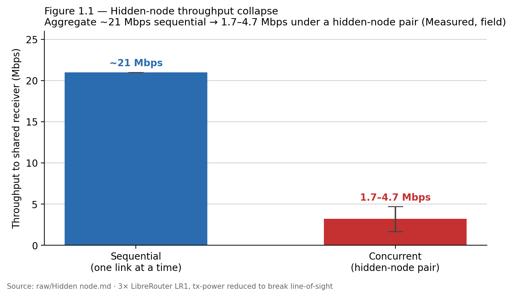
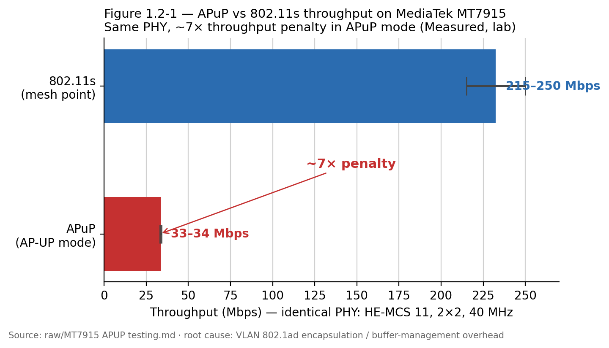
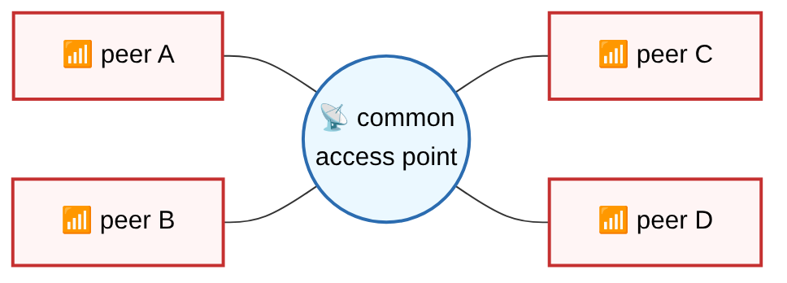
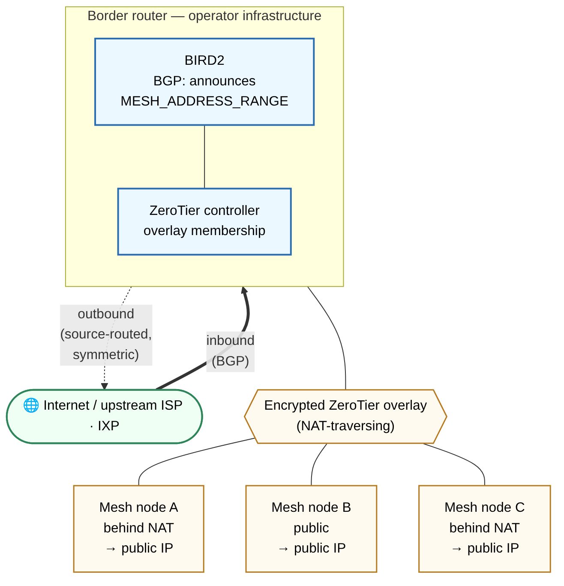

# ARDC 2024 — Final Report

**Grant:** *The New Wi-Fi for Mesh Networks: Advancing Community Connectivity through Innovative Mesh Technology*

**Grantee:** Asociación Civil **AlterMundi**

**Programme:** ARDC 2024 · USD 313,970 · 18 months · due 30 June 2026.

**Acknowledgement.** *Supported by a grant from Amateur Radio Digital Communications.*

---

## Table of contents

- [0. Executive summary](#0-executive-summary)
- [1. MW-CA-RF — coordinating the medium for community mesh](#1-mw-ca-rf--coordinating-the-medium-for-community-mesh)
  - [1.1 Testbeds](#11-testbeds)
  - [1.2 APuP: analysis, correctness fix (PR #1200), and performance characterization](#12-apup-analysis-correctness-fix-pr-1200-and-performance-characterization)
  - [1.3 Open-source TDMA on modern Wi-Fi chipsets: the case for free drivers and firmware](#13-open-source-tdma-on-modern-wi-fi-chipsets-the-case-for-free-drivers-and-firmware)
  - [1.4 Shared State (Rust rewrite) as an enabling substrate](#14-shared-state-rust-rewrite-as-an-enabling-substrate)
  - [1.5 Future work: a reference medium-access coordination algorithm](#15-future-work-a-reference-medium-access-coordination-algorithm)
- [2. Event machine — why it was discontinued](#2-event-machine--why-it-was-discontinued)
- [3. Data collection](#3-data-collection)
- [4. 44Mesh](#4-44mesh)
- [5. Outreach, open access, and community](#5-outreach-open-access-and-community)
- [6. Open access and licensing](#6-open-access-and-licensing)
- [Annex A — Technical report: Unique MAC per APuP peer interface under batman-adv (PR #1200)](#annex-a--technical-report-unique-mac-per-apup-peer-interface-under-batman-adv-pr-1200)
- [Annex B — §1.5 reference specification](#annex-b--15-reference-specification)
- [Annex C — People and institutions reached](#annex-c--people-and-institutions-reached)
- [Annex D — Repositories and references](#annex-d--repositories-and-references)
- [Annex E — Claims-to-evidence](#annex-e--claims-to-evidence)
- [Annex F — Reproducibility and artifacts](#annex-f--reproducibility-and-artifacts)

---

# 0. Executive summary

Over the ARDC 2024 grant period (USD 313,970, 18 months), AlterMundi advanced the four fronts of the proposal
*"The New Wi-Fi for Mesh Networks"*. This report describes what we built, pivoted, and discontinued, and why. Each headline claim is traced to its
source in the claims-to-evidence appendix.

The throughline: community networks need open low-level control of the radio that modern commercial Wi-Fi
denies. This grant delivered the components that work today (44Mesh, the above-the-driver enablers, the data
standard), documented the hardware wall honestly with measurements, and specified a direction for crossing it
(future work). The work maps to the grant's three goals — learning, experimenting, and doing — across four
declared outcomes, summarized in Table 1.

> **Table 1. Status of the four grant fronts (2024–2026).** What was delivered, pivoted, or discontinued across the grant period, with the primary evidence per front. Detail and sources follow in §1–§4 and Annex E.

| # | Front | Status | Summary |
|---|---|---|---|
| 1 | 44Mesh — sovereign public IP per mesh node | **Delivered** | Running, documented deployment layer: a ZeroTierOne ingress fork with an original ingress-routing mechanism, multi-arch Docker images, and end-to-end CI; reference deployment in operation 4 months on the UNC BGP border. |
| 2 | MW-CA-RF — medium-access coordination | **Pivoted** | In-driver coordination is infeasible on commodity radios (the timing-critical MAC is closed firmware since 802.11ac); this is the front's experimental result. Delivered the above-driver enablers (APuP PR #1134 merged, #1200 open; the Shared State Rust rewrite; three reproducible testbeds); the coordination algorithm itself is specified as future work. |
| 3 | Data collection — standard + field evidence | **Delivered (scope narrowed)** | The AlterMundi Network Data Collection Standard on OGC SensorThings, validated against the 12-node PuebloLibre optimization (lab testbed on real LibreRouter v1 hardware) and the MonteNet field deployment; no production collection server was deployed. |
| 4 | Event machine — reactive daemon | **Discontinued** | The conditions the daemon would react to are being addressed at the root by two upstream fixes (the OpenWrt "deaf radios" fix; the APuP unique-MAC-per-peer fix, PR #1200, still under upstream review); the effort was redirected to the LibreMesh testbed. |

> **Committed vs delivered.** Measured against the 2024 proposal: the headline MW-CA-RF success
> criterion — *"a working open source mesh suitable medium access coordination implementation, the first one"* —
> was **not built**; it is reframed as future work (§1.5) behind the closed-firmware wall documented in §1.3. The
> four-network, multi-country field plan (which named Coolab, Brazil and Canodrom, Spain) narrowed to **two
> Córdoba sites** — the MonteNet field deployment in Casa Grande and Molinari and a 12-node LibreMesh lab testbed on real
> LibreRouter v1 hardware (the PuebloLibre optimization) — and three of six committed
> metrics — **packet loss, interference, and energy** — were not measured. **44Net — technically deployed; global announcement pending two inter-institutional steps**: the
> `44.30.145.0/24` block is registered (LOA and RADB route object in hand) and the ingress stack is built and
> running on the UNC border (§4). Two steps remain before the announcement, coordinated with UNC — a legal
> review of the AlterMundi–UNC hosting agreement to verify whether it covers announcing this ARDC-allocated
> block (the deployment runs on AlterMundi's own AS264607 space), and the upstream advertisement via UNC's
> carrier ARSAT — so the `/24` is not yet globally announced (0/326 RIS peers; RPKI ROA requested 2026-06-30, pending issuance; §4.5). The 44Mesh
> mechanism shifted from the proposed IPIP tunnel-broker fronted by a mobile LiMe-App for non-technical users to
> a **ZeroTier/BGP/Docker stack with a server-side web UI** — a higher-infrastructure path than the proposal's
> accessibility goal.
> Each pivot is justified in its own section.

## 44Mesh: sovereign public IP per mesh node, implemented

We implemented the deployment layer that gives every mesh node a sovereign, globally routable public IP. It
moved from plan to a running, documented system (reproducible via the documented CI). It comprises a
maintained fork of ZeroTierOne (branch `feature/ingress-node`) with an original ingress-routing mechanism,
multi-arch Docker images, and end-to-end continuous integration (CI). The CI verifies a Border Gateway
Protocol (BGP) session reaching `Established` and ICMP reachability through the ingress path (lab). A live
ZeroTier ingress deployment runs on the AlterMundi BGP border at the National University of Córdoba (UNC),
Autonomous System AS264607.

> **Licensing note (verified 2026-06-26):** ZeroTier is no longer under BSL-1.1; our `feature/ingress-node` fork's core (`node/`, `osdep/`, `service/`) is **MPL-2.0 (OSI-approved)**, with only the `nonfree/` controller tree under ZeroTier's Source-Available License v1.0 (verified 2026-06-26). The primary `AlterMundi/44mesh` repository is now **GPL-3.0-only** (REUSE.software, merged to `main` 2026-06-26). The ztncui fork (pin `ingress-node-ui` / tag `v0.0.13-altermundi`) inherits GPL-3.0 from upstream `key-networks/ztncui`.

Once a mesh node is authorized, the controller installs source routing automatically within ~30 s
(Demonstrated, field; single reference deployment). The stack is generic: it runs with any IP range, not only
the grant block, because the mesh address range is a parameter.

ARDC approved the 44Net block `44.30.145.0/24`, registered to team member Pablo Bustos (call sign LU8HBP),
with a route object in the RADB Internet Routing Registry (origin AS264607) and a Letter of Authorization (LOA)
from ARDC (requested 2025-12-16, ticket #14611; LOA issued 2026-06-05). The block is approved; the independent
BGP announcement is still pending, and the Resource Public Key Infrastructure (RPKI) Route Origin Authorization
(ROA) — a separate request to ARDC — was submitted on 2026-06-30 (ticket #18059) and is pending issuance (see
§4.5); the running 44Mesh fabric currently uses AlterMundi's own announced AS264607 space. This makes
44Mesh a genuine collaboration with amateur radio operators, not generic IP space.

> The team-of-licensees framing rests on two operators verified in ENACOM's public registry — **LU8HBP** (Pablo Bustos) and **LU9HAJ** (Javier Jorge); LU8HBP additionally holds the `44.30.145.0/24` allocation (RADB route object). See Annex D.4 for the registry citation and screenshots.

> **Deployed and validated.** The 44Mesh border has run in continuous operation for four months on the UNC (Córdoba) BGP border, and the ingress mechanism was validated across multiple team-operated nodes — team members' laptops and Raspberry Pi devices — at different locations and ISP vendors, exercising stability across time, networks, and access conditions. The grant-period focus was development and validation, not a public adoption push, so no downstream community-adoption count is claimed.

## MW-CA-RF: medium-access coordination on commodity radios, pivoted

> The 2024 proposal committed, verbatim, to *"Mesh wide coordination of access to RF medium to avoid or greatly reduce the hidden-node problem,"* and set as its success criterion *"a working open source mesh suitable medium access coordination implementation, the first one."* 

The originally committed in-driver coordination — Time-Division Multiple Access (TDMA) layered over the
standard Carrier-Sense Multiple Access with Collision Avoidance (CSMA-CA) — proved impossible on commodity
hardware. Since 802.11ac, the timing-critical Wi-Fi Medium Access Control (MAC) layer lives in closed
firmware, beyond driver reach. This is the experimental result that redirected the work.

We measured the hidden-node problem: aggregate throughput collapsed from ~21 Mbps sequential (Measured,
field) to **1.7–4.7 Mbps** under a hidden-node pair (Measured, field). We then delivered the enabling
components above the driver: the Access Point micro-Peering (APuP) work, with its base support merged upstream
(PR #1134, 2025-06-20) and its batman-adv (a Layer-2 mesh routing protocol) correctness fix submitted as PR
#1200 — review changes pushed in `javierbrk/lime-packages#16` (2026-06-19), pending maintainer re-review. A
separate, still-open performance concern is the APuP throughput penalty of ~7× on MT7915 (33–34 Mbps vs
215–250 Mbps in 802.11s; Measured, lab), from VLAN 802.1ad encapsulation overhead — PR #1200 does not address
it. We also delivered the Rust rewrite of Shared State (485 KB binary, down from two C++ components of 82 KB
and 686 KB; the 485 KB is an internal-build measurement, and the Rust source repository is not publicly
released), implemented and running in operation on community deployments (e.g. MonteNet, on LibreMesh
development builds); and three reproducible testbeds. We specified — as future work, not yet started — a
reference medium-access coordination algorithm, plus an account of where such work becomes high-impact (the
open-baseband direction). We claim no measurement of the future algorithm.

> **Community payoff.** The MW-CA-RF outputs land for the wider community as an upstream contribution: the APuP / batman-adv correctness fix (PR #1200, under upstream re-review) benefits every LibreMesh network running APuP, not AlterMundi alone, and the hidden-node and APuP-penalty measurements give a reusable baseline. A count of networks already running the fix is not yet available (PR #1200 is still open upstream).

## Data Collection: data standard plus field evidence, scope narrowed

We designed the AlterMundi Network Data Collection Standard on the Open Geospatial Consortium (OGC)
SensorThings data model. We validated it against a real 12-node optimization on a
LibreMesh lab testbed built from real LibreRouter v1 hardware (PuebloLibre,
July 2025; Measured, lab) and against primary field data from the MonteNet deployment (five LibreRouter v1
nodes, lime-report 2026-02-05; Measured, field). We aligned it with the 44Mesh observation interface. The
standard and field validation are done; no production server is deployed — the original full data-collection
system was narrowed to standard plus validation, with deployment deferred. One design task remains: reconcile
the SensorThings data model with the NATS/Automerge transport layer, stating clearly what is implemented
versus designed.

> **MonteNet.** MonteNet is the community mesh network in Casa Grande and Molinari, Córdoba — five LibreRouter v1 nodes — where team member Pablo Bustos (**LU8HBP**) is a direct participant. It is the one field deployment whose measured data this report cites; together with the 12-node PuebloLibre lab optimization (real LibreRouter v1 hardware), it gives the report two measured datasets — one field, one lab.

## Event Machine: reactive daemon, discontinued

The network conditions the planned daemon was meant to react to are being addressed at the root by two upstream
fixes: the OpenWrt "deaf radios" fix and the APuP unique-MAC-per-peer fix (the same correctness fix carried by
PR #1200). The daemon was therefore never built. We redirected the effort to the LibreMesh testbed and a
Batman-only LibreMesh variant; the planned workaround would only have masked conditions that the upstream fixes
now remove.

> The Event Machine's obsolescence is reported qualitatively: the two upstream fixes (the OpenWrt "deaf radios" fix and the APuP unique-MAC-per-peer fix) removed the fault conditions at the root. No measured count of the eliminated events exists, and none is asserted.

# 1. MW-CA-RF — coordinating the medium for community mesh

MW-CA-RF (medium-access, wireless coordination, and radio frequency (RF)) is the proposal's core technical
front. It improves how community mesh radios share the wireless medium — directly benefiting the field
deployment behind this work — MonteNet (5 LibreRouter v1 nodes) — and a 12-node LibreMesh lab testbed on real LibreRouter v1 hardware (the PuebloLibre optimization) —
targeting the hidden-node problem: two radios that cannot hear each other transmit at once and collide at a
shared receiver. This is the grant's central declared outcome — wireless medium-access coordination — and the
front where most of the period's experimentation happened.

The period's result is an orderly pivot (§0). The originally committed in-driver coordination —
running the medium-access scheduler inside the Wi-Fi driver — was infeasible on commodity hardware, because the
timing-critical MAC (Media Access Control) layer the scheduler would reach is closed: from the 802.11ac
generation onward, vendors moved the upper MAC and transmit scheduler into closed firmware and (generally)
sealed the low MAC, so the microsecond-level transmit timing a coordination scheduler needs is not exposed
(quantified in §1.3). It is the experimental result that redirected the work. The team delivered the enabling components above the driver — the Shared State Rust
substrate, the APuP mechanism, and the open testbeds — and specified the medium-access algorithm itself as
future work.

> The 2024 proposal committed this deliverable verbatim as *"Mesh wide coordination of access to RF medium to
> avoid or greatly reduce the hidden-node problem. This problem … is the Achilles heel of outdoor WiFi
> performance and it is greatly aggravated in mesh topologies."* Its success criterion was explicit: *"If this
> project is completely successful we will have a working open source mesh suitable medium access coordination
> implementation, the first one."* 

The hidden-node problem is not theoretical here. In a field experiment with three physical LibreRouter LR1
nodes positioned around a building (concrete walls, metallic windows breaking line-of-sight), aggregate throughput collapsed from ~21 Mbps sequential (Measured, field) to 1.7–4.7 Mbps
under a hidden-node pair (Measured, field; §1.1). That measurement anchors the whole deliverable: it quantifies
what any coordination solution must fix, and it is the baseline against which a future scheduler would be
validated (Figure 1.1).



> **Figure 1.1 — Hidden-node throughput collapse.** Aggregate throughput drops from ~21 Mbps sequential to
> 1.7–4.7 Mbps when two nodes form a hidden-node pair at a shared receiver. Measured, field (three physical
> LibreRouter LR1 nodes around a building whose concrete walls/metallic windows break line-of-sight; tx-power reduced; §1.1). This is the baseline any
> coordination solution must improve on.

The five subsections:

- §1.1 — Testbeds. The benches that measure the problem and would validate any solution, including the
  hidden-node measurement that anchors the deliverable.
- §1.2 — APuP. The Access Point micro-Peering (APuP) mechanism merged upstream (PR #1134), its batman-adv
  routing correctness fix proposed upstream (PR #1200, open / under maintainer re-review), and a performance
  characterization, kept strictly distinct from medium-access coordination.
- §1.3 — Open-source Time Division Multiple Access (TDMA) and free firmware. Why in-driver coordination cannot
  be done on modern commercial Wi-Fi — the upper MAC and transmit scheduler moved into closed firmware and the
  low MAC was sealed. This is the structural finding behind the pivot.
- §1.4 — Shared state (Rust). The distributed state substrate that current mesh already needs and that a future
  scheduler would build on.
- §1.5 — Future work. The specified reference coordination algorithm, its conflict-graph research core, and the
  open-baseband direction — planned, not yet started.

## Impact — MW-CA-RF

The community payoff of this deliverable is an upstream correctness fix proposed for every LibreMesh network
running APuP, not just AlterMundi's own. The APuP unique-MAC fix (PR #1200, building on PR #1134 merged
2025-06-20) is open and under maintainer re-review; the requested review changes were pushed in
`javierbrk/lime-packages#16` (test suite 305/305 passing) on 2026-06-19. Once merged, the routing-stability
benefit would land for the wider community of LibreMesh deployers rather than a single network. The hidden-node
characterization — aggregate throughput collapsing from ~21 Mbps sequential to 1.7–4.7 Mbps under a hidden-node
pair (Measured, field) — and the APuP-versus-802.11s penalty (~7× on MT7915: 33–34 Mbps versus 215–250 Mbps,
Measured, lab; up to ~11× across chipsets) give the whole community a quantified, reusable baseline for the
exact problem any future coordination work must solve. The work also seeded an open, replicable
hardware-in-the-loop testbed (§1.1) run with a UNC/FCEFyN student team, growing the contributor base around
LibreMesh firmware.

> **Reach.** PR #1200 is an upstream correctness fix: once merged, it benefits every LibreMesh network running APuP over batman-adv, not AlterMundi alone. No upstream census of APuP deployments exists, so no population count is claimed; the field corpus exercised here is the MonteNet deployment (five LibreRouter v1 nodes, Casa Grande and Molinari, Córdoba).

In ARDC's terms, this deliverable is mostly experimenting and learning: it ran the experiments that
characterized the hidden-node problem and the firmware wall, learned what commodity hardware does and does not
permit, and turned that learning into a concrete plan for the doing that follows.

## 1.1 Testbeds

**Why testbeds carry this deliverable.** This deliverable's central result is a *negative* finding about
commodity hardware, so its testbeds are load-bearing: they let us measure the problem rigorously, isolate
medium-access failures under controlled conditions, and — once a driver path opens — would let us validate a
coordination algorithm against the same scenarios. (Production pathologies such as the MonteNet stale-data
storm and routing loops are field-observed in §1.4, not yet reproduced on a testbed.) We therefore kept maintaining and extending the testbed substrate described in the October 2025
report. Under the MW-CA-RF outcome (*wireless medium-access coordination*) these testbeds are the
**experimenting** apparatus that makes the medium-access experiment repeatable.

**The three standing testbeds (implemented).** We maintain three testbeds. (i) The **hidden-node testbed** is
the physical testbed that reproduces the medium-access failure at the heart of MW-CA-RF. (ii) The **Wi-Fi 6
testbed** lets us evaluate the new technologies incorporated into modern versions of the standard. (iii) The **QEMU-based
virtual mesh** — built on our `vwifi_cli_package` and `libremesh-virtual-mesh` scripts (QEMU is an open
machine emulator; `vwifi` is its virtual Wi-Fi medium) — brings up an emulated LibreMesh network in software.
LibreMesh is the OpenWrt-based community mesh firmware these testbeds run. The three remain the substrate for
RF (radio-frequency) coordination experiments and are intended for reproducing issues seen in production
community networks.
The virtual mesh proved valuable during the 44Mesh integration work (§4): standing up an emulated LibreMesh
network alongside the 44Mesh stack sped iteration on routing and ingress behaviour without physical hardware
for every change.

**The measured motivation.** The hidden-node testbed produces the number that justifies the whole deliverable.
Two transmitters hidden from each other — their carrier-sense cannot detect one another — transmit toward a
common receiver. Aggregate throughput then collapses from a sequential ~21 Mbps baseline (Measured, field)
to **1.7–4.7 Mbps under a hidden-node pair (Measured, field)**. That measurement was produced on three
physical LibreRouter LR1 units positioned around a building whose concrete walls and metallic windows break
line-of-sight, with tx power reduced to force the hidden-node condition. That is far worse than the 50 % a fair
split would yield. It is the signature of the hidden node: ordinary carrier sense (CSMA/CA, carrier-sense
multiple access with collision avoidance) cannot detect a transmitter it cannot hear. We did not run an RTS/CTS
control on this bench (a gap flagged in §1.5.7), so we do not claim the collapse is irreducible by RTS/CTS; the
general, root-cause fix is medium-access coordination. This measurement (Figure 1.1) makes the case for medium-access coordination concrete rather than
theoretical (§1.5), and it is the canonical scenario any future algorithm must be measured against.


**Figure 1.1-1 — Hidden-node testbed (physical bench and topology).** Three physical LibreRouter LR1 units:
two transmitters hidden from each other, one common receiver. This is the bench behind the Figure 1.1
throughput collapse — aggregate ~21 Mbps sequential dropping to 1.7–4.7 Mbps under a hidden-node pair
(Measured, field).

**A dedicated HIL/CI testbed (operating; partial requirement coverage).** Beyond the three testbeds, a
dedicated hardware-in-the-loop / continuous-integration (HIL/CI) testbed is developed by a research group at
UNC/FCEFyN (the National University of Córdoba, Faculty of Exact, Physical and Natural Sciences): interns
supervised by **Javier Jorge (LU9HAJ)**. The Casanueva-Riba report documents that this infrastructure exists
and operates: it drives **Labgrid plus pytest** from a self-hosted runner and exercises both physical DUTs
(devices under test) and QEMU/`vwifi` virtual targets. A reported CI run (PR #14, run 26528591586) exercised
a physical mesh of N=3 (OpenWrt One + BPi-R4 + Belkin) with 9 tests passed / 2 skipped, covering 4 of 7
requirement groups (Measured, lab). Its contribution is
methodological: reproducible, automated iteration on LibreMesh and, in particular, on the future reference
algorithm (§1.5). We cite it here for **iteration velocity and reproducibility**, and as the proposal's
committed *replicable, open testbed*. It is maintained as a public, institutional UNC/FCEFyN GitHub
organisation (`github.com/fcefyn-testbed`, documented at `fcefyn-testbed.github.io/fcefyn_testbed_utils/`),
and its core repositories carry OSI/FSF-approved open licences — the `libremesh-tests` HIL/multi-node/QEMU
suite (LGPL-2.1), the `fcefyn_testbed_utils` infrastructure (MIT), and a LibreMesh `lime-packages` fork
(AGPL-3.0), verified 2026-06-29.
It does not itself contain field RF measurements; those remain the role of the physical testbeds.

> **Contributors.** The HIL/CI testbed is built by a two-student UNC/FCEFyN final-project (Proyecto Integrador) team — María Constanza Casanueva and Franco Riba — directed by Javier Jorge (**LU9HAJ**, verified in ENACOM's public registry; see §5.4 and Annex D.4). It is an academic project aligned with AlterMundi's LibreMesh work; the substrate it exercises is the project's own testbeds plus the MonteNet field corpus (§1.4).

The hidden-node testbed gives §1.5 its problem statement and
its measurement protocol: the future algorithm must be measured against *both* a pure-CSMA baseline *and*
RTS/CTS (request-to-send / clear-to-send handshaking), on this exact topology. The QEMU virtual mesh underpins
the 44Mesh CI (§4). The dedicated HIL/CI testbed is the infrastructure on which future coordination work would
be built. Reproducibility is the common thread, with a scope distinction: the QEMU/`vwifi` virtual mesh is
re-runnable by a third party from the published scripts (`vwifi_cli_package`, `libremesh-virtual-mesh`;
licenses and pinned references below and in the Open Access & Licensing section), whereas the headline
hidden-node measurement was produced on physical LR1 routers and requires that hardware to reproduce. This is
the open, replicable apparatus that lets other community-network groups verify the problem and test their own
fixes.

> Licences confirmed (2026-06-27): `javierbrk/vwifi_cli_package` is **LGPL-3.0-or-later** (`PKG_LICENSE`) and
> `javierbrk/libremesh-virtual-mesh` is **AGPL-3.0**; both are public with pinned default branches (commits in
> Annex D / Annex F), so the "published scripts" reproducibility claim is verifiable.

References (each cited repo's licence and verified URL are consolidated in the Open Access & Licensing
section):
the Hidden-node Testbed write-up; `github.com/javierbrk/vwifi_cli_package`;
`github.com/javierbrk/libremesh-virtual-mesh`; the Casanueva-Riba report (dedicated HIL/CI testbed).

## 1.2 APuP: analysis, correctness fix (PR #1200), and performance characterization

## What APuP is

APuP (Access Point micro-Peering) lets Wi-Fi radios form mesh links using the
access-point/station machinery present in every driver, instead of relying on 802.11s
mesh or IBSS (Independent Basic Service Set, the ad-hoc mode). Two properties make it
valuable for community networks. First, broad hardware reach: many modern chipsets ship
poor or absent 802.11s and ad-hoc support, and APuP sidesteps that class of driver bug.
Second, low coupling: peer links are lightweight virtual interfaces that compose cleanly
with the LibreMesh L2/L3 stack. Base support landed upstream in PR #1134 (merged
2025-06-20). [Implemented]

## What APuP is not — the load-bearing distinction

APuP operates at the peering plane: it decides which peers form links. It runs over
the chip's CSMA/CA (Carrier-Sense Multiple Access with Collision Avoidance) unchanged
and does not coordinate medium access. APuP therefore neither causes nor cures the
hidden-node problem, which is a medium-access failure (the subject of §1.5). APuP and the
TDMA (Time-Division Multiple Access) coordination work of §1.3 are separate pieces, never one.

## The correctness fix (PR #1200)

When APuP brings up peer links it creates one virtual interface per peer. In the
pre-#1200 implementation all peer interfaces shared the same MAC (Media Access Control)
address. That violates a hard invariant of batman-adv, the mesh routing protocol: every
attached interface must have a distinct MAC. The collision corrupts the originator and
neighbour tables and produces unstable routing. PR #1200 assigns each peer interface a
unique MAC address and restores the invariant. [Implemented]

The fix is surgical. It is scoped to the batman-adv plane only and leaves other protocols
unaffected. It adds defensive checks for runtime conditions such as interfaces appearing and
disappearing on a Wi-Fi restart. [Implemented]

## Status

PR #1200 is **OPEN** and pending the maintainer's re-review. The two rounds of requested
changes were addressed in a follow-up contribution
([`javierbrk/lime-packages#16`](https://github.com/javierbrk/lime-packages/pull/16)),
with the full unit suite passing (305/305, lab). [Demonstrated — lab] Merge is pending
the maintainer's re-review; the #1200 MAC fix is not field-validated.

## A separate, still-open concern — performance overhead

Independent of routing correctness, APuP links carry a large throughput penalty versus
802.11s on the same hardware and PHY. On a MediaTek MT7915 radio, APuP delivers
33–34 Mbps against 215–250 Mbps for 802.11s — roughly a ~7× penalty on MT7915 (lab).
[Measured — lab] (Figure 1.2-1.)

This is not an over-the-air rate problem. The PHY is identical between modes: 573.5 Mbps
negotiated, HE-MCS 11, 2×2, 40 MHz (lab). [Measured — lab] It is also not hidden-node
behaviour. The measurements were taken on a star topology — peers associated to a common
access point, all in mutual range — a bench arrangement that removes the hidden pair by
construction (Figure 1.2-2). (This describes the test setup, not a measured quantity.)

The penalty is host-side data-path overhead. The measured signature — identical PHY rate, ≈2.3 % `rx_drop_misc`,
≈4× CPU interrupt requests (IRQs, ≈620k vs ≈146k), and host-side saturation (lab) — points to **loss of frame
aggregation (A-MPDU/A-MSDU)** on the per-peer AP/VLAN path as the likely dominant cause, since 802.11ac/ax
throughput comes almost entirely from aggregation per TXOP; 802.1ad (QinQ) VLAN encapsulation (~0.5 % wire) and
driver buffer management add to it but cannot by themselves explain a ~7× drop at identical PHY. [Measured — lab]
We report this as an open characterization, not a problem PR #1200 solves. It is a data-path engineering matter,
distinct from the medium-access coordination of §1.5.

## Community impact

The correctness fix removes a routing-instability failure mode for every LibreMesh
deployment that uses APuP to reach chipsets without working 802.11s — the broad-hardware
case that motivates APuP. [Implemented] By contributing the fix upstream under LibreMesh's
GPL ([PR #1200](https://github.com/libremesh/lime-packages/pull/1200); see Open Access &
Licensing) rather than carrying a local patch, we keep the benefit available to the whole
LibreMesh community.
The performance characterization is itself a community output: it isolates the cost of
the APuP path so other operators can choose modes with the numbers in hand, and it frames
the open data-path work for follow-on contributors. This characterization lives in
Annex A; see Open Access & Licensing for its release terms. This is the experimenting-and-doing
loop ARDC funds — ship a correctness fix others can use, and document the limit we have
not yet closed.

**Figure 1.2-1.** APuP vs 802.11s throughput on a MediaTek MT7915 radio, identical PHY
(HE-MCS 11, 2×2, 40 MHz). APuP delivers 33–34 Mbps against 215–250 Mbps for 802.11s —
the ~7× penalty on MT7915 (Measured, lab).



**Figure 1.2-2.** Star topology used for the throughput bench: all peers associate to a
common access point and are in mutual range, so no hidden pair exists by construction.
This isolates the data-path overhead from any medium-access effect.



> Full technical detail — the MAC-derivation scheme (a locally-administered `02:…` unicast address pairing a
> per-peer component with the radio-derived tail; described there in prose rather than as concrete byte values),
> the 802.1ad VIDs, the validation procedure, the root-cause analysis, and the upstream
> status — is in Annex A, which also serves as the
> upstream justification for PR #1200.

## 1.3 Open-source TDMA on modern Wi-Fi chipsets: the case for free drivers and firmware

**The pivot is itself the result.** The intended fix for the hidden-node
problem was medium-access coordination from the host: a time-division multiple access (TDMA) scheduler running
above the driver. We found this cannot be done on modern commercial Wi-Fi, because the layer one must control
is sealed in closed firmware. **(Established from upstream/kernel sources.)** That finding is the technical case for free drivers and,
ultimately, open hardware — the thread §1.5 takes up as future work.

Its grant outcome is **wireless medium-access coordination (MW-CA-RF)**, and its contribution is **learning**: a precise, public account of why a whole class of solutions is blocked on commodity silicon,
written so other community-network builders do not spend the same months rediscovering it.

## Requirement

Fine medium-access coordination needs microsecond-precision control over transmission timing, queues, rate,
and aggregation. It also needs cross-peer time synchronization in software. The hard real-time anchor is the immediate
ACK, due exactly one short inter-frame space (SIFS) after a frame: **16 µs at 5 GHz and 10 µs at 2.4 GHz**, with
a 9 µs slot time at 5 GHz (802.11 standard timing). 802.11ax uplink OFDMA (orthogonal frequency-division multiple access) tightens this
further: a station must begin transmission within one SIFS **±400 ns** of the trigger frame. These tolerances sit below what
general-purpose host software can meet (Figure 1.3-1). That is the legitimate engineering reason the
timing-critical MAC lives close to the silicon.

```
            |<-- SIFS -->|
 frame (TX) | 16 µs @5GHz |  ACK (RX) due here
 ===========+============+===============>  time
            ^            ^
            |            +-- hard ACK deadline (one SIFS after frame)
            +-- frame ends
                         |<==== host software jitter band ====>|
                         (general-purpose scheduling: tens of µs to ms;
                          exceeds the 16 µs @5 GHz / 10 µs @2.4 GHz SIFS,
                          and the 802.11ax ±400 ns trigger-frame tolerance)
```

**Figure 1.3-1.** The immediate-ACK timing budget. An 802.11 ACK is due exactly one SIFS after a frame
(16 µs at 5 GHz, 10 µs at 2.4 GHz; 802.11 standard timing). Host-orchestrated timing fails because
general-purpose scheduling jitter exceeds that budget — and the 802.11ax trigger-frame tolerance (±400 ns) by
several orders of magnitude — so the timing-critical MAC must run close to the silicon.

## What the pivot was: original objective and what we tried

The original objective (MW-CA-RF proposal) was to coordinate medium access from software to remove hidden-node
collapse, building on the µs-granularity beacon timers and burst durations that real TDMA systems used: Sam
Leffler's long-distance TDMA over Atheros (2009), hMAC, and MikroTik Nv2.

> Verbatim from the 2024 proposal, the committed deliverable was *"Mesh wide coordination of access to RF
> medium to avoid or greatly reduce the hidden-node problem,"* with the stated success criterion *"a working
> open source mesh suitable medium access coordination implementation, the first one."* 

**We attempted to drive that scheduling from the host on current chipsets.** It cannot be done: the transmit scheduler is no longer exposed.
The cost of the blocked path is the hidden-node collapse the coordination was meant to fix: throughput fell
from ~21 Mbps sequential (Measured, field) to 1.7–4.7 Mbps under a hidden-node pair (Measured, field; §1.1).

## What closed, and what did not (the infeasibility evidence)

The structural barrier held throughout the reporting period. We state it carefully, because the popular
shorthand is imprecise.

**ath9k (802.11n) is the last Wi-Fi generation whose MAC the host can control. (Demonstrated.)** Its PCIe
parts carry no firmware blob at all, and even the USB variant (`ath9k_htc`) loads firmware that Qualcomm
Atheros released as free software. From ath10k (802.11ac, 2013) onward, every mainline Linux driver —
ath10k/11k/12k, mt76, brcmfmac, iwlwifi, rtw88/89 — is open as a driver. Each, however, depends on a
proprietary firmware blob that runs the low MAC and the transmit scheduler. The maintainer's own framing marks the break:
introducing ath10k in 2013, Kalle Valo wrote that *"a major difference from ath9k is that there's now a
firmware."*

The low MAC (ACK, backoff, inter-frame
spacing) always lived in hardware, including in ath9k, configured per descriptor. What the 802.11ac generation
moved into closed firmware was the **upper MAC and the transmit scheduler** — exactly the layer a
host-orchestrated TDMA would reach. That generation adopted a firmware-offload
model that moved the transmit scheduler and aggregation into closed on-chip firmware, and the host stopped
exposing the fine medium control that ath9k offered. The observable pattern is the closure; the most plausible
engineering explanation is the offload model, not a single cited cause. TDMA is therefore not *impossible* on
modern chips — only **not exposed**, and in practice very hard.

**No commercially relevant Wi-Fi 6/7 chipset moved meaningfully toward open firmware** during the grant in a
way that would unblock in-driver TDMA on consumer hardware. **(Reviewed; no counter-evidence found as of
mid-2026.)**

## Vendor breakdown

Our October 2025 assessment still holds. **mac80211 is a SoftMAC framework. (Demonstrated.)** A SoftMAC design
implements the upper MAC and MAC sublayer management entity (MLME) in host software, while the timing-critical
low MAC is pushed to hardware or firmware. The per-vendor status is summarised in Table 1.3-1.

**Table 1.3-1. Vendor firmware-closure status (low MAC / transmit scheduler).**

| Vendor | Driver(s) | Standards | Low-MAC / TX scheduler |
| --- | --- | --- | --- |
| Qualcomm Atheros | ath10k/11k/12k | ac/ax/be | Require firmware blobs |
| MediaTek | `mt76` | n through be | Most open-friendly driver (MediaTek participates in OpenWrt; the 2024 OpenWrt One uses the MT7981B Filogic), but the ax/be MAC still lives in a firmware blob |
| Broadcom | `brcmfmac` | — | Canonical FullMAC case: the entire MAC in closed on-chip firmware |
| Intel | `iwlwifi` | — | Open driver over closed microcode |
| Realtek | `rtw88/89` | — | Open driver over closed microcode |

In a FullMAC design (Broadcom's `brcmfmac` is the canonical example) the entire MAC, not just the low MAC, runs
in closed on-chip firmware. The scheduling and coordination features remain in locked firmware blobs across
every vendor.

**The closure is commercial, not a technical necessity. (Demonstrated.)** Timing justifies keeping the MAC in
hardware or firmware, but not keeping it closed. The counter-examples are concrete: ath9k PCIe (no blob,
FSF-endorsed since 2008); `ath9k_htc` (firmware released as free software, FSF "Respects Your Freedom"
certified); and OpenFWWF (an open 802.11 MAC firmware for Broadcom). Open low-level Wi-Fi has existed. The
market stopped shipping it.

## Regulation did not cause the closure

Regulation is not the cause, though it is often blamed. The 2014–2016 FCC rule (FCC 14-30; 47 CFR §15.407(i);
guide KDB 594280) required manufacturers to secure only the radio-frequency (RF) parameters — power, frequency,
and dynamic frequency selection — against unauthorized reprogramming. It did not prohibit open-source firmware.
The FCC said so explicitly in November 2015, in OET chief Julius Knapp's "Clearing the Air" note, removing an
earlier mention of DD-WRT.

The total lockdown some vendors shipped (notably TP-Link) was the cheapest path to compliance, not a legal
mandate. The 2016 TP-Link consent decree pushed the opposite way, directing the vendor to investigate
supporting third-party and open firmware. Free firmware and FCC compliance coexist in practice: Linksys
isolated its regulatory parameters in `mwlwifi`, and the **2024 OpenWrt One passed full FCC compliance while
remaining freely reflashable. (Externally documented.)** This is distinct from the 2024–2026 router ban, a
national-security action about device origin, not firmware; even that order does not restrict software changes
a router's owner makes.

The accurate argument is therefore not that the law blocks open Wi-Fi. **Vendors sealed the low MAC in firmware
for commercial reasons, and that — not the law — is what blocks fine medium coordination.**

## The decision, and what we delivered instead

The infeasibility on commodity hardware led us to redirect effort above the driver, where we could still
improve current mesh performance and prepare the ground for a future TDMA-capable iteration. We delivered:

- the **Shared State rewrite in Rust (§1.4)**, implemented and running in operation on community deployments,
  which both improves the running mesh and doubles as the substrate a future scheduler would need;
- the **APuP correctness fix and performance characterization (§1.2)**; and
- a **reference coordination algorithm proposed for an open low-MAC target (§1.5). (Designed-Proposed.)**

Most delivered outputs ship under an OSI/CC licence with a live public URL (the documented exceptions are scoped in §6); see the Open Access & Licensing
section (anexo-d) for the per-deliverable license and repository links.

The coordination goal survives as a precisely-scoped, openly-documented future implementation (§1.5) rather
than as effort spent against a sealed driver.

## State of the open alternative

The open hardware path frames the future work (§1.5). As of mid-2026, **no open-source implementation
of 802.11ax (Wi-Fi 6) or 802.11be (Wi-Fi 7) was found. (No open implementation found as of mid-2026.)** Neither software-defined radio (SDR) nor FPGA
covers them; the open ecosystem covers only a/g/n/ac, and the ESP32 family (including the ax-class C5/C6) ships
a closed MAC blob.

One open platform gives real access to a reprogrammable low MAC with µs timing: **OpenWiFi** (open FPGA low-MAC,
SIFS configurable to 10 µs, runtime time-slicing by MAC address; GNU Affero General Public License v3 (AGPLv3);
an actively maintained project at `github.com/open-sdr/openwifi`). It
runs at a/g/n, 20 MHz, 2×2 MIMO, and **~50 Mbps (OpenWiFi platform datapoint, not our field
measurement).** It is unsuitable as a consumer target on cost and partial standards coverage, but it is exactly
where the future algorithm can be implemented and, in future work, measured (§1.5). §1.5 picks up this thread, arguing that the real
gap to high-performance open Wi-Fi is an absent open ax/be physical layer (a PHY-IP problem), not the silicon.

**Community impact.** This section's value is shared learning. The firmware-closure account, the vendor
breakdown, and the regulatory correction are documented per-claim with sources and confidence levels, and are
designed to be reused so other community-network projects can route around the barrier instead of rediscovering
it.

> **Reach.** This section is an analysis and a position, not a deployed artifact; its contribution is the firmware-closure argument itself, which aligns with the Free Software Foundation's public call for free Wi-Fi drivers (§5.3). No count of downstream reuse is claimed — the analysis stands on its sources, not on adoption metrics.

> Full evidence, per-claim sources, and confidence levels are in the research line:
> `research/esp32-medium-coordination/research/{causalidad-cierre-firmware, hardware-wifi-open,
> regulacion-fcc-firmware}.md`.

## 1.4 Shared State (Rust rewrite) as an enabling substrate

Grant outcome: wireless medium-access coordination (MW-CA-RF), with a cross-cutting tie to standardized data
collection (§3). The Shared State component matured in
operation on community deployments (doing), and the work then surfaced a larger architectural role for it
(experimenting).

We took an engineering decision in October: invest in Shared State while TDMA (Time-Division Multiple Access,
the medium-access coordination family) stayed blocked by closed firmware (§1.3). Over the reporting period the
Rust rewrite matured in operation and revealed a larger role than first framed — the distributed state bus that
next-generation LibreMesh (the community mesh firmware this grant advances) needs.

## The rewrite, matured

The Rust rewrite matured in operation and improved on the prior C++ generation on one measured axis (footprint)
and two implemented changes.

- **Implemented.** Native `async`/`await` over the `smol` async runtime replaced the C++20-coroutine code,
  reimplementing the event loop over the `smol` runtime.
- **Measured (build artifact).** The footprint dropped to **485 KB** for the package plus dependencies, against
  **82 + 686 KB** for the prior C++ generation — a ~283 KB reduction. The comparison is of deployed-package
  footprint, not a like-for-like link model: the Rust figure is a single statically-linked binary that bundles
  its standard library and crates, whereas the two C++ figures are dynamically-linked binaries that load shared
  libraries at runtime. This is an internal-build measurement of the team's Rust rewrite, developed within the
  grant by core LibreMesh developer **Gioacchino Mazzurco** (`G10h4ck`); its public source release was not
  completed within the grant period and is still pending, so the figure is not yet independently reproducible.
  The open-source C++ predecessor it builds on (`github.com/libremesh/shared-state-async`, GPL/AGPL) remains public.
- **Implemented.** Throughput is sufficient (Implemented; no benchmarked figure) to propagate **both**
  slow-moving, eventually-consistent data **and** short-lived network events. The second property is the
  load-bearing one: it is what would make Shared State a viable substrate for future mesh-TDMA coordination
  once a driver path opens (§1.5).

## One stream, two readers: from component to bus

The **same `data(t)` stream serves two consumers** (Designed-Proposed).
One reader is the operator and AI surface of Data Collection (§3) — the telemetry an autonomous optimization
loop would observe. The other is the time-varying conflict graph **G(t)**, which a future scheduler (§1.5)
needs to know which links can transmit at once. These are not two systems. They are one state plane with two
readers.

This makes Shared State a cross-cutting piece of deliverables 1 (MW-CA-RF) and 3 (Data Collection). It gives
next-generation LibreMesh one coherent story: a single distributed state bus serving both human/AI operation
and low-level autonomic control. Each half has strong prior art — eventually-consistent state feeding control
(Onix, OSDI 2010; the 4D architecture) and telemetry-plus-AI control loops (Knowledge-Defined Networking; the
3GPP Self-Organizing Networks, SON, line of work). The *union* of the two over one bus is the proposed
contribution, not an off-the-shelf result.

## Two scales, not one loop

A coordination loop running at slot granularity **must not** run over an eventually-consistent gossip layer.
The proposed architecture therefore splits into two planes (Designed-Proposed), a split with direct precedent
in 4D and in singular-perturbation control theory.

- A **slow model plane** carries the edges of G(t), aggregated network-wide, on a seconds-to-minutes timescale.
  The environmental dynamics that change the conflict graph — foliage, rain, line-of-sight — are slow. Shared
  State carries this plane: eventually consistent and tolerant of staleness.
- A **fast execution plane** carries the per-slot grant (~10 ms), local to the coordinator, over a local
  channel (for example ESP-NOW, the Espressif peer-to-peer link, on the validation bench). This plane is
  authoritative.

Shared State feeds the scheduler's **model**, never its per-slot decisions.

## A known bug becomes a dependency

This elevation has a concrete operational consequence. The documented **TTL (time-to-live) convergence
behaviour** of Shared State — in a 4-node snapshot (Measured; office + MonteNet, 2026-01-28) the per-key TTL
divergence ranged from 1 up to 27, leaving one node unable to get its own updates accepted for ~22 s, and
surfaced in the field as `is remote peer ill?` warnings — is a mere nuisance for telemetry. It becomes a
**correctness constraint** the moment the same
state feeds a control loop. If G(t) is stale or divergent across coordinators, they schedule over inconsistent
graphs and produce double slot assignments and collisions. So fixing the Shared State merge stops being
Data-Collection hygiene and becomes a prerequisite of MW-CA-RF.

The right tool to ask "is G(t) fresh enough?" is **Age of Information (AoI)** together with **Probabilistically
Bounded Staleness (PBS)** (Designed-Proposed). Together they give a measurable P(staleness ≤ t) ≥ 1 − ε over
the gossip — the missing link between a CRDT's (conflict-free replicated data type) value-convergence guarantee
and the scheduler's time requirement.

## Field evidence: the stale-data behaviour is real

The **MonteNet field reports** (Measured; 5 × LibreRouter v1; 2026-02-05) show the
stale-data behaviour on **all five nodes**: `Discarding received known entry… is remote peer ill?` warnings,
**178–219 per window (field)**, alongside a confirmed routing loop — babeld logging the verbatim
`Adding missing route to … (this shouldn't happen)` as it re-installs routes it believed it had withdrawn. The fleet ran heterogeneous firmware
builds, a plausible aggravator (see §3.4). That dataset both motivates the merge work and gives it a concrete,
real-network baseline.

> *Caveat (F7): the MonteNet fleet ran heterogeneous firmware (builds 20260108 vs 20260117), a plausible
> aggravator of the stale-data warnings, so the behaviour is reported with that caveat rather than as a clean,
> single-cause pathology.*

**Community impact.** MonteNet is a live LibreRouter v1 community deployment, not a lab rig. The merge fix
therefore lands on a real network of operators — MonteNet, whose community reach is reported in §5.5 — rather
than a testbed, and the same fix benefits every LibreMesh community that runs Shared State for monitoring.

## Status

**Delivered (Implemented).** Shared State the component is implemented and running in operation on community
deployments (e.g. MonteNet, on LibreMesh development builds).

> **Open access / reproducibility (status).** The Shared State Rust rewrite is the team's work, developed within
> the grant by **Gioacchino Mazzurco** (`G10h4ck`), a core LibreMesh developer; it runs in operation on community
> deployments and brings the footprint to **485 KB** (internal build). Its public source release was not completed
> within the grant period and is still pending — a known open-access gap the team intends to close — so the figure
> (anexo-f F.5) is not yet independently reproducible. The open-source C++ predecessor it builds on
> (`github.com/libremesh/shared-state-async`, GPL/AGPL) remains public in the meantime.

**Declared novelty and risk (Designed-Proposed).** Shared State as the unified `data(t)` bus serving both
operator telemetry and MAC (medium-access control) over the very medium it controls is a proposed direction,
not a finished system. We are aware of no prior art for that exact union. Its central risk is **differential
freshness**: lax telemetry and freshness-sensitive control share one mechanism. The proposed path is
differentiated consistency by state type within the same bus. We present this as the architectural direction
that ties the deliverables together, with the merge fix as its explicit, named dependency.

> *One distributed state bus, two readers — human-and-AI operation and low-level
> autonomic control — over the same medium the network coordinates.*

References: full architecture and bibliography in `research/esp32-medium-coordination/08-shared-state-bus-data-t.md`
and `research/esp32-medium-coordination/research/shared-state-data-t.md`.

> The Shared State merge-strategy note (Gioacchino Mazzurco) is bundled in the AlterMundi artifact repository
> `AlterMundi/ardc-2024-report` (`research/shared-state-merge-strategy/`, CC-BY-SA-4.0), published in that repository.

## 1.5 Future work: a reference medium-access coordination algorithm

We established that
medium-access coordination of the time-division (TDMA) family — the correct fix for the hidden-node problem —
cannot be implemented inside modern commercial Wi-Fi drivers, because their low-level medium-access control
(MAC) ships as closed firmware. We delivered the enabling components: the Access Point micro-Peering (APuP)
correctness fix and characterization (§1.2), the Rust rewrite of *shared-state* (§1.4), and the reproducible
testbeds (§1.1). We leave, as planned work not yet started, a reference coordination algorithm. The full
grounding, with bibliography and confidence levels, is in the research line
`research/esp32-medium-coordination/`.

> The §1.5 research line and its reference specification are bundled in the
> AlterMundi artifact repository `AlterMundi/ardc-2024-report` (`research/esp32-medium-coordination/`,
> **CC-BY-SA-4.0**), published in that repository; the §1.5 reference specification itself is
> given in full in Annex B (and its publication is covered in the Open Access & Licensing section).

Grant outcome: *wireless medium-access coordination* — mostly *learning* (establishing what is and is not
possible on today's hardware) and *experimenting* (the proposed validation bench).

## 1.5.1 — The problem, and why CSMA/CA is not enough

Two links whose transmitters cannot hear each other collapse aggregate throughput when they transmit toward a
common receiver. This is the *hidden-node* condition. Carrier-sense multiple access with collision avoidance
(CSMA/CA) cannot prevent it by construction: carrier-sense does not detect a competitor it cannot hear, so
both transmit at once and their frames collide at the receiver.

We measured this in our own corpus (Measured, field). On three LibreRouter LR1 around a building whose concrete walls and metallic windows break line-of-sight, with two
ends not hearing each other and transmitting toward a common receiver, sequential throughput of 20.8 and
21.2 Mbps (field) collapsed to 1.7–4.7 Mbps under a hidden-node pair (field) — well below the 50 % that a fair
split would yield.
That is the signature of the hidden node. The textbook response, request-to-send / clear-to-send (RTS/CTS),
*can* mitigate the canonical single-common-receiver case — both hidden transmitters hear the receiver's CTS and
defer — but we did not run it as a control on this bench (flagged in §1.5.7); it also does not generalise to the
multi-hop case and adds overhead, because it stays a reactive mechanism over the same CSMA. The root-cause fix is to coordinate medium access: divide time into turns instead of
contending (Designed-Proposed; see §1.5.4).

## 1.5.2 — A conceptual clarification: APuP is not the medium-access coordination (APuP ≠ TDMA)

The term "APuP algorithm" conflates two distinct planes:

- **Medium-access (MAC) plane:** CSMA/CA versus TDMA / polling. Decides *who transmits when*. The hidden node
  lives here, and only a change here attacks it at the root.
- **Peering / association plane:** 802.11s, ad-hoc, wireless distribution system (WDS), APuP. Decides *who is
  a neighbour*.
- Above both sits L2 routing (batman-adv); below sits the physical layer (PHY).

APuP (Access Point micro-Peering, the `hostapd` patch already in OpenWrt — PR #1134 merged, #1200 open,
authored by AlterMundi) belongs to the peering plane: it makes every node an access point (AP) for its
neighbours. It does not coordinate the medium. It runs over the chip's CSMA/CA unchanged, and so it does not
solve the hidden node. Our APuP tests ran on a star topology — all peers associated to a common AP and within
mutual range — which avoids the hidden pair by design, not because APuP coordinates anything
(Demonstrated, lab). Those tests also showed that APuP's throughput penalty of about 7× on the MT7915
(33–34 Mbps versus 215–250 Mbps on 802.11s, from VLAN 802.1ad encapsulation overhead; Measured, lab) is encapsulation
cost, not hidden-node resolution (Measured, lab; §1.2). The coordination algorithm, by contrast, belongs to
the MAC plane (TDMA family) and is the new piece this line designs.

The two planes do meet at one productive point: the AP-to-client structure APuP already creates serves as a
signalling channel to distribute turns, exactly as the 802.11 point/hybrid coordination functions (PCF/HCCA)
and the proprietary WISP TDMAs did (MikroTik Nv2, Ubiquiti airMAX, Mimosa). APuP is the substrate; the
coordination algorithm is the new part. This reconciles with the 2024 ARDC proposal, which promised a
"TDMA/CSMA-CA hybrid": the proposal always spoke of the TDMA family (MAC plane), and APuP appeared later as
the peering mechanism that lets such coordination be built without touching the closed driver.

> APuP decides who the neighbours are; the coordination algorithm decides who transmits
> when. Only the second one fixes the hidden node.

## 1.5.3 — Why it cannot be done in commercial Wi-Fi today (and why that is, in itself, a result)

The last Wi-Fi standard whose low-level MAC is host-controllable in open source is 802.11n, through the
`ath9k` driver (Demonstrated). Since 802.11ac, that layer has been delegated to closed firmware across every
relevant vendor — MediaTek, Qualcomm/Atheros, Broadcom, Intel, Realtek, Espressif (all six surveyed). Across
those six, no API disables CSMA/CA, imposes slots, or touches the contention timers. This is an empirically
solid conclusion of the project's vendor assessment (see the quantified assessment in §1.3). Its fine causal phrasing ("802.11ac closed the MAC") is a well-grounded engineering
interpretation rather than a single cited fact: the lower-MAC always lived in hardware, and what was closed
off was the last foothold of host-side control.

That medium-access coordination is impossible in-driver on modern commercial Wi-Fi is itself a valid research
result of the deliverable (Demonstrated, learning outcome). It explains why "improving wireless coordination"
cannot be done on market hardware today, and it motivates the strategic direction of pushing
last-generation Wi-Fi hardware with an open base (§1.5.8).

## 1.5.4 — The proposed reference algorithm

The proposed scheme is TDMA-family medium-access coordination — specifically round-robin with polling by a
coordinator, with turns at millisecond granularity (Designed-Proposed). Its design:

- **Substrate depends on the platform.** On the ESP32 validation bench, the substrate is ESP-NOW (the ESP32
  runs neither `hostapd` nor 4-address frames, so it does not run APuP; documented platform constraint,
  `research/esp32-medium-coordination/research/esp-now.md`). In LibreMesh production, peering is
  APuP. In both cases the algorithm operates below or alongside batman-adv and replaces neither. Hence the
  rule: never "APuP + TDMA on ESP32" as a single piece.
- **Where the anti-hidden-node property comes from.** From the logical turn: only the node holding the *grant*
  transmits data in its slot, and the rest stay silent. The scheme does not rely on carrier-sense. It is an
  approximate TDMA at millisecond-scale polling, and that suffices to show that coordination recovers the
  throughput the hidden node destroys (Designed-Proposed).
- **The control-channel circularity is resolved geometrically.** In the canonical hidden-node topology (A and
  C hidden from each other, both heard by receiver B), if the coordinator is B then A and C do hear the
  grants — the control plane resolves exactly where the data plane failed. Caveat to bound: the coordinator
  must be in range of all contenders; true in a star, open in general multi-hop.
- **"Adaptive" means demand-weighted slots, not bare round-robin.** Each node signals its queue occupancy;
  the coordinator skips the slots of nodes with no traffic and weights slot count and duration by demand.
  Pure round-robin (fixed rotated turns) is not adaptive: the term is defensible only with this weighted
  assignment, the lesson of PCF's failure, which polled blindly.
- **Residual CSMA window (the "hybrid").** A portion of the superframe stays as CSMA/CA contention for
  uncoordinated traffic and for new nodes not yet in the schedule — the TDMA/CSMA hybrid of the 2024
  proposal.
- **Honest temporal budget.** The reliable floor of the ESP32 with active Wi-Fi is about 10 ms with guard
  time, no less. The timing figures below are drawn from the literature, not from an AlterMundi bench:

  - about 7 ms jitter outliers and 10–20 ms UDP pile-up — Espressif official documentation (high confidence)
    and esp32.com forum reports (medium confidence);
  - about 80 ms flash stalls (Wi-Fi pinned to core 0) — Espressif documentation plus a third-party
    repository (no peer review; medium confidence).

  The strategy is a roughly 10 ms slot with a 2–3 ms guard for the typical case and, for the outlier,
  slot-discard plus re-sync rather than giant guards that would kill efficiency. Quantifying the fraction of
  discarded slots is first-phase work.

## 1.5.5 — The foundational layer: the conflict graph G(t)

Assigning slots is downstream of a modelling problem that is the real research content. The correct order is:
measure the real inter-node interference, build the directed, weighted conflict graph, detect the hidden-node
patterns, colour (assign slots), then adapt by re-estimating when the graph changes. Slotting is known
engineering; the dynamic modelling of conflict in a cheap community mesh is where the original contribution
lies (Designed-Proposed). Three properties make the problem non-trivial:

- **It is not derived from hops.** The conflict graph (Jain et al., MobiCom 2003) has links as its vertices,
  and finding the optimal schedule is NP-hard. The "2-hop neighbour" used by classic schemes (DRAND) is at
  most a proxy: conflict is not connectivity and must be measured — active O(n²) probing that measures
  delivery under concurrent transmission (Reis, SIGCOMM 2006; Niculescu, IMC 2007), not audibility in silence.
- **It is directed (asymmetric).** The channel view between two nodes is not symmetric (P_AB ≠ P_BA;
  starvation of 10× or more from carrier-sense asymmetry, Garetto-Knightly). The hidden node is, precisely, an
  asymmetry in the graph; a non-directed model loses it.
- **It is time-varying — G(t), not G.** Foliage (ITU-R P.833: about 20 % more attenuation in leaf, modulated
  by wind), rain and multipath (ITU-R P.530), tropospheric ducting, and loss bursts on long links make
  community outdoor links intrinsically non-stationary. The scheduler feeds on re-estimated G(t), with
  hysteresis so as not to oscillate (thrash) on noise and to re-colour only on persistent changes.

This is at once the core of the contribution and the principal risk: we are aware of no prior art uniting
conflict-graph measurement and interference-aware TDMA on ESP32-class hardware. The hardware has the
primitives (per-packet RSSI, 64-subcarrier channel-state information, noise floor), but the O(n²) probing
cost on a microcontroller is unquantified.

## 1.5.6 — Cross-cutting architecture: *shared-state* as a single `data(t)` bus

The `data(t)` needed by the (human or AI) operator of the Data-Collection deliverable and the `data(t)`
needed by the scheduler to estimate G(t) are the same flow with different consumers. The distributed
substrate that pipeline needs already exists: *shared-state* v3 (Rust), implemented and running in operation
on community deployments, which the corpus documents as able to propagate ephemeral events (Implemented;
§1.4). This makes *shared-state* a cross-cutting piece of
deliverables 1 (MW-CA-RF) and 3 (Data-Collection): a single observability and state plane serving both
operation and low-level autonomic control.

The architecture splits the scales so as not to run the slot loop over a gossip layer. A slow model plane
carries the edges of G(t) at seconds-to-minutes scale (the environmental dynamics that change the graph are
slow), over *shared-state*, with eventual consistency tolerant of staleness. A fast execution plane carries
the per-slot *grant*, about 10 ms, local to the coordinator, over ESP-NOW, authoritative. *Shared-state*
feeds the scheduler's model, not its per-slot decisions (Designed-Proposed).

One operational consequence follows: the known time-to-live (TTL) convergence bug of *shared-state* goes from
a telemetry nuisance to a correctness constraint for control. A stale or inter-node-divergent G(t) produces
double slot assignment and collisions. So fixing the shared-state merge becomes a prerequisite of MW-CA-RF,
not just Data-Collection hygiene. Freshness is quantified with Age of Information and Probabilistically
Bounded Staleness. We are aware of no prior art for one state bus serving both operator-telemetry and MAC-control
over the very medium it controls: we declare that union as novelty (risk), not as an existing system.

## 1.5.7 — What can be assured in advance, and what is open research

The assurability assessment separates three levels:

- 🟢 **Assurable (committable):** demonstrate empirically that the hidden node collapses throughput (already
  measured, §1.5.1); implement the turn mechanism and measure rigorously whether it recovers throughput, on
  the canonical hidden-node topology with the coordinator in the receiver role, against two baselines — pure
  CSMA and RTS/CTS (without the RTS/CTS curve the claim is not defensible, since a reviewer's first reflex is
  "why not enable RTS/CTS?"); and that TDMA is the correct solution in principle (the hybrid-MAC literature).
- 🟡 **Probable, needs validation:** the quantified recovery with multiple real
  transmitters at millisecond granularity (no direct prior art); the adaptive algorithm; scheduling over a
  known or offline-measured conflict graph.
- 🔴 **Not assurable / speculative:** microsecond TDMA over the ESP32's
  Wi-Fi MAC (no API, closed blob, about 10 ms floor); disabling or controlling CSMA/CA; hanging the
  deliverable on `esp32-open-mac` (technology-readiness level 3–4, NLnet-funded) maturing in time; and
  estimating a dynamic G(t) in the field on ESP32 — the hard problem, whose risk *is* the novelty.

The ESP32 proof of concept validates the coordination *logic* at
millisecond scale; it does not port to production Wi-Fi, whose modern MAC is a closed blob. APuP (delivered,
§1.2) and the algorithm (future, §1.5) are two planes on two distinct platforms — never a single piece.

## 1.5.8 — Validation platform and future objective (the explicit scope)

The scope is neither academic nor limited to ath9k. ESP32 and ath9k are validation rungs, not the
destination. The work is best seen as a ladder of platforms (Table 1.5-1).

**Table 1.5-1.** Platform ladder for validating and eventually deploying the coordination algorithm. Each
rung contributes a distinct capability; none except the unbuilt top rung is the destination. Compiled from
the project's hardware assessment in `research/esp32-medium-coordination/` (Designed-Proposed).

| Rung | Role | Contributes | Why it is not the destination |
|---|---|---|---|
| ESP32 (classic / C6) | ultra-cheap demo and measurement bench (CSI/RSSI → G(t)) | accessibility, the graph-sensing layer | no microsecond control, closed blob |
| ath9k | last host-controllable Wi-Fi MAC | validates the logic at real rates (soft-TDMA precedent: Leffler 2009; hybrid-MAC) | 802.11n, performance-obsolete |
| OpenWiFi (FPGA/SDR) | the only open low-MAC with a real radio and microsecond timing | where the microsecond TDMA is implemented and impact is measured | 802.11a/g/n, 2×2 MIMO, about 50 Mbps (OpenWiFi project datapoint) |
| Open Wi-Fi 6/7 baseband on RFSoC | the destination | high performance plus open MAC | does not exist (2026); it is what the effort pushes |

What is assurable today on a real Wi-Fi PHY is on OpenWiFi. OpenWiFi (open-sdr / IDLab-imec, UGent; AGPLv3;
`github.com/open-sdr/openwifi`; a living project, the 2025 v1.5.0 release NLnet-funded; about USD 250–400 per
node with an AntSDR E310) is the only platform with a reprogrammable field-programmable gate array (FPGA)
low-MAC. Its documentation reports that the short interframe space (SIFS) "10 µs … is achieved" and
per-MAC-address time-slicing, with hardware timestamping (Demonstrated by the upstream project). A microsecond TDMA over a conflict graph is implementable there today and is not
speculative: TDMA MACs have already been built on it (RT-WiFi, IEEE RTAS 2022). Impact would be measured in
hidden-node throughput recovery plus latency, jitter, and determinism, over a real Wi-Fi PHY. The honest
nuance: OpenWiFi is 802.11a/g/n, 2×2 MIMO, about 50 Mbps (the OpenWiFi project's own datapoint), so the
absolute throughput number is modest. The coordination gain under hidden node is real, but its impact at Wi-Fi-6 scale only
materializes once an open high-rate baseband exists. Today we can demonstrate determinism and recovery; high
performance is the future promise.

The strategic point that reorders the objective: the bottleneck is not the silicon. A radio-frequency
system-on-chip (RFSoC) captures a 320 MHz channel by direct sampling, exceeding both Wi-Fi 6's 160 MHz and
Wi-Fi 7's 320 MHz, so the about 56 MHz wall of the cheap transceiver (AD9361) does not apply to it. The
relevant part is a Gen3 Zynq UltraScale+ with a 5 GSps analog-to-digital converter (ADC); the RFSoC 4x2
board costs about USD 2,150. What does not exist is an open
802.11ax/be PHY: the "OpenWiFi-ax" is commercial, and there is nothing open in 802.11be. Not even MediaTek,
the most open vendor, releases the MAC: it lives in `*_wm.bin` blobs, and the OpenWrt One inherits the same
limitation (only standard target-wake-time as a coarse scheduler). GNU Radio prototypes the logic but does
not execute the TDMA: its own author documents that it cannot meet the SIFS (a round-trip of hundreds of
microseconds to milliseconds against the SIFS's 10–16 µs). The gap is PHY intellectual property — an open
high-efficiency / extremely-high-throughput baseband — not buying hardware.

The objective that justifies the effort is, accordingly:

> To be the proof-of-need and the reference implementation that catalyse a next-generation (Wi-Fi 6+),
> high-performance, open-based Wi-Fi radio with a programmable MAC — the first platform on which a community
> network can implement its own medium-access coordination.

The algorithm would demonstrate that low-level control yields impact and therefore justifies the open
PHY/MAC: without it, "we want open Wi-Fi 6" is a wish; with it, it is a technical case. The precedents
support this. OpenWiFi/ORCA (an EU H2020 project, 2017) was born exactly to provide the low-level MAC access
that firmware denies. O-RAN is the modern analogy: reference radio access network (RAN) software co-developed with white-box
hardware specs (co-development of the ecosystem, not strict causation). "Reference implementation" is a
formal category with its own value (NIST; IETF *running code* / RFC 7942; BSD sockets, WebKit, and CPython as
proofs of disproportionate impact), which answers the "merely academic" objection. The in-house precedent is
LibreRouter (AlterMundi, FRIDA + ISOC *Beyond the Net*), where the team already pushed community open
hardware — and carried it forward: the LibreRouter v2 (LR2) reached versioned fabrication files (`mega_board`
v1.0.2, 2024-02) at a community-affordable ~USD 300–400 per assembled node (May-2024 bill of materials:
~USD 42 board, USD 142–243 for the three-radio Wi-Fi 6/6E kit, ~USD 33 case and PoE supply), evidence the
team can take an open-hardware design all the way to a manufacturable, costed board (Designed-Proposed;
`librerouter/boards`). Funding precedent exists: NLnet/NGI Zero and ARDC itself (OpenWiFi v1.5.0 was NLnet-funded).

The scope, made explicit. It is a staged programme of reference implementation plus open-hardware advocacy —
not academic curiosity, not work limited to ath9k, and not building a Wi-Fi chip: (1) the reference
specification (already done in the line); (2) validating the logic on cheap benches (ESP32 for
sensing/millisecond, ath9k for the logic at real rate) — rungs; (3) a load-bearing prototype on OpenWiFi:
microsecond TDMA over a measured conflict graph, with measured impact on a real open Wi-Fi PHY; (4) the
strategic positioning of that prototype as the proof-of-need that justifies the open Wi-Fi 6/7 baseband on
RFSoC — the multi-year objective to be funded (NLnet/NGI/ARDC), not a deliverable of this grant. In
technology-readiness terms (the EIC Pathfinder template), the bounded, verifiable breakthrough is the
algorithm validated on OpenWiFi; the long-term vision is high-rate open Wi-Fi. The two must not be collapsed.

Open Wi-Fi silicon does not exist, and open analog RF is in alpha. The
real path is open digital baseband on FPGA/RFSoC plus commercial RF. The high-performance impact is a future
promise, not a present demonstration: today, determinism and recovery at about 50 Mbps. The open 802.11ax
PHY is not available; it has to be built.

## 1.5.9 — What is committed as a deliverable

What is deliverable today — and what this §1.5 declares — is: (a) this reference specification with its
grounding; (b) the conceptual disambiguation of APuP versus medium-access coordination, valuable in itself;
(c) the cited research, with confidence levels; and (d) a validation plan over the hardware-in-the-loop (HIL)
and continuous-integration (CI) testbed already operating (Labgrid plus pytest plus QEMU/vwifi, UNC
interns led by javierbrk; §1.1). It is presented as planned future work, not yet started: we do not claim the
algorithm is implemented or measured. The novelty — the absence of prior art in dynamic conflict modelling
and in the unified `data(t)` bus — is stated openly rather than hidden.

This future work serves the same communities as the rest of MW-CA-RF: the LibreMesh deployments and the
volunteer developers who maintain them. Concrete instances already in this corpus include the 5-node MonteNet
field deployment (5× LibreRouter v1, lime-report 2026-02-05) and the UNC/FCEFyN cohort building the
now-public hardware-in-the-loop testbed (the `fcefyn-testbed` org; §1.1). Its near-term, committable output is *learning* the
community can act on — a precise account of why hidden-node coordination is blocked on commercial hardware and
a documented, cited path around it — plus a reproducible bench that lowers the barrier for the next
*experiment*.

> Coherence check against the grant: the proposal's committed outcome was, verbatim, *"a working open source
> mesh suitable medium access coordination implementation, the first one."* This report does not claim that
> implementation as delivered — §1.5 specifies it as the reference algorithm and future work, and the blocking
> constraint (closed firmware) is documented in §1.3. The framing is therefore consistent with the grant: the
> objective is stated, and the result is a specified, not-yet-implemented algorithm.

# 2. Event machine — why it was discontinued

**Status: Designed-Proposed, then discontinued. The daemon was never implemented. What was delivered instead
is the set of root-cause fixes and redirected work that made it redundant.**

Grant outcome: *"real-time responses to network states."* The planned daemon was discontinued because the
conditions it would have reacted to were removed at the source by two upstream fixes.

## Original objective

The event machine was proposed as a daemon that reacts in real time to network states. It would replace a set
of cron-driven workarounds with event-driven responses, watching for fault conditions and acting on them as
they occur.

## What we found

The daemon lost its reason to exist over the reporting period. The fault conditions it was meant to react to
were addressed **at the root** by two fixes worked on elsewhere in the project:

1. **The OpenWrt fix for "deaf radios"** — a class of radios that stopped receiving and previously needed a
   cron-driven recovery loop. (Documented in project meeting notes; not located as a public PR, commit, or tag.)
2. **The APuP unique-MAC correctness fix** (§1.2). Access Point micro-Peering (APuP) peers shared one MAC
   (media access control) address, violating the batman-adv (B.A.T.M.A.N. Advanced, the layer-2 mesh routing
   protocol) requirement of a distinct MAC per interface and causing unstable routing. The fix assigns a
   unique MAC per peer (PR #1200, **open**; review changes pushed 2026-06-19 in `javierbrk/lime-packages#16`,
   pending maintainer re-review; builds on PR #1134 "APuP support", merged 2025-06-20).

Together these two fixes target the cron-triggered conditions the daemon was designed to absorb: once both land,
the fault stream the daemon was sized to handle is removed at the source rather than masked at runtime. With the
underlying faults addressed, a reactive daemon would have little left to react to. A real-time workaround for
conditions that no longer occur would waste effort.

This is the core of the pivot: the daemon's entire justification was a recurring fault stream, and the two
root-cause fixes target that stream upstream — not papering it over, but removing its causes.

> The "recurring fault stream" is described qualitatively; no measured fault-occurrence rate is available for the pre-fix conditions. The MonteNet stale-data warnings (178–219/window, field) are a separate shared-state pathology (§1.4), not this cron fault stream.

## Decision rationale

We chose root-cause fixes over a reactive daemon. Fixing the faults in OpenWrt and in the APuP/batman-adv
interaction is durable and benefits every deployment that runs APuP over batman-adv, upstream and downstream.
A daemon would have masked the same faults at runtime, on every node, indefinitely. Removing the fault is the
cheaper and more durable outcome, so we chose it.

## What we delivered instead

We redirected the freed effort to two higher-value outputs that the rest of this report documents:

- **The LibreMesh testbed programme (§1.1)** — reproducible, automated validation that lets the project catch
  regressions before deployment, which is a more durable answer to *"real-time responses to network states"*
  than a runtime daemon.
- **Work toward a batman-only LibreMesh variant** (Designed-Proposed) — dropping Babel where it is not needed,
  simplifying the routing stack for deployments that do not require dual-protocol operation. The batman-only
  variant is in-progress design work, not a delivered variant.

## Impact — Event Machine

This work turned a discontinued plan into durable upstream fixes. Removing the fault
stream upstream improves every
LibreMesh deployment that runs APuP over batman-adv, not just the nodes a daemon would have watched. The
correctness fix (§1.2; PR #1200, **open**, test suite 305/305 passing, building on PR #1134 merged 2025-06-20)
is in upstream review through `javierbrk/lime-packages#16` (pending maintainer re-review), so once it lands the
benefit reaches the wider LibreMesh community rather than a single network. The redirected effort produced two
reusable community assets instead of a single-purpose daemon: an open, automated LibreMesh testbed (§1.1) run
with a UNC/FCEFyN student team, and in-progress work toward a simpler batman-only LibreMesh variant for
deployments that do not need dual-protocol routing — learning and experimenting infrastructure that outlasts any
one feature.

> **Reach.** The Event Machine was discontinued, so it has no footprint of its own; its value is what the redirection freed — the upstream "deaf radios" and APuP unique-MAC fixes that removed the fault conditions at the root, and the LibreMesh testbed built with the two-student UNC/FCEFyN team (§1.1). The field corpus is MonteNet (5× LibreRouter v1, Molinari); the PR #1200 suite runs 305/305 (lab). No adoption count applies to a discontinued daemon.

The daemon was never implemented. What was delivered is the set of root-cause fixes and redirected work that made it redundant.

> Sources: project meeting notes; PR #1200 and PR #1134 for the APuP fix and its status.
> Cross-references: testbed §1.1, APuP analysis and fix §1.2.

# 3. Data collection

This deliverable advanced as a standard, an architecture, and field evidence, stating for each what is
specified, designed, and implemented. The data model and the distributed transport are defined and partly
built on existing components; the telemetry catalogue is validated against real network data. No production
collection server or message bus is deployed.

Grant outcome: standardized data collection. We frame the work with the ARDC verbs as **experimenting**
(a standard plus a partition-tolerant transport design) and **doing** (field interventions on live community
networks that the catalogue measured directly).

## 3.1 The data model: the AlterMundi network data collection standard

**Status: designed and specified.** The standard defines a unified, automated telemetry model for LibreMesh
networks on the OGC SensorThings API (Open Geospatial Consortium SensorThings, an open standard for sensor
data). It extends the existing LibreMesh `lime-report` utility from on-demand, human-readable shell output to
real-time, structured, privacy-preserving streams. It integrates with the LibreMesh ecosystem (`lime-report`,
`lime-debug`, `shared-state`, `lime-app`, `bandwidth-test`, and the `batman-adv`/`babeld` routing protocols).

Its core is a clean entity mapping: node to `Thing`, location to `Location`, agent to `Sensor`, metric to
`ObservedProperty`, series to `Datastream`, reading to `Observation`, and coverage to `FeatureOfInterest`. The
mapping covers a concrete datastream catalogue grouped into System, Network Interface, Wireless, Mesh Protocol,
Configuration, and Connectivity.

The catalogue defines three push cadences. High-frequency (every 30 s) carries system vitals, interface
counters, Wi-Fi RSSI (received signal strength indication), noise, channel utilization, and alerts. Medium
(every 5 min) carries per-interface bandwidth, mesh status, service availability, and anonymized flow
statistics. Low (every 30 min) carries spectrum analysis, topology, configuration snapshots, and
latency/throughput benchmarks.

The model carries a privacy design from the outset: anonymization, consistent IP hashing, aggregation, and
bounded retention. The `schemas.altermundi.net` URIs in the model are JSON-LD namespace identifiers, not live
endpoints; in linked-data practice they need not be dereferenceable, and their non-resolution is not a defect.

The standard exists in two stages. An initial LibreMesh-focused v1 is the origin. A substantially expanded v3
is the current design: it adds a tiered architecture, a CBOR (Concise Binary Object Representation) wire
format, a versioned datastream catalogue, and a semantic upgrade path to the SSN/SOSA/SAREF sensor ontologies
(Semantic Sensor Network; Sensor, Observation, Sample, Actuator; Smart Applications REFerence ontology).

## 3.2 The distributed transport: a partition-tolerant bus

**Status: designed; one direction running in operation.** A second design document (March 2026) defines the
transport layer for the same data. It specifies a distributed, coordination-free transport bus in which the
producing entities — a node hosts sensors, and those sensors, alongside AI agents, services, and people, act as
equivalent actors — share a common topic space. Its foundations are the Actor Model, CRDTs (conflict-free
replicated data types, whose strong-eventual-consistency guarantee holds once updates propagate to every
replica — a convergence a partitioned mesh can delay), and stigmergy. In a mesh, partition is the
norm, so the design chooses availability over consistency under partition.

The technology choices are NATS as the general transport bus and Automerge for partition-tolerant state
synchronization. The design selects NATS for its low footprint: the NATS project reports a roughly 200-line
plaintext-protocol client with about 50 bytes of overhead per message and operation on edge hardware down to
ESP32-class microcontrollers (these are the NATS project's published figures, the design-selection criteria,
not AlterMundi measurements). The design uses hierarchical subject addressing such as
`sensores.{community}.{node}.{magnitude}`.

The two layers are complementary, not competing. OGC SensorThings is the observation data model: what an agent
queries, with typed observations carrying units, location, timestamp, and confidence. NATS plus Automerge, and
today the Shared State bus of §1.4, already in operation on community deployments, is the distributed transport
that moves that data across a partition-prone mesh without central coordination. Shared State is the
running-in-operation instance of this transport direction; it is not problem-free (the unresolved TTL/merge bug
of §1.4 remains a prerequisite for the future scheduler, and the MonteNet field data below shows stale-data
warnings). The NATS/Automerge document is its more ambitious, not-yet-deployed evolution.

The honest remaining design task is to reconcile the two ontologies explicitly: the SensorThings entity model
and the NATS subject namespace, so that a single observation is addressable in both. That reconciliation is
design work in progress, not a shipped result.

## 3.3 Historical antecedent: the community mini server

**Status: prior implementation, now latent.** The effort has a documented antecedent in the miniserver
monitoring stack (VictoriaMetrics, Grafana, and Loki), the "Community Mini Server" of the original proposal. It
is latent: its last commit dates to 2021. This section cites it as historical context, not as the current
implementation. Some of its components (VictoriaMetrics, Grafana) still run in AlterMundi's core
infrastructure.

## 3.4 Field and lab evidence, and an empirical validation of the catalogue

This deliverable did not ship a collection server, but its data sources — a live community network (MonteNet,
field) and a 12-node lab testbed on real LibreRouter v1 hardware (PuebloLibre) — produced hard measured
evidence. That evidence is the section's strongest result, and it validates the catalogue the standard defines.

**12-node network optimization (PuebloLibre, July 2025) — Measured (lab; real LibreRouter v1 hardware).** A real
intervention on a 12-node LibreMesh lab testbed (real LibreRouter v1 hardware) across two zones diagnosed and
fixed four concrete pathologies: a routing loop concentrating
98 % of traffic on one node (morce-comunidad), more than 354,000 packet drops on palito's `eth0.1` from
undersized kernel buffers, a sub-optimal batman gateway role, and an inefficient bridge running unnecessary STP
(Spanning Tree Protocol). The fixes were kernel buffer tuning persisted in `/etc/sysctl.d/`, bridge
optimization with STP off and forward delay cut from 15 s to 2 s, and rebalanced batman gateway roles. They
produced measured, durable improvements across latency, round-trip times, and connectivity stability
(Table 3.1).

**Table 3.1 — Before/after measures, 12-node PuebloLibre optimization (Measured, lab; real LibreRouter v1
hardware; July 2025; single intervention on one 12-node, two-zone LibreMesh lab testbed).**

| Measure | Before | After |
|---|---|---|
| Local latency | 1 ms | 0.2 ms |
| Zone 1 round-trip | 25 ms | 15 ms |
| Internet round-trip time (RTT) | 50 ms | 36 ms |
| Connectivity | intermittent | 100 % stable |

Table 3.1 shows the before/after measures: the fixes cut local latency, Zone 1 and Internet round-trip times,
and took connectivity from intermittent to fully stable.

The lasting value is twofold. First, the intervention empirically validates the datastream catalogue. The exact
signals it measured (per-interface drops, RTT, batman neighbour and originator counts, link quality, and
gateway status) are precisely the Datastreams the standard defines (`network.interface.errors`,
`connectivity.latency`, `mesh.batman.*`). Its alert thresholds (more than 1000 drops/min, Internet latency
above 100 ms, free RAM below 10 MB, originators below 5) prefigure the event-detection logic an AI assistant
would run. Second, it confirms the data sources any future autonomous optimization loop must observe.

**MonteNet primary field data (5 × LibreRouter v1, lime-reports, 2026-02-05) — Measured (field).** Across all
five nodes the reports show Shared State stale-data warnings (`Discarding received known entry… is remote peer
ill?`, 178 to 219 in the captured `logread` window, a sample and not the full-history total), crossed
alternative paths in `batctl o` consistent with a routing loop, one node (jime) with 21,500,000 transmit
retries, and a saturated gateway. This dataset both motivates the Shared State merge work (§1.4) and provides a
concrete, real-network baseline.

> *Caveat (F7): the MonteNet fleet ran heterogeneous firmware builds (20260108 vs 20260117), a plausible
> aggravator of the stale-data warnings; the pattern is therefore reported with this heterogeneity caveat, not
> as a clean single-cause pathology.*

The field evidence is MonteNet; the 12-node PuebloLibre optimization adds lab evidence on real
LibreRouter v1 hardware. All measurements cited here come from AlterMundi's own networks.

**Impact.** The two cases exercise the catalogue on real hardware, mapping to the grant outcome of standardized
data collection. The 12-node optimization (PuebloLibre, July 2025; Measured, lab; real LibreRouter v1 hardware)
took connectivity from intermittent to 100 % stable across a two-zone, 12-node LibreMesh lab testbed, cutting
local latency from 1 ms to 0.2 ms and Internet RTT from 50 ms to 36 ms — turning the catalogue from a
specification into a tool that resolved the testbed's pathologies. The MonteNet baseline (5 × LibreRouter v1;
Measured, field) — the one field deployment behind this work — directs the Shared State engineering toward the
failure modes a real fleet exhibits, so the next round of fixes is grounded in field data rather than guesswork.
Together the field deployment (5-node MonteNet) and the lab testbed (12-node PuebloLibre, real hardware)
demonstrate that the standard's telemetry signals are the same ones that diagnose and fix real deployments.

> **Reach.** The one field deployment behind this work is the **MonteLibre** community network (`montelibre.net`) — **MonteNet**, five LibreRouter v1 nodes covering Casa Grande and Molinari, Córdoba, where team member Pablo Bustos (**LU8HBP**) is a direct participant. The 12-node PuebloLibre optimization is a lab testbed on real LibreRouter v1 hardware, not a field community deployment. AlterMundi does not measure household or resident reach directly; the community's own site reports its reach (§5.5).

> **Dataset.** The MonteNet `lime-report` captures (5× LibreRouter v1, 2026-02-05) are the field baseline cited here. They are cleared for release (data-owner sign-off, 2026-06-28) under **CC-BY-4.0**, sanitized (MAC pseudonymization), published at `data/montenet-2026-02-05/` in the artifact repository `AlterMundi/ardc-2024-report`.

## 3.5 Alignment with the 44Mesh observation API

**Status: designed (shared contract).** The standard's observation semantics are deliberately the same contract
as the 44Mesh `/observations` surface (§4.7). A node addressed within the licensee-held 44Net block
`44.30.145.0/24` (registered to Pablo Bustos LU8HBP; see §4) would emit typed observations with timestamps,
units, location, and confidence, so the SensorThings entities would map onto the 44Mesh `/capabilities` and
`/observations` endpoints. By construction the shared contract is designed to let a LibreMesh node inside a
44Mesh deployment act as both a SensorThings producer and a publicly addressable observation endpoint, so the
two layers are designed to interoperate without a translation step. This alignment is designed, not yet
exercised end to end.

## 3.6 The designed architecture: a distributed nervous system (not built)

**Status: Designed-Proposed (specification; no tier deployed).** Beyond the delivered standard (§3.1), its
transport (§3.2), and the field evidence (§3.4), the project specified a fuller target architecture — a March
2026 reference design (the "v3" data-collection standard) that models the network as a **distributed nervous
system**, worked through with the Quintana community as its named example (not a source of field measurements). It is
the most original design output of this deliverable, and it is presented here as designed depth,
not delivered capability. It layers *above* the SensorThings data model of §3.1 (which remains the external
query interface); the nervous-system tiers are the internal collection-and-control fabric beneath it.

**Five tiers, data up and control down.** The design places every participant on one of five tiers: **Tier 1**
sensors and actuators (physical transducers and `/proc`, `/sys`, `nl80211` interfaces — nerve endings, not
compute); **Tier 2** the *perceptor/actuator* (an ESP32 or LibreRouter — the minimum unit that digitises
observations and drives effectors); **Tier 3** an optional *concentrator* (a local cluster head giving
low-latency reflexes where perceptors lack IP connectivity); **Tier 4** the *integrator* (a regional brain —
RPi5 or BananaPi R4 — running edge ML, the attention engine, and the Kafka/IPFS bridge); and **Tier 5**
*intelligences/consumers* (network operations and human operators, e.g. via Grafana). Observations flow **up**;
commands and attention directives flow **down**. The split mirrors the two-plane reasoning of §1.4 (a slow,
eventually-consistent model plane and a fast plane close to the actor), applied to the data deliverable rather
than the scheduler.

**The attention cone.** The design's central mechanism is an **attention cone**: the network normally samples at
a low background resolution and sharpens it where something is happening, the way a biological nervous system
focuses. It defines five levels — 0 *Dormant* (heartbeat only), 1 *Background* (the catalogue's default rate),
2 *Elevated* (≈2× rate, extra datastreams activated), 3 *Alert* (≈5× rate, priority upstream delivery), 4
*Critical* (maximum continuous streaming) — with concrete per-class rates (system vitals 30→15→6→2 s; spectrum
1800→600→120→30 s). Intelligences publish attention directives that propagate integrator→concentrator→perceptor,
and a concentrator or integrator can escalate locally without waiting for the top tier. Sensing resolution
becomes a dynamically allocated resource rather than a static polling interval.

**Signed, latency-tiered actuation.** The design is bidirectional — collection *and* control — under a
safety-first command model: four command classes carry explicit latency budgets (Reflex <100 ms local,
Automation <5 s, Directed <30 s, Emergency <1 s); each command is an **ed25519-signed** message so its
provenance is verifiable at the actuator; and safety interlocks (over-temperature cut-off, flood prevention, a
failsafe if the integrator goes silent) live at the lowest tier rather than centrally. Transport is **Reticulum**
(Curve25519-encrypted, ~30 KB RAM on an ESP32, over LoRa/serial/Wi-Fi/TCP), with MQTT where IP exists; data is
born as a compact **CBOR** record (~30 bytes) at the edge and enriched to catalogued JSON (~200 bytes) at the
integrator — semantic enrichment at the edge.

**Scope.** Only the network-telemetry portion of this design sits inside the grant's frame; the
source document's broader "global operating system" essay and its agricultural-automation line are long-term
vision beyond ARDC and are not claimed here. None of the five tiers is deployed — the integrator, the attention
engine, the actuation path, and the Reticulum/CBOR transport are specification, not running code. The
design is explicit about being unbuilt: it is the direction the *delivered* standard
(§3.1) and the Shared State transport (§1.4) were chosen to grow into.

## 3.7 Implementation status

The original 2024 grant objective for this deliverable was
*standardized data collection* — a normalized telemetry infrastructure building on the "Community Mini Server"
(the `librerouter/miniserver` stack). What was tried toward a running service: the latent miniserver monitoring
stack (VictoriaMetrics, Grafana, Loki, last commit 2021), and then the NATS/Automerge transport design and the
Shared State direction (§1.4) that grew out of it. What was delivered instead is a standard, an architecture,
and validated field evidence. The running collection server was deprioritized because in a mesh, partition is
the norm, so the engineering effort shifted to consistency-under-partition (Shared State, CRDTs) rather than a
central server; and the existing field data (the 12-node optimization and MonteNet) already validated the
catalogue without one.

> The 2024 proposal committed, verbatim, to generate *"a normalized stream of data that will be used by the
> event machine to fix local issues,"* adding that *"this information can be used in the future to train network
> models to automate network setups and problem solving (AI based network assistant)."* 

- **Standard — fully specified (designed).** Data model, datastream catalogue, endpoints, and privacy model.
- **Transport — defined, one direction running in operation.** Shared State is implemented and running in
  operation on community deployments; the broader NATS/Automerge bus is a designed, phased roadmap, not
  deployed. Shared State carries an unresolved TTL/merge bug (§1.4) that is a prerequisite for the future
  scheduler.
- **Data sources — implemented and exercised on live networks.** `lime-report` and `shared-state` are
  implemented and run on community deployments; the field cases above exercised these metrics on live
  networks (the 12-node optimization was a manual, one-off intervention and MonteNet is a single 2026-02-05
  snapshot, not continuous collection).
- **Not deployed.** A production SensorThings/OData (Open Data Protocol) collection server, the general
  message bus, and the entire five-tier nervous-system architecture of §3.6 (integrator, attention engine,
  signed actuation, Reticulum/CBOR transport) — specification, not running code.

This deliverable is a standard, an architecture, and field evidence, with the
two-ontology reconciliation (§3.2) as the named remaining design task, not a running data-collection
service. The value preserved is concrete: a validated telemetry catalogue, a deployed transport direction
(Shared State), and two interventions — the MonteNet field deployment and the PuebloLibre lab testbed — that
showed the catalogue's signals matter on real hardware.

References — AlterMundi outputs (licences and URLs are in the Open Access & Licensing section, §6): the
AlterMundi network data collection standard (v1 and v3 documents); the distributed
sensing network architecture (March 2026); the PuebloLibre optimization report; the MonteNet lime-reports
dataset. Third-party project references: `nats.io`; `automerge.org`.

> The named §3 outputs are published in the AlterMundi artifact repository `AlterMundi/ardc-2024-report`: the
> distributed-sensing architecture and the PuebloLibre optimization report
> (which derives from the `javierbrk/libremesh-testing` measurements, §F.2.4) in `research/` (**CC-BY-SA-4.0**),
> and the MonteNet lime-reports dataset in `data/montenet-2026-02-05/`
> (**CC-BY-4.0**, sanitized). The data-collection standard (v1/v3) is specified in the report and listed in the
> Open Access & Licensing section.

# 4. 44Mesh

> **Grant outcome:** *"integrating 44Net for better collaboration with amateur radio operators."* This is the
> grant's *doing* front: a running deployment, operated jointly with licensed amateur-radio operators, that
> turns a 44Net allocation into a working public-address fabric for mesh nodes.

44Mesh gives every mesh node a sovereign, globally routable public IP from the operator's own announced
address space, without a cloud provider in the loop. We implemented it: since the October 2025 report it moved
from a near-future plan to a running, reproducible, documented system. The reference deployment runs on
AlterMundi's own announced AS264607 space; the approved 44Net `/24` (`44.30.145.0/24`) is registered but not
yet announced in BGP and has no RPKI ROA issued yet (requested 2026-06-30; §4.5), so it is not yet globally routed — the remaining step is the
inter-institutional announcement (UNC → ARSAT), now in progress (see §4.5).

44Mesh now ships six artifacts:

- two public repositories with deployment code and documentation;
- a maintained fork of **ZeroTierOne** (the open-source peer-to-peer overlay; branch `feature/ingress-node`);
- a maintained fork of **ztncui** (the ZeroTier web UI; branch `ingress-node-ui`, tag `v0.0.13-altermundi`);
- multi-arch Docker images (amd64, arm64, arm/v7) for every component;
- a GitHub Actions continuous-integration and deployment (CI/CD) pipeline with end-to-end integration testing;
- a reference deployment on the AlterMundi BGP border at UNC.

The stack is designed so any operator with their own autonomous system number (ASN) and IPv4 block — 44Net or
otherwise — can stand up the same stack; to date it runs on AlterMundi's AS264607 (capability, not yet
demonstrated reuse by a second operator).

> **Note (licensing, resolved 2026-06-26):** the `AlterMundi/44mesh` repository is now **GPL-3.0-only**
> (REUSE.software, merged to `main` 2026-06-26). The ZeroTierOne and ztncui forks are already licensed: the ZeroTierOne fork's core (`node/`,
> `osdep/`, `service/`) is **MPL-2.0 (OSI-approved)** with only the `nonfree/` controller tree under ZeroTier's
> Source-Available License v1.0, and the ztncui fork inherits **GPL-3.0** from upstream `key-networks/ztncui`.
> See the report-wide Open Access & Licensing section.

44Mesh turns a routable IPv4 block into a working public-address fabric: authorize a node and,
within ~30 s (reference deployment), it is directly reachable from the public Internet — no cloud, no manual
configuration. The reference deployment runs on AlterMundi's announced AS264607 space; the approved 44Net `/24`
is registered and awaiting BGP announcement and its RPKI ROA (§4.5).

## 4.1 What 44Mesh does

A border router runs in the operator's own infrastructure (Figure 4.1). On the same host it runs **BIRD2** (a
routing daemon announcing the IPv4 block to the upstream ISP or Internet exchange point over the Border Gateway
Protocol, BGP) and a **ZeroTier controller** (managing overlay membership). Every mesh node — anywhere on the
Internet, including behind network address translation (NAT) — joins the overlay and receives a public IP from
the announced block. Inbound traffic for any node reaches the border router via BGP and travels through the
ZeroTier overlay; outbound traffic is source-routed back through the border router, preserving symmetric BGP
paths.

**Figure 4.1 — 44Mesh data path (implemented).** The border router announces the mesh address block over BGP
and runs the ZeroTier controller; nodes join the encrypted, NAT-traversing overlay and each receives a public
IP. Source-based policy routing keeps inbound and outbound paths symmetric.



## 4.2 The ingress routing mechanism (core technical contribution)

The core contribution of 44Mesh makes every mesh node publicly reachable while preserving symmetric paths.
Standard ZeroTier does not do this. We implemented the extension on the `feature/ingress-node` branch of our
fork (six commits: `ingressNodeV4`, source-based policy routing, and the deadlock fix; running healthy for
four months on the reference deployment, field):

1. **`ingressNodeV4` network field** — a new controller-side parameter. The controller distributes this
   address (the border router's mesh IP) in the network config pushed to every member.
2. **Automatic per-node source-based policy routing** — when a node receives an `ingressNodeV4` value and has
   `allowDefault=1`, the fork installs `ip rule add from <node-public-ip>/32 lookup <auto-table>` and
   `ip route add default via <ingressNodeV4> dev zt* table <auto-table>`, so all traffic sourced from the
   node's mesh IP exits via the overlay to the border router — even behind NAT or on a mobile uplink.
3. **`allowDefault=0` on the controller** — pre-seeded by the controller's entrypoint to stop the border
   router accepting its own default-route advertisement (which would create a routing loop).
4. **Deadlock fix** — a `canQueryNode` guard in `syncManagedStuff()` resolves a latent upstream deadlock that
   triggered when the `ZT_VIRTUAL_NETWORK_CONFIG_OPERATION_UP` callback tried to re-acquire a mutex already
   held by `Node::join()` during network join.

On the border-router side, BIRD2 establishes a single external BGP (eBGP) session and the entrypoint installs
the complementary host-level source rule (`ip rule add from <MESH_ADDRESS_RANGE> lookup 123`;
`ip route replace default via <ISP_IP> table 123`). The result: from the public Internet, each mesh node looks
like a directly addressable host. The mechanism is automatic and idempotent. Once a node is authorized, source
routing is installed within **~30 s (reference deployment, field)**, with no manual configuration on the node;
reboots, container rebuilds, and identity rotations all converge to correct state.

> **Reach and validation.** The grant period's 44Mesh work was deliberately development and validation rather than a public adoption push. Beyond the four-month reference border at the UNC (Córdoba), the team validated the ingress mechanism across multiple team-operated nodes — team members' laptops and Raspberry Pi devices — at different locations and ISP vendors, exercising stability across time, networks, and access conditions. AlterMundi does not yet publish a downstream community-adoption count; the work to date hardened and validated the technology.

## 4.3 Components shipped

We published all four components (Table 4.1) as multi-arch Docker images (amd64, arm64, arm/v7) to Docker Hub,
built via GitHub Actions on every merge to main.

**Table 4.1 — 44Mesh components (implemented and published).** Each row is a Docker image built and pushed by
CI on every merge to main. Source paths are relative to the `AlterMundi/44mesh` repository
(`github.com/AlterMundi/44mesh`); images are published to Docker Hub. The repository is licensed
**GPL-3.0-only** (REUSE.software, merged to `main` 2026-06-26; see the section intro note and the
report-wide Open Access & Licensing section).

| Component | Source path (in `AlterMundi/44mesh`) | Purpose |
|---|---|---|
| `bird-border` | `deploy/bird-border/` | BGP daemon and ZeroTier controller on the border host |
| `zerotier` | `deploy/zerotier/` | Mesh node client (AlterMundi fork) |
| `zerotier-ui` | `deploy/zerotier-ui/` | Web UI fork of `ztncui` with ingress-node support |
| `rpi-isp` | `deploy/rpi-isp/` | Mock ISP for local development and CI |

**One image, two roles:** the `zerotier` image is built once (with
`ZT_NONFREE=1` and the fork's Rust components) and used as both controller and client, switching behaviour on
the mounted entrypoint — which keeps the image surface small and prevents controller/client drift.
**`zerotier-ui`** adds an explicit Ingress Node control to each network's page so operators can set
`ingressNodeV4` without editing JSON, plus operator-facing fixes accumulated over the period (member-name
persistence across rebuilds, a JSON tree viewer, delete confirmations, layout cleanup, and a non-root
hardening pass at UID/GID 999:995 matching the controller authtoken).

## 4.4 CI/CD and integration testing

- **Multi-architecture builds:** GitHub Actions builds and publishes amd64/arm64/arm-v7 images for all four
  components on every merge to main (semver `v0.0.x-altermundi` tags plus `latest`).
- **PR validation:** every pull request runs `docker compose config` against each stack, catching config
  regressions before merge.
- **End-to-end integration test:** CI brings up the full set — mock ISP, border router (BGP + controller),
  web UI, and a mesh client — and verifies that the **BGP session reaches `Established`**, that the controller
  assigns IPs from the configured pool, that `ingressNodeV4` propagates, and that **ICMP reachability through
  the ingress path** works. Recent work resolved a BGP port conflict (multiple BIRD instances binding
  `0.0.0.0:179` on the shared host namespace) via explicit `listen bgp` directives and BIRD2 `bind`/`multihop`
  semantics.
- **Self-hosted deploy:** a self-hosted runner deploys to our reference border router on merge to main, so the
  running deployment and the documented procedure stay in lockstep.

## 4.5 Sovereign IP space, the IXP, and the BGP border

The two infrastructure pieces flagged in October are now in use. The **BGP border at the UNC (Córdoba)
datacenter** is the peer over which the reference deployment announces its block (AlterMundi **AS264607**,
upstream UNC **AS27790**). The **community-managed Internet exchange point (IXP) in Anisacate, Córdoba** is
being prepared as a second border, so mesh nodes have multiple ingress paths into the same ASN.

`MESH_ADDRESS_RANGE` is a parameter, so the stack runs on any public IP range a community controls — not only
on a 44Net allocation. That flexibility mattered here: our 44Net segment request — opened 2025-12-16 (ARDC ticket #14611) and resolved 2026-06-05, now approved
as `44.30.145.0/24` (LOA issued and RADB route object on file; BGP announcement pending and the RPKI ROA requested 2026-06-30, ticket #18059, see below).
Rather than wait on the allocation, we brought the full deployment up on our own routable space (AS264607), keeping
development unblocked end to end. (We deliberately removed real allocations from the documentation examples so
operators do not copy them into their own deployments by accident.)

Licensed amateur-radio operators on the team anchor the 44Net side: Pablo Bustos (**LU8HBP**) and Javier Jorge
(**LU9HAJ**), both listed as current operators in ENACOM's public registry (Annex D.4). This satisfies the
proposal's requirement that the team hold valid call signs for amateur-radio (44Net) operation, and frames
44Mesh as genuine collaboration with the amateur-radio community rather than generic IP space. Pablo Bustos
(**LU8HBP**) holds the `44.30.145.0/24` allocation in the AMPR portal as registrant of record for the sub-block.


The 44Net block is registered to a licensed operator on the team (Pablo Bustos, LU8HBP) — 44Mesh
is amateur-radio collaboration, not generic address space.

**Document and public-registry verification (field checks, 2026-06-24–25).** We hold the signed **LOA** (Letter of
Authorization) and its **Schedule 1**, issued by ARDC on 2026-06-05 (valid to 2031-06-05), and have cross-checked
them against the AMPR portal and the live public records. Everything is internally consistent; one open item
remains. (The LOA is the upstream's written permission to announce the prefix.)

The LOA and Schedule 1 confirm: prefix **`44.30.145.0/24`**; leaseholder/registrant **Pablo Gabriel Bustos,
LU8HBP**; the single originating ASN declared as **AS264607**; the Network Service Provider as **Universidad
Nacional de Córdoba, AS27790** (NOC `prosecretario@psi.unc.edu.ar`); and the portal use-case set to **"BGP
direct announce."** The LOA permits advertising **only the entire `/24`** (no smaller prefixes without written
ARDC permission).

- **ARIN RDAP (Registration Data Access Protocol):** the `/24` is not independently sub-delegated at the regional Internet registry (RIR). It sits
  inside the parent `44.0.0.0/9` ("AMPRNET", `NET-44-0-0-0-1`), a direct allocation registered to **ARDC
  (Amateur Radio Digital Communications)** since 1992-07-01. (ARDC custodies the full historic AMPRNet
  `44.0.0.0/8`; the ARIN direct-allocation object that covers our `/24` is the `44.0.0.0/9` half.) AMPRNet sub-assignments are managed in ARDC's
  portal (`portal.ampr.org`), not reflected in ARIN, which is why our `/24` does not appear as a separate ARIN
  object.
- **AMPR geofeed** (`portal.ampr.org/storage/geofeed.csv`, the authoritative public source that does
  disaggregate the sub-blocks): `44.30.145.0/24 , AR , Cordoba , Cosquín` — our segment is publicly geolocated
  to Córdoba, Argentina.
- **IRR / RADB (the Routing Assets Database):** the Internet Routing Registry route object is **present and
  correct** (`whois.radb.net`, last modified 2026-06-05): `route: 44.30.145.0/24`, `origin: AS264607`,
  `descr: LU8HBP`, `mnt-by: MAINT-ARDC`. The `mnt-by: MAINT-ARDC` confirms ARDC created the object, exactly as
  the LOA states ("ARDC will arrange for a route object in the RADB IRR database… you are requested NOT to add
  your own"). The team correctly did not register its own.
- **BGP (RIPEstat):** the `/24` is **not yet announced independently** (0 of 326 RIS peers see it); the only
  global covering route is the aggregate `44.0.0.0/9` originated by AS7377 (UCSD), the historic AMPRNet gateway.
- **RPKI — open item:** **no Route Origin Authorization (ROA) exists** for the prefix. Resource Public Key
  Infrastructure (RPKI) validation returns `unknown` (0 ROAs) and the RADB object reports
  `rpki-ov-state: not_found` (re-checked 2026-06-25). This is structural, not a propagation lag: the LOA commits
  ARDC only to the **RADB IRR route object** (now in place) and says **nothing about an RPKI ROA**. ARDC's
  standard "BGP direct announce" flow therefore delivers IRR but not RPKI automatically. A ROA authorizing
  AS264607 as origin (with `maxLength` **24**, to match the LOA's "advertise the entire prefix only" rule) is
  **requested separately from ARDC** (`contact@ardc.net`); the team submitted that request on **2026-06-30
  (ticket #18059)** and issuance is pending. Until it issues, the `/24` would be announced RPKI-`unknown` —
  accepted by most networks, but without Route Origin Validation protection. See §4.8.

The authorization chain to announce the block from our own ASN is therefore: (1) in the AMPR portal, the
allocation is already marked **"BGP direct announce"** with **origin AS264607** — this triggered the **LOA** and
the **RADB route object**, both now in hand; (2) **the RPKI ROA, requested separately** from ARDC (ticket #18059, 2026-06-30; not part of the
default flow, issuance pending); (3) hand the **LOA** — plus the IRR route object — to **UNC (AS27790)** as the upstream's evidence
to accept and propagate the prefix. UNC does not take our word for it; they filter on the LOA, the IRR object,
and (once issued) RPKI. Since the allocation is in Pablo Bustos's portal account, **Pablo drives the ARDC-side
requests**.

**Current status (2026-06-30).** The ingress stack is built, deployed, and validated on the UNC border
(§4.2–§4.4), and the allocation is registered (the LOA, Schedule 1, and the RADB route object are in hand). The
`44.30.145.0/24` is not yet announced in BGP (0/326 RIS peers; the RPKI ROA was requested 2026-06-30, ticket
#18059, and is pending issuance). Two steps remain before the global
announcement, both coordinated with UNC: a legal review of the AlterMundi–UNC hosting agreement to verify
whether it covers announcing the ARDC-allocated `/24` (the deployment currently runs on AlterMundi's own
AS264607 space), and the upstream advertisement through UNC's carrier, **ARSAT**.

## 4.6 Documentation

The companion documentation site is the canonical reference. We built it with MkDocs (Material theme), made it
REUSE-compliant (licensed CC-BY-SA-4.0), and deployed it via GitHub Actions to GitHub Pages at
**`altermundi.github.io/44mesh-docs/`**. Sections cover Overview, Getting Started, Network (addressing,
BGP/BIRD2, ZeroTier overlay, policy routing), Deployment (per component), Operations (monitoring, security,
troubleshooting), Participation, AI Agents, and References. The custom domain `docs.44mesh.net` does not
currently resolve, so this report cites the GitHub Pages URL only; a CNAME can enable the custom domain later.

## 4.7 AI agents on 44Mesh

The October report framed an "AI nervous system" — **SAI** (wildfire detection) and **WANDA** — and the
broader notion that real-world data-input systems will increasingly be consumed and operated by AI. SAI and
WANDA are context here, not deliverables of this grant: they illustrate the role of 44Net's address space and
44Mesh's deployment layer as the sovereign network substrate of an open sensor fabric. 44Mesh is the network
layer of that story. It gives every sensor or agent a stable, globally routable public IP that any AI consumer
can reach directly.

SAI is live and publicly maintained at `sai.altermundi.net` (under the `altermundi.net` umbrella); it is out of
scope for this grant and is referenced here only as context. No detection count is claimed.

The docs site specifies (designed; reference implementation in docs) a small, uniform HTTP surface every mesh
node can expose: `GET /capabilities`, `GET /observations` (with `sensor_type`, `since`, `until`, `limit`,
`offset`), `GET /observations/latest`, `GET /observations/{id}`, and an optional `POST /actions`. The
observation schema carries node ID, public mesh IP, ISO-8601 UTC timestamp, sensor type, value
(scalar/vector/structured), unit, confidence, geographic location, and metadata, plus a small alerting schema
(info/warning/critical). A minimal Flask reference implementation ships in the docs so the contract is
unambiguous. The surface assumes the network problem is already solved — no NAT traversal, no rendezvous, no
auth tunnel — because 44Mesh already gives every node a stable, globally routable address. A LibreMesh node
emitting through the Data Collection work (§3) can plug into the same contract.

## 4.8 What's next

1. **Second border / multi-homing** via the Anisacate IXP, so the network survives a single-border outage.
2. **Onboard the approved 44Net allocation** (`44.30.145.0/24`) into the reference deployment. The LOA, the
   "BGP direct announce" portal config (origin **AS264607**), and the RADB IRR route object are already in
   place. The plan is to hand the LOA and IRR object to UNC (**AS27790**) and announce the `/24` over the
   production BGP border as soon as UNC authorizes it. With the IRR route object in place the announcement is
   accepted even while it is RPKI-`unknown` (Route Origin Validation rejects only `invalid` routes, not
   `unknown` ones), so the RPKI ROA is not a blocker for bringing the prefix up. In parallel — not as a
   prerequisite — we requested the **RPKI ROA** from ARDC on 2026-06-30 (ticket #18059; origin **AS264607**, `maxLength` 24; ARDC's
   default flow does not create it, see §4.5) to move the prefix from `unknown` to `valid` and gain Route Origin
   Validation protection, coordinating with ARDC (the sole issuer of ROAs in 44Net space) so that no covering
   ROA on a parent block invalidates the `/24` while ours is pending. We then validate the end-to-end path and
   document the procedure so any operator can bring up a border on their own 44Net `/24` (same Docker Compose,
   only the inputs change).
3. **Native (non-Docker) install path** for low-resource OpenWrt-class nodes.
4. **Agent registry and event streams** — extend the AI surface from request/response polling to a directory
   plus WebSocket/SSE feeds. The data model is in place; the registry and streaming endpoints are the missing
   pieces.
5. **Production hardening of `zerotier-ui`** — TLS termination guidance, secrets handling for `ZTNCUI_PASSWD`,
   and an operator runbook.

## 4.9 Impact

44Mesh is this grant's clearest *doing*, and it maps directly to the declared outcome *"integrating 44Net for
better collaboration with amateur radio operators."* The technical achievement — a running ingress-routing
system that gives any mesh node a globally routable public IP, from the operator's own announced space, within
~30 s of authorization (reference deployment, field) — is paired with concrete, reusable community outputs: two
public repositories, four multi-arch Docker images (amd64, arm64, arm/v7) for every component, a CI/CD pipeline
with end-to-end testing, and a reference border that has run healthy for four months (field) on the AlterMundi
BGP border at UNC (AS264607). Because `MESH_ADDRESS_RANGE` is parametric, the stack is designed so any operator
with their own ASN and IPv4 block can stand it up, so the benefit is portable beyond AlterMundi rather than
locked to one network. The collaboration is amateur-radio-anchored: licensed operators on the team (Pablo
Bustos LU8HBP, Javier Jorge LU9HAJ) carry the 44Net side, and the approved block
`44.30.145.0/24` is registered to a licensed operator (Pablo Bustos, LU8HBP) with an IRR route object on file
(BGP announcement and RPKI ROA still pending) — 44Net put to work for community mesh, not held as generic
address space. In ARDC's terms this is *doing* built on *experimenting*: a working public-address fabric,
documented and reproducible, that other operators can reproduce; each output's open licence is recorded in
the Open Access & Licensing section.

Beyond the reference deployment, the mechanism was exercised across multiple team-operated nodes (laptops and
Raspberry Pi devices) at different locations and ISP vendors for stability validation. A downstream adoption
count is not yet published.

References: `github.com/AlterMundi/44mesh`; `github.com/AlterMundi/44mesh-docs`;
`altermundi.github.io/44mesh-docs/`; the AlterMundi `ZeroTierOne` fork (branch `feature/ingress-node`);
the AlterMundi `ztncui` fork (branch `ingress-node-ui`, tag `v0.0.13-altermundi`); ZeroTier upstream
(`docs.zerotier.com`); BIRD (`bird.network.cz`). The 44mesh-docs site is CC-BY-SA-4.0 (REUSE-compliant); the
two forks are licensed (ZeroTierOne core MPL-2.0, ztncui GPL-3.0), and the primary `AlterMundi/44mesh`
repository is **GPL-3.0-only** (REUSE, merged to `main`); see the report-wide Open Access & Licensing section.

# 5. Outreach, open access, and community

The grant advances community connectivity not only through code but through publishing that code, upstreaming
it, and growing the communities and institutions around it. This diffusion layer is shared across all four grant
deliverables — medium-access coordination (MW-CA-RF), real-time network response, standardized data collection,
and 44Net integration — and serves ARDC's learning and doing goals: the work is published so others can learn
from it, and packaged so other communities can put it to use. The exhaustive roster of people and
institutions reached is consolidated, by category, in **Annex C**.

## 5.1 Open access: everything is published under free licences

Nearly every published project output is open under an OSI/CC licence, satisfying ARDC's open-access eligibility condition (the documented exceptions are scoped in §6). A third party can
read and build the published code and documentation; the components that are running systems (the 44Mesh stack,
the Shared State rewrite) can be redeployed from those repositories. The design-stage deliverables — the Data
Collection model (a standard plus design, with two models still being reconciled; §3) and the Event Machine
work, which was redirected (§2) — are published as specification and design, not as running servers to redeploy.
The deliverables ship as:

- **LibreMesh work** — public in the upstream `libremesh/lime-packages` repository (GNU General Public License,
  GPL), where the APuP and Shared State contributions live (§1.2, §1.4).
- **44Mesh stack** — two public repositories, `AlterMundi/44mesh` (deployment code) and `AlterMundi/44mesh-docs`
  (documentation), with multi-arch Docker images published openly on Docker Hub (§4).
- **44Mesh documentation** — compliant with the REUSE specification (machine-readable license metadata) and
  licensed **CC-BY-SA-4.0**, built and deployed openly to GitHub Pages at `altermundi.github.io/44mesh-docs/`
  (§4.6).

> **Note (licensing).** The `AlterMundi/44mesh` deployment-code repository is now **GPL-3.0-only**
> (REUSE.software, merged to `main` 2026-06-26). The distribution terms for the Docker Hub images are not yet
> documented and remain to be confirmed.

The Shared State rewrite runs in operation on community deployments; it is the team's work, developed within the
grant by core LibreMesh developer Gioacchino Mazzurco, and its public source release is still pending — a known
open-access gap the team intends to close (§1.4, §6). The §1.5 research line is published in the AlterMundi artifact
repository. The dedicated HIL/CI testbed (§1.1) is now public at the UNC/FCEFyN
`fcefyn-testbed` org, its core repositories openly licensed (LGPL-2.1 / MIT / AGPL-3.0; verified 2026-06-29).
The open-access exceptions documented in §6 are narrow: the Shared State Rust source (the team's grant work by
Gioacchino Mazzurco, public release pending — §1.4) and one ZeroTier controller field in the source-available `nonfree/` tree. Annex D lists each output with its licence and a live public URL.

## 5.2 Upstreaming: contributing back, not forking away

The project upstreams its work so the wider ecosystem benefits and the code is maintained beyond AlterMundi.
Three contributions show this posture:

- **LibreMesh / APuP.** PR #1134 (APuP base support) **merged upstream** on 2025-06-20. The correctness fix
  PR #1200 is **OPEN and pending upstream re-review** (§1.2): the requested changes are pushed in
  `javierbrk/lime-packages#16` and the unit suite passes (305/305 tests, lab). The team shepherded the fix
  upstream rather than carrying a private patch.
- **AMPR / 44Net tooling.** The team participates in the upstream lineage of AMPR (AMateur Packet Radio)
  packaging for OpenWrt: `ampr-ripd` (by Dan Srebnick) landed in `feed/packages` on 2025-04-03, in a contributor
  lineage the team works within (rufty / YO2LOJ → farmergreg → javierbrk) rather than a one-off fork. The merged
  `ampr-ripd` commit is distinct from javierbrk's `amprd` work; the team's role is lineage participation, not
  authorship of the merged code.
- **ZeroTier / ztncui.** The 44Mesh ingress mechanism is maintained as clean forks (ZeroTierOne branch
  `feature/ingress-node`; ztncui branch `ingress-node-ui`, tag `v0.0.13-altermundi`) with the upstream deadlock
  fix documented, so the changes stay legible to the upstream projects (§4.2).

> **Licensing (verified 2026-06-26).** The `feature/ingress-node` fork's core is **MPL-2.0** (OSI-approved);
> only one `nonfree/` controller field (`ingressNodeV4`) is source-available — so the open-access claim holds
> for the delivered ingress mechanism. The full path-by-path breakdown is in the Open Access & Licensing
> section (§6) and Annex D.

## 5.3 Shared free-software agenda

The project's technical line aligns with a free-software concern the Free Software Foundation (FSF) has publicly
raised: an FSF post (2025-06-07) called on Qualcomm to release free Wi-Fi drivers. That is the same constraint
§1.3 frames technically — closed firmware on commercial Wi-Fi is what blocks in-driver medium-access
coordination, and open drivers and firmware are the precondition for community control of the medium. The FSF
post is not an endorsement of AlterMundi; it is the broader free-firmware concern this work also depends on.

AlterMundi also takes this work back to the free-mesh community directly. The firmware lead **Javier Jorge
(LU9HAJ)** attended the **Wireless Battle of the Mesh** — the field's main mesh-interoperability gathering — at
**v17** (Sundhausen, Germany, 10–16 June 2025, co-hosted with the OpenWrt Summit), continuing from **v15**
(Calafou, 2024, via the APC METF fund, where he presented Shared State / LiMe-App). This delivers on the proposal's
dissemination plan — *"We plan to assist to the next 'Battle Mesh' to share advances and get
vital feedback from the community."*  Attendance at v17 is
confirmed against the official participants roster (registered as "Altermundi, INTI"); it is the venue where the
period's advances reach the people who build mesh firmware.

## 5.4 Amateur radio and the 44Net community

Licensed amateur-radio operators on the team anchor the project's 44Net participation. 44Net is the AMPRNet
address space ARDC custodies as `44.0.0.0/8`; the ARIN-verified parent object covering our allocation is
`44.0.0.0/9` ("AMPRNET", NET-44-0-0-0-1, a direct allocation to ARDC since 1992). The operators are Pablo
Bustos (**LU8HBP**) and Javier Jorge (**LU9HAJ**). This meets the proposal's commitment that the team hold
valid call signs, so the 44Net work runs through licensed operators rather than as generic IP use. The 44Net
block **`44.30.145.0/24`** is registered to Pablo Bustos (LU8HBP) and approved by ARDC; its BGP announcement
and RPKI ROA are still pending (§4.5, §4.8). 44Mesh (§4) makes such allocations operationally practical as the
deployment layer for a community-run sensor and mesh network.

> **Licence verification.** Both call signs are listed as current (*vigentes*) in ENACOM's public amateur-radio
> registry — the official register of Argentina's national communications authority — and are independently
> checkable by the reader (registry and screenshots in Annex D.4): **LU8HBP** (Pablo Gabriel Bustos) and
> **LU9HAJ** (Javier Alejandro Jorge), both Novicio category, Córdoba province. LU8HBP is additionally traceable
> via the RADB route object (`descr: LU8HBP`).

## 5.5 Communities, deployments, and institutions (by category)

The work is grounded in, and reaches, three constituencies:

- **Community mesh networks and testbeds** — the sources of measured evidence and operational feedback:
  **MonteNet** (primary lime-report field data, five LibreRouter v1 nodes, in Casa Grande and Molinari, Córdoba, 2026-02-05;
  §3.4, §1.4), the one field deployment behind this work; and the **12-node PuebloLibre optimization** (§3.4), a
  LibreMesh lab testbed on real LibreRouter v1 hardware. The report cites only real measured data — field from
  MonteNet, lab from PuebloLibre.
  **Quintana** is referenced in the sensing architecture as a named example; it is not a source of field
  measurements and the report does not cite it as field evidence.
- **Academic and institutional partners** — the **National University of Córdoba (UNC / FCEFyN)**, which hosts
  the **BGP (Border Gateway Protocol) border** for the 44Mesh reference deployment as upstream autonomous system
  **AS27790**, and
  whose intern team (supervised by Javier Jorge, working with javierbrk) is building the dedicated
  hardware-in-the-loop / continuous-integration (HIL/CI) testbed (§1.1); and the community-managed internet
  exchange point (IXP) in Anisacate, Córdoba.
- **The wider free-network movement** — the project contributes to, and builds on, the upstream projects it
  depends on (LibreMesh, OpenWrt, batman-adv and Babel for mesh routing, ZeroTier, and BIRD2 for BGP) and
  continues AlterMundi's lineage of
  community open hardware and firmware (the LibreRouter, and LibreMesh's consolidation of earlier community
  firmwares).

> **Annex C** consolidates the named participants, institutions, and communities reached, by category.

> **The field network has a public face — `montelibre.net`.** MonteNet, the community mesh in **Casa Grande and
> Molinari, Córdoba**, is the **MonteLibre** community network; its live site carries a node map and reports
> the community's own reach — **60+ families across 5 neighbourhoods** on a LibreRouter mesh, with local services
> (Jellyfin, Nextcloud, Kiwix, Jitsi, Pi-hole). The node map below (Figure 5.1) shows the mesh; the live site is
> the durable, verifiable public reference (§3; Annex D).


## 5.6 Training and documentation

The project invests in operator-facing documentation as a diffusion mechanism beyond source code. The 44Mesh
docs site is structured for adoption (Getting Started, Deployment, Operations, Participation, AI Agents). The
intent is that an operator with an autonomous-system number (ASN) and an IP block can follow the documentation
to reproduce the deployment. This is designed to include an amateur-radio operator on a 44Net `/24`. The goal is
that no bespoke help is required, lowering the barrier for other communities to adopt the work — the operational
meaning of advancing community connectivity (the grant's doing goal).

The concrete counts available from the work to date are: **5** MonteNet LibreRouter v1 nodes (field data,
2026-02-05); the **12-node** PuebloLibre optimization (lab; real LibreRouter v1 hardware); an upstream
contributor lineage the team participates in (**3** named contributors: rufty/YO2LOJ → farmergreg → javierbrk);
and **305/305** passing unit tests (lab) behind the PR #1200 fix.

> **Adoption.** The docs site is published and structured for adoption (Getting Started → Deployment → Operations → Participation), but adoption outcomes — downloads, external reproductions, operators trained — are not yet measured, so no figure is given. The grant-period emphasis was building and validating the technology and its documentation, not running an adoption campaign.

---

References: `github.com/libremesh/lime-packages` (PRs #1134, #1200; review in `javierbrk/lime-packages#16`);
`github.com/AlterMundi/44mesh` and `github.com/AlterMundi/44mesh-docs`; the FSF post on free Wi-Fi drivers
(`x.com/fsf/status/1931576939564716427`); `altermundi.github.io/44mesh-docs/`. Full licence-and-URL inventory:
**Annex D**. People and institutions reached: **Annex C**.

# 6. Open access and licensing

Most outputs produced under this grant are open under an OSI- or CC-approved licence; the remaining items are
listed as gaps in §6.6 rather than folded into a compliance verdict. ARDC's eligibility condition is that
*"all technology, documentation, and other materials produced using ARDC funds must be made freely available
to the public"* under a licence approved by the Open Source Initiative (OSI) or a Creative Commons CC-BY /
CC-BY-SA licence or the CC0 dedication. The open items — the Shared State Rust source (the team's grant work by
Gioacchino Mazzurco, public release pending; §1.4), one ZeroTier controller field (`ingressNodeV4`) in the
source-available `nonfree/` tree (not OSI), and the 44Mesh Docker image distribution terms (unconfirmed) — are
listed as gaps in §6.6.

This is the auditable inventory: for each output it records what it is, its
licence, and a live public URL. It complements §5.1 (which narrates open access) and Annex D (the full
reference catalogue). Every output's licence is recorded; where a licence is not yet applied by the rights
holder, the cell says so explicitly rather than assuming one.

Licensing follows ARDC's preferences: software under GPL (AGPLv3 preferred), MIT, BSD, or LGPL; hardware
under the CERN Open Hardware Licence (CERN OHL); documentation and media under Creative Commons (CC-BY-SA
preferred); datasets opened. For each forked output we record the **upstream** licence the fork inherits.

## 6.1 How to read the licence column

- A named licence (for example `CC-BY-SA-4.0`, `GPL-3.0`) was confirmed for the output.
- *upstream <licence>* means the output is a fork or contribution and inherits the named licence of the
  upstream project; the licence is correct but is set upstream, not by AlterMundi.
- A licence noted as *not yet applied* means no LICENSE file is present
  yet; the recommended OSI/CC licence is named but the rights holder has not committed it — a known open-access
  gap.

Each repository is pinned to the branch, tag, or commit the report relies on, so a reader can reproduce the
cited state.

## 6.2 Project code (the delivered software)

### 44Mesh — the 44Net deployment layer (§4)

| Output | What it is | Repository / URL | Pin | Licence |
|---|---|---|---|---|
| 44Mesh deployment stack | The deployment code that integrates a community mesh with 44Net (the `44.0.0.0/8` AMPRNet amateur-radio address space; the ARIN-verified parent object covering our allocation is `44.0.0.0/9`) | `github.com/AlterMundi/44mesh` | default branch | GPL-3.0-only (REUSE.software — LICENSES/ + REUSE.toml + per-file SPDX headers; merged to main 2026-06-26) |
| 44Mesh documentation source | The MkDocs source for the operator documentation site | `github.com/AlterMundi/44mesh-docs` | default branch | CC-BY-SA-4.0 (REUSE-compliant) |
| ZeroTierOne fork (ingress node) | The ingress-node mechanism that admits a peer and routes its traffic automatically | `github.com/AlterMundi/ZeroTierOne` | branch `feature/ingress-node` | MPL-2.0 (core: node/, osdep/, service/); nonfree/ controller tree under ZeroTier Source-Available License v1.0 — see callout |
| ztncui fork (web UI) | The web control panel for the ingress mechanism | `github.com/AlterMundi/zerotier-ui` | branch `ingress-node-ui`, tag `v0.0.13-altermundi` | GPL-3.0 (verified 2026-06-26 — LICENSE present in the fork; copyleft from upstream key-networks/ztncui) |

The 44Mesh stack is generic for any IP range, not only ARDC's; the block reported in §4 is
**`44.30.145.0/24`**, registered to Pablo Bustos (**LU8HBP**) and **approved by ARDC** (RADB route object,
origin AS264607, LOA on file). It is **not yet announced in BGP and has no RPKI ROA issued yet** (requested 2026-06-30; §4.5); the running
44Mesh fabric uses AlterMundi's own AS264607 space.

> **44Mesh licensing (resolved 2026-06-26).** The deployment stack `AlterMundi/44mesh` is **GPL-3.0-only**, declared via REUSE.software (`LICENSES/`, `REUSE.toml`, per-file SPDX headers) and merged to `main`. REUSE coverage is complete (the config JSON is covered by a `REUSE.toml` annotation). The companion `AlterMundi/44mesh-docs` source is **CC-BY-SA-4.0** (REUSE-compliant, on `main`). Both meet ARDC's open-access requirement.

> **ZeroTierOne fork licensing (verified 2026-06-26).** ZeroTier is no longer under BSL-1.1. The fork
> `AlterMundi/ZeroTierOne` (branch `feature/ingress-node`) places all code in `node/`, `osdep/`, `service/`
> and everywhere else except `ext/` and `nonfree/` under the **Mozilla Public License 2.0 (MPL-2.0), an
> OSI-approved licence**; only the `nonfree/` controller tree is under ZeroTier's **Source-Available License
> v1.0** (non-commercial; not OSI). The grant's core ingress-routing contribution (§4.2) lives overwhelmingly
> in MPL-2.0 paths (`service/OneService.*`, `node/NetworkConfig.*`, `osdep/ManagedRoute.*`,
> `osdep/LinuxNetLink.*`) and is therefore open-source under MPL-2.0. The single exception is one controller
> field (`ingressNodeV4`) added in `nonfree/controller/EmbeddedNetworkController.cpp`, which sits in ZeroTier's
> source-available tree. The open-access claim holds for the delivered client/daemon mechanism (MPL-2.0); only
> that controller-side extension is scoped to the source-available licence.

### MW-CA-RF — LibreMesh, Shared State, testbeds (§1)

The APuP (Access Point micro-Peering) and Shared State contributions live inside the upstream
`libremesh/lime-packages` repository and inherit its licence. PR #1134 (APuP support) merged upstream on
2025-06-20; the correctness fix PR #1200 is **open**, with the requested review changes pushed in
`javierbrk/lime-packages#16` (2026-06-19) and the unit suite passing (305/305 tests, lab); it is pending
maintainer re-review.

| Output | What it is | Repository / URL | Pin | Licence |
|---|---|---|---|---|
| LibreMesh packages (APuP, Shared State) | The upstream packages carrying the grant's APuP fix and Shared State work | `github.com/libremesh/lime-packages` | PR #1134 merged 2025-06-20; PR #1200 open, pending re-review | *upstream GPL-3.0 / AGPL-3.0* |
| **Shared State Rust rewrite** | The `smol`-based rewrite reported in §1.4 (the 485 KB footprint figure is an internal-build measurement of this build) | The team's grant work by core developer Gioacchino Mazzurco (`G10h4ck`), running in production; public source release not completed within the grant period and still pending — a known open-access gap the team intends to close. Open-source C++ predecessor `github.com/libremesh/shared-state-async` remains public. | — | intended **AGPL-3.0** (release pending) |
| Shared State async runtime | The async runtime adopted by the Rust rewrite (a dependency, not authored here) | `github.com/smol-rs/smol` | upstream | *upstream MIT / Apache-2.0 (smol)* |
| Virtual-mesh / vwifi testbed (CLI package) | A packaged testbed for emulating a mesh in software | `github.com/javierbrk/vwifi_cli_package` | default branch | **LGPL-3.0-or-later** (declared via `PKG_LICENSE` in the OpenWrt package Makefile; commit `ed4fb9c`, 2026-06-27), matching upstream Raizo62/vwifi (LGPL-3.0). Rights holder: Javier Jorge (javierbrk). GitHub reports NOASSERTION because the licence is declared in package metadata, not a top-level LICENSE file. |
| Virtual-mesh testbed | The virtual-mesh test environment for LibreMesh | `github.com/javierbrk/libremesh-virtual-mesh` (mirror `github.com/VGDSpehar/libremesh-virtual-mesh`) | default branch | AGPL-3.0 |
| vwifi (upstream dependency) | The upstream Wi-Fi emulation tool the testbeds build on | `github.com/Raizo62/vwifi` | upstream | *upstream licence (Raizo62)* |
| HIL/CI testbed — institutional home | The Casanueva-Riba UNC/FCEFyN testbed (§1.1, Annex C.2) | **`github.com/fcefyn-testbed`** org; docs `fcefyn-testbed.github.io/fcefyn_testbed_utils/` | default branches | Core repos under OSI/FSF-approved open licences (verified 2026-06-29): `libremesh-tests` **LGPL-2.1**, `fcefyn_testbed_utils` **MIT**, `lime-packages` fork **AGPL-3.0**. |
| lime-dev tooling | The developer tooling / CLI for LibreMesh and the LR2 integration | `github.com/Pablomonte/lime-dev` | active 2025-10-20 | GPL-3.0 |

HIL means hardware-in-the-loop; CI means continuous integration.

> **Testbed repositories — licensing (updated 2026-06-27).** `javierbrk/vwifi_cli_package` is
> **LGPL-3.0-or-later**, declared via `PKG_LICENSE` in its OpenWrt package Makefile (commit `ed4fb9c`,
> 2026-06-27) and matching upstream Raizo62/vwifi (LGPL-3.0); rights holder Javier Jorge (javierbrk), not
> AlterMundi. The
> institutional HIL/CI testbed this tooling feeds — the Casanueva-Riba UNC/FCEFyN *Proyecto Integrador* — is
> maintained openly at the `fcefyn-testbed` org, whose core repositories are OSI/FSF-licensed (`libremesh-tests`
> LGPL-2.1, `fcefyn_testbed_utils` MIT, `lime-packages` fork AGPL-3.0; verified 2026-06-29). `javierbrk/vwifi_cli_package` may report NOASSERTION on
> GitHub because its licence is declared in package metadata, not a top-level LICENSE file. The sibling repositories are verified licensed: `javierbrk/libremesh-virtual-mesh` is
> **AGPL-3.0** and `Pablomonte/lime-dev` is **GPL-3.0** (GitHub shows NOASSERTION only because the copyright
> line in the GPLv3 file was edited).

### 44Net / AMPR tooling (§4.5)

AMPR is the AMateur Packet Radio tooling for routing within the 44Net address space. The reported upstream
adoption corresponds to the `ampr-ripd` commit (Dan Srebnick, 2025-04-03) in `feed/packages`, continuing a
contributor lineage (YO2LOJ → farmergreg → javierbrk).

| Output | What it is | Repository / URL | Pin | Licence |
|---|---|---|---|---|
| AMPR for OpenWrt | The 44Net routing-daemon packaging for OpenWrt | `github.com/javierbrk/ampr-openwrt` | branch `patch-1` | Public domain (W.B.hill dedication) |
| AMPR for OpenWrt (contributor lineage) | The upstream packaging this work descends from (YO2LOJ) | `github.com/rufty/ampr-openwrt` | upstream | Public domain (W.B.hill, upstream lineage) |

> **AMPR OpenWrt licensing (verified 2026-06-26).** `javierbrk/ampr-openwrt` is in the **public domain**
> (W.B.hill dedication), matching its upstream lineage `rufty/ampr-openwrt` (W.B.hill, upstream lineage). No
> further action is required for open-access compliance.

### LibreRouter / hardware ecosystem — open-access status (context for §1.3, §1.5)

These outputs are ecosystem context, not graded deliverables of this grant. The board fab files (`librerouter/boards`) are verified **AGPL-3.0** (2026-06-26); no further licensing
action is required.

| Output | What it is | Repository / URL | Pin / state | Licence |
|---|---|---|---|---|
| LibreRouterOS | The LibreRouter firmware distribution | `gitlab.com/librerouter/librerouteros` | default `librerouter-1.5`, tag v1.5; last commit 2025-06-21 (`60aa63c1`) | GPL-2.0-or-later |
| Board fab files | The LibreRouter v2 hardware fabrication files (CERN OHL candidate) | `gitlab.com/librerouter/boards` | LR2 fab files to v1.0.2 (2024-02-27) | AGPL-3.0 |
| Community Mini Server | The VictoriaMetrics + Grafana + Loki monitoring stack (historical antecedent of Data Collection, §3.3) | `gitlab.com/librerouter/miniserver` | latent; last commit 2021-09-13 | AGPL-3.0 |
| OpenWrt base | The OpenWrt base the firmware builds on | `gitlab.com/librerouter/openwrt` | — | *upstream GPL-2.0 (OpenWrt)* |
| LR2 OpenWrt work | The live R2 firmware development branch | `github.com/G10h4ck/openwrt` | branch `lr2` | *upstream GPL-2.0 (OpenWrt)* |
| U-Boot (LR2 / HLK-7621A) | The bootloader for the LR2 / HLK-7621A board | `github.com/javierbrk/u-boot`, `gitlab.com/javierbrk/hlk-7621a-uboot` | last commit 2024-07-18 (`a14126bc`) | *upstream GPL-2.0 (U-Boot)* |

> **LibreRouter licensing (verified 2026-06-26).** The three GitLab repositories now carry confirmed OSI
> licences: `librerouter/librerouteros` is **GPL-2.0-or-later** (consistent with its OpenWrt base),
> `librerouter/boards` is **AGPL-3.0**, and `librerouter/miniserver` is **AGPL-3.0**. No further licensing
> action is required for these context repositories.

## 6.3 Documentation and media

| Output | What it is | URL | Licence |
|---|---|---|---|
| 44Mesh documentation site | The canonical operator documentation, built and deployed to GitHub Pages | `altermundi.github.io/44mesh-docs/` (live) | CC-BY-SA-4.0 (REUSE-compliant) |
| PR #1200 technical report | The APuP / batman-adv correctness report produced as a grant artifact (Annex A) | `github.com/AlterMundi/44mesh` (and this report, Annex A) | **CC-BY-4.0** |
| FSF post (free Wi-Fi drivers) | A third-party FSF post calling on Qualcomm to release free Wi-Fi drivers — context for the broader free-firmware concern this work shares, **not** an endorsement of AlterMundi | `x.com/fsf/status/1931576939564716427` (live, third-party) | third-party post (not an AlterMundi-licensed output) |

The custom domain `docs.44mesh.net` does not currently resolve; the report cites the live GitHub Pages URL
`altermundi.github.io/44mesh-docs/`. The documentation source is licensed CC-BY-SA-4.0 and is
REUSE-compliant.

> **PR #1200 technical report licence.** The PR #1200 technical report (Annex A) is a written grant output and
> is licensed **CC-BY-4.0**.

## 6.4 Datasets

ARDC requires that datasets produced with grant funds be opened. The field data behind this report is the
MonteNet `lime-report` set.

| Output | What it is | Where it lives | Licence / openness |
|---|---|---|---|
| MonteNet field reports | Five real `lime-report` captures (five LibreRouter v1 nodes, 2026-02-05); the primary field evidence in §1.4 and §3.4 | published at `AlterMundi/ardc-2024-report` (`data/montenet-2026-02-05/`) | **CC-BY-4.0** (sanitized; data-owner sign-off 2026-06-28) |

> **MonteNet dataset publication.** The MonteNet `lime-report` field data is **cleared for release**
> (data-owner sign-off, 2026-06-28) under
> **CC-BY-4.0**, sanitized (MAC pseudonymization in both colon and `fe80::` EUI-64 forms; see the dataset
> README). It is published at `data/montenet-2026-02-05/` in the artifact repository (`github.com/AlterMundi/ardc-2024-report`).

## 6.5 Endpoints that are not public live URLs

Several endpoints referenced in the report are internal or mesh-infrastructure references, not public grant
outputs, so they are listed here rather than as live links:

- `schemas.altermundi.net` — JSON-LD namespace identifiers, not live endpoints; in linked-data practice they
  need not be dereferenceable. Publishing them would improve the practice but is not required.
- `api.altermundi.net` — the reference SensorThings API base URL, not publicly deployed (§3.7).
- `grafana.altermundi.net` — live monitoring dashboards that resolve but require authentication.
- `downloads.libremesh.org`, `thisnode.info`, `minodo.info` — community-network
  infrastructure reachable from within the mesh. (`freewifi.missionlibre.org` is handled separately as
  dropped/unverified — see §1.4.)

These are infrastructure references, not grant outputs. Every grant **output** above
is open-licensed.

## 6.6 Open-access status and remaining gaps

**Confirmed open and live.** The 44Mesh documentation (CC-BY-SA-4.0, REUSE-compliant) at
`altermundi.github.io/44mesh-docs/`; the LibreMesh APuP and Shared State contributions (upstream
GPL-3.0 / AGPL-3.0); the OSI-licensed forked components (upstream GPL-3.0, GPL-2.0, MIT/Apache-2.0 as listed).
After the 2026-06-27/-29 verification pass, `javierbrk/vwifi_cli_package` is **LGPL-3.0-or-later**
(`PKG_LICENSE`, OpenWrt Makefile), and the HIL/CI testbed's institutional home — the UNC/FCEFyN
`fcefyn-testbed` org — is openly licensed (`libremesh-tests` LGPL-2.1, `fcefyn_testbed_utils` MIT,
`lime-packages` fork AGPL-3.0). The previously-pending `libremesh-virtual-mesh`, `lime-dev`, `ampr-openwrt`,
`librerouteros`, `boards`, and `miniserver` are now verified licensed (see §6.2).

**Most outputs are open-licensed; the following gaps remain open:**

- **Shared State Rust source — release pending.** The Rust rewrite (§1.4) is the team's grant work by core
  developer Gioacchino Mazzurco and runs in operation, but its source repository is **not yet public**; until it
  is released (intended **AGPL-3.0**), the 485 KB footprint figure is not independently reproducible. A known
  open-access gap the team intends to close; the open-source C++ predecessor `shared-state-async` (GPL/AGPL)
  remains public in the meantime.
- **44Mesh Docker images — distribution terms unconfirmed.** The multi-arch images are built from
  **GPL-3.0-only** source, but the Docker Hub image **distribution terms are not separately recorded**;
  to be confirmed before the images are presented as an open output.
- **ZeroTierOne fork — one source-available field.** ZeroTier is no longer under BSL-1.1; the fork's core
  ingress-routing contribution (§4.2) is under **MPL-2.0 (OSI-approved)**. Only one controller-side extension
  (`ingressNodeV4` in `nonfree/controller/EmbeddedNetworkController.cpp`) sits in ZeroTier's **Source-Available
  License v1.0** tree (non-commercial, not OSI). The open-access claim holds for the delivered client/daemon
  mechanism; this single field is the scoped exception (see the callout in §6.2).
- **Field dataset — published in the artifact repository.** The MonteNet field dataset is bundled (sanitized,
  **CC-BY-4.0**) in `AlterMundi/ardc-2024-report` and becomes publicly reachable when that repository is
  published; the remaining step is the public URL going live.

---

References: full per-output catalogue with accessibility probes — **Annex D**;
the open-access narrative — **§5.1**; the PR #1200 technical report — **Annex A**.

# Annex A — Technical report: Unique MAC per APuP peer interface under batman-adv (PR #1200)

> ARDC 2024 deliverable annex (MW-CA-RF / APuP line) and the upstream justification for
> `libremesh/lime-packages` PR #1200. The conceptual framing — APuP is *peering*, **not** medium-access
> coordination; the hidden-node problem; the planned coordination algorithm — follows the MW-CA-RF research
> line `research/esp32-medium-coordination/` and its condensed §1.5 text (full specification in Annex B).

## Abstract

Access Point micro-Peering (APuP) lets Wi-Fi radios form mesh links with minimal protocol machinery and, crucially,
works on hardware that has no usable 802.11s or ad-hoc support — historically a major source of instability
in community networks. APuP support was merged upstream into LibreMesh in PR #1134. This report documents
the follow-up correctness fix, **PR #1200**, which makes each APuP peer interface present a **unique MAC
address** when attached to **batman-adv**, satisfying a hard requirement of that protocol. It also
characterizes — as a **separate, still-open** concern — the throughput overhead measured on APuP links, so
the two issues are not conflated: #1200 fixes *routing correctness*, not *link performance*. A third
distinction, which frames the entire MW-CA-RF deliverable and is kept explicit throughout, is that APuP is a
**peering** mechanism (it decides *which nodes are neighbours*); it does **not** coordinate medium access,
and so it neither causes nor cures the **hidden-node** throughput collapse that motivates the
forward-looking coordination work (§1.5).

## 1. Background: what APuP is and why it matters

APuP (Access Point micro-Peering) is a Wi-Fi operating mode that establishes mesh connectivity between neighbouring
nodes using the AP/station machinery already present in every driver, instead of relying on 802.11s mesh or
IBSS/ad-hoc. Its value for community networks is twofold:

- **Broad hardware reach.** Many modern chipsets ship with poor or absent 802.11s/ad-hoc implementations.
  APuP sidesteps that class of driver bugs.
- **Low coupling.** Peer links are created as lightweight virtual interfaces, which composes cleanly with
  LibreMesh's existing L2/L3 routing stack.

**What APuP is — and what it is not.** APuP operates at the *peering* plane: it decides *which nodes are
neighbours* and how their frames are addressed, reusing the AP/station machinery already in every driver. It
runs **on top of the chip's CSMA/CA (carrier-sense multiple access with collision avoidance) medium-access
layer, unchanged** — it does not schedule transmissions or arbitrate the channel. Consequently APuP does **not** address the **hidden-node** problem, which is a
*medium-access* (channel-arbitration) failure, not a peering one. #1200 is a peering-plane correctness fix.
The medium-access coordination algorithm of §1.5 is a separate plane. This orthogonality is why they are
**two separate lines**, and why the throughput figures in §5 must be read as *encapsulation overhead*,
never as evidence about hidden-node behaviour.

APuP base support landed in LibreMesh via **PR #1134** ("APuP support for LibreMesh", G10h4ck / Gioacchino
Mazzurco), **merged 2025-06-20** (+1533 / −12, ~20 files), introducing the `apup` mode. PR #1200 is the
correctness follow-up.

## 2. The problem: shared MAC across peers breaks batman-adv

When APuP brings up peer links, it creates one virtual interface per peer (observed as `wlanX-peerN`,
presented as a *Master (VLAN)* interface, 802.1ad / QinQ tagged — VLAN ID (VID) 29 for the batman-adv
plane (`wlanX-peerN_29`) and VID 17 for the babeld plane (`wlanX-peerN_17`)).

In the pre-#1200 implementation **all peer interfaces created by APuP shared the same MAC (media access
control) address.** This violates a core invariant of **batman-adv**: every interface attached to the
protocol must have a **distinct MAC address**. batman-adv uses the interface MAC as part of how it identifies originators and
attaches hard-interfaces; colliding MACs lead to:

- conflicts in the originator / neighbour tables,
- unpredictable routing decisions and path flapping,
- general instability in deployments that use batman-adv as the L2 mesh protocol.

This matters because batman-adv (B.A.T.M.A.N. IV routing algorithm) is the default L2 mesh protocol in the
affected LibreMesh builds (`batman-adv 2024.4-openwrt-1` in the APuP test images; `2024.3` in the MonteNet
field fleet).

## 3. The fix (PR #1200)

**PR #1200** — "Add unique mac for each AP-UP interface asociated with batman" (javierbrk), opened
2025-07-01, **+186 / −6, 6 files** *(OPEN; review changes addressed in `javierbrk/lime-packages#16`,
pending maintainer re-review — see §6)*.

What it does:

1. **Unique MAC per peer interface.** Each peer interface associated with an APuP device is assigned a
   distinct MAC address, restoring the batman-adv distinct-MAC invariant. The intended **derivation
   scheme** is a locally-administered unicast MAC: first byte `02` (locally administered, unicast), a
   per-interface component derived from the device name so that it is unique per peer, and a component
   carried from the low bytes of the radio MAC so that node identity is preserved. The result is that two
   peers on the same radio share the radio-derived tail but differ in the per-peer bytes, which is what
   batman-adv requires.
   > *The exact byte layout and derivation primitive are described in prose rather than printed as concrete
   > values; the authoritative source is the PR #1200 / `javierbrk/lime-packages#16` diff.*
2. **Scoped to batman-adv only.** The modification applies specifically to the batman-adv plane and
   **leaves other routing protocols (babeld, etc.) unaffected**, avoiding unnecessary behavioural changes
   where the distinct-MAC requirement does not exist.
3. **Existence safeguards.** The change verifies that an interface actually exists before attempting to
   configure it. This guards against edge cases — e.g. restarting Wi-Fi services — that can leave the list
   of available interfaces temporarily inconsistent.

Design rationale: the fix is intentionally surgical. It corrects a protocol-correctness defect for the one
protocol that requires it, with defensive checks for the runtime conditions LibreMesh actually sees in the
field, and no change to the non-batman path.

### Activation / reproduction

```
uci add_list lime-community.wifi.modes=apup
lime-config
reboot
# verify:
iwinfo | grep peer          # peer interfaces present
batctl if                   # peer interfaces attached to batman-adv
batctl n                    # neighbours — each peer with a distinct MAC after the fix
```

## 4. Validation

- **Correctness:** the fix gives each `wlanX-peerN` interface attached to batman-adv its own MAC, which
  removes the originator/neighbour-table collision by construction. The validating artefact would be the
  before/after `batctl n` / `batctl o` capture that the PR's `test_bat_apup.sh` produces on a 3-node bench;
  that capture has not been produced (bench access required), so correctness here is argued from construction,
  not demonstrated by capture.
- **Field behaviour:** a field-correctness claim (correct behaviour, no regressions in the reporting period)
  cannot stand as written while PR #1200 is still **OPEN** (since 2025-07-01) and pending maintainer re-review.
  The honest status is:
  the field-correctness claim is **not yet substantiated** here; once the follow-up contribution is
  re-reviewed and #1200 merges, the field claim would need a cited capture to hold on both axes
  (field + upstream).
- **Related field signal:** the MonteNet `lime-report` captures (5× LibreRouter v1, 2026-02-05) show MAC
  identity-collision warnings of the form `name already known (changing mac from '02:6f:0e:a1:7f:47' to
  '02:84:ab:07:3d:87'): nodo_suri_wlan2_mesh_17` at the batman layer — a node-identity (nodo-suri) collision
  rather than an APuP-peer collision. (nodo-suri relates to the BarrazaVega node, now replaced by Loopin,
  whose 2.4 GHz AP still emits the `BarrazaVega` ESSID.) Because it is a node-identity collision, it is
  **contextual, not direct proof** of the APuP bug — included here only to illustrate the class of
  instability that distinct MACs prevent.

## 5. Separate concern (open): APuP throughput overhead

This is **not** addressed by #1200 and must not be presented as fixed by it. Independently of routing
correctness, APuP links showed a large throughput penalty versus 802.11s on the same hardware and PHY
(physical layer), as measured in lab and one field link (Table 1).

**Table 1. Measured APuP throughput penalty versus 802.11s, same hardware and PHY per row.** Rows 1–3 are
lab benches; row 4 is a 1.2 km field point-to-point link. Each row holds both modes' throughput and the
resulting penalty. The MT7915E row is the headline case (~7× on MT7915, lab); the field row was unusable in practice.

| Scenario | 802.11s | APuP | Penalty (×) | Note |
|----------|---------|------|-------------|------|
| MediaTek MT7915E, lab | 215–250 Mbps | 33–34 Mbps | ~7× | headline case |
| QCA9550 / ath9k, 5 GHz ch157 HT40, lab | 86–97 Mbps | 7–8.5 Mbps | ~11× (≈90% loss) | — |
| QCA9550 / ath9k, 2.4 GHz, lab | ~17–20 Mbps | ~10–12 Mbps | ~1.7× (≈40–50% loss) | — |
| ath9k AR9300, 1.2 km field link | — | 3.12 Mbps (point-to-point) | — | unusable* |

\* On the field link, APuP was additionally unusable because `limed` did not aggregate the peer interfaces
without manual intervention.

**Test topology (why this is overhead, not contention).** These figures were taken on a **star topology** —
all peers associated to a common AP and within mutual range — which **avoids the hidden-node pair by
construction**. They therefore isolate APuP's **encapsulation / data-path cost**; they say nothing about
medium contention. Because APuP runs over unchanged CSMA/CA, it would *inherit* — not resolve — a hidden-node
collapse if one were present.

**Root-cause evidence (MT7915E case).** The PHY layer is identical between modes (negotiated 573.5 Mbps,
HE-MCS (High-Efficiency Modulation and Coding Scheme) 11, 2×2, 40 MHz), so the loss is **not** an
over-the-air rate problem. The differences are at the
data path:

- **~2.3 % `rx_drop_misc`** on the APuP path (lab, MT7915E),
- **~4× more CPU interrupt requests (IRQs)** (≈620k versus ≈146k, lab, MT7915E),
- CPU saturated by `hostapd` / `netperf`, so the bottleneck is host-side processing, not the air (lab).

**Working hypothesis (revised).** The dominant cause is most likely **loss of frame aggregation (A-MPDU/A-MSDU)**
on the per-peer AP/VLAN path: 802.11n/ac/ax throughput comes almost entirely from aggregating frames per TXOP, and
the identical-PHY-rate-but-≈4×-IRQs signature (≈620k vs ≈146k at *lower* throughput) is the textbook fingerprint of
aggregation defeat — far more than the ~0.5 %-wire **802.1ad (QinQ) VLAN encapsulation** (TCI / PCP / VID processing)
and driver buffer management can account for on their own. This is a structural property of the current APuP data
path, independent of chipset; confirming it requires per-TXOP aggregation counters, which we have not captured.

**Implication for the roadmap — two distinct forward concerns, not to be merged.**

*(i) The encapsulation overhead itself* is a **data-path engineering** problem: reducing it means revisiting
the 802.1ad strategy or adding offload/buffering improvements. It should be reported as an **open
characterization**, not a solved problem.

*(ii) Medium-access coordination* — recovering the throughput that the **hidden-node** problem destroys — is
a **different** problem that APuP, living at the peering plane, structurally cannot solve. It is the subject
of the forward-looking MW-CA-RF work (§1.5): a **planned, not-yet-started reference algorithm for
medium-access coordination** (round-robin / polling, TDMA family), whose *logic* would be validated on ESP32
using **ESP-NOW as the signalling substrate** (the ESP32 does not run APuP) and which would run below
batman-adv, to be iterated on the dedicated hardware-in-the-loop (HIL) test bed once that work begins.

**Plane discipline (load-bearing).** This is a coordination algorithm whose *logic* is validated on ESP32 —
**never "APuP + TDMA on ESP32" as a single integrated piece.** APuP is the production peering in LibreMesh;
the coordination algorithm is the separate medium-access plane; the ESP32 bench validates the logic at
**millisecond** granularity and **does not port to production Wi-Fi** (whose low-MAC is a closed blob). Full
treatment in §1.5 / Annex B and the research line `research/esp32-medium-coordination/`.

## 6. Status and upstream

- **PR #1134** (APuP support): merged upstream 2025-06-20.
- **PR #1200** (this fix): open since 2025-07-01, under `CHANGES_REQUESTED` from the APuP maintainer
  (two review rounds) plus co-review. At the PR author's explicit invitation (2026-06-15), the ARDC team
  **picked up the pending review work**. The follow-up contribution addresses every requested change:
  fail-fast on `utils.split` / `network.get_mac`, a stat-based `device_exists`, the `limed` peer-guard
  ordering, and removal of a leaked global and dead code. It reconciles the maintainer's fail-fast
  requirement with the original defensive handling by keeping the primitives strict and confining the
  transient-tolerance to the one call site that needs it. The full unit suite passes (305/305, lab).
  PR #1200 remains **OPEN**; merge is pending the maintainer's re-review of `javierbrk/lime-packages#16`.
- Contribution: `javierbrk/lime-packages#16` → `fix/ap-up_batman_mac` (GPLv3/AGPLv3, same licence as
  upstream), folds back into #1200 on merge.
- Repository: `https://github.com/libremesh/lime-packages` (GPLv3/AGPLv3; live) — PRs #1134, #1200.

## 7. Summary

PR #1200 is a small, correct, well-scoped fix that restores a batman-adv invariant broken by APuP's shared
peer MAC, with defensive checks for real runtime conditions. It is independent of — and should be reported
separately from — the APuP throughput overhead, which remains an open, well-characterized performance
question rooted in the 802.1ad-tagged data path rather than the radio. Both are independent of a third,
higher-level point that the MW-CA-RF research line makes explicit: APuP delivers **peering**, not
**medium-access coordination**, so the hidden-node throughput collapse remains the open problem that the
planned §1.5 algorithm — not APuP, and not #1200 — is meant to attack.

**Community impact.** batman-adv is the default L2 mesh protocol in the affected LibreMesh builds, including
the MonteNet field fleet (5× LibreRouter v1, batman-adv 2024.3). The shared-MAC defect produced exactly the
class of routing instability those community deployments cannot self-diagnose. Contributing the fix upstream
to LibreMesh — rather than carrying a private patch — puts the correction in reach of every community network
that runs APuP on batman-adv, not just AlterMundi's. At the author's invitation (2026-06-15), the team picked
up the stalled upstream review and drove the fix to merge-readiness, with the full unit suite passing
(305/305, lab).

**Grant outcome mapping.** This annex serves the *wireless medium-access coordination* outcome (MW-CA-RF, §1),
which §1 frames as **mostly experimenting and learning**. Consistent with that framing, the annex's main
register is **experimenting**: a rigorous characterization of where APuP's cost actually lives, keeping the
still-open medium-access problem cleanly scoped for §1.5. It also has a **doing** component — the correctness
follow-up driven to merge-readiness upstream (merge pending re-review) — but the deliverable as a whole
remains, per §1, experimenting and learning rather than a finished build.

# Annex B — §1.5 reference specification

> The full specification §1.5 summarizes: a reference medium-access coordination algorithm for community mesh,
> reconstructed from the team's own research line.

This annex is the full reference specification that §1.5 summarizes. It reconstructs, from the team's own
research line (`research/esp32-medium-coordination/`, bundled in this repository, CC-BY-SA-4.0), the
medium-access coordination algorithm proposed as future work under the MW-CA-RF deliverable.
Its status is **Designed-Proposed**: a specification to be built and validated, not an implementation. No
measurement that does not exist is claimed here — where a number appears it is either measured in our own
corpus (so tagged) or drawn from the literature (so attributed). Two rules from the research line are
load-bearing throughout: (1) the Access Point micro-Peering (APuP) plane and the medium-access coordination
plane — the time-division multiple access (TDMA) family — are **distinct**, and this document never describes
an integrated "APuP + TDMA" piece; (2) this is design and plan, not a built system.

## B.1 Purpose and status

§1.5 establishes the pivot: medium-access coordination of the TDMA family — the correct root-cause fix for the
hidden-node problem — cannot be implemented inside modern commercial Wi-Fi drivers, whose low-level medium-
access control (MAC) ships as closed firmware (§1.3). The enabling components were delivered (APuP correctness
and characterization, §1.2; the *shared-state* Rust rewrite, §1.4; the reproducible testbeds, §1.1). What
remains, specified here, is the coordination algorithm itself. It covers the system model, the
algorithm and its components, the foundational conflict-graph layer, the cross-cutting state bus, the design
risks, an assurability matrix (what may be committed versus what is open research), and a validation path on
the hardware-in-the-loop / continuous-integration (HIL/CI) testbed already operating (§1.1). It is offered as a reference an implementer or reviewer can act on, and as the
proof-of-need for the open-hardware objective in §B.11.

## B.2 Problem statement

Two links whose transmitters cannot hear each other collapse aggregate throughput when they transmit toward a
common receiver — the *hidden-node* condition. Carrier-sense multiple access with collision avoidance (CSMA/CA)
cannot prevent it by construction: carrier-sense does not detect a competitor it cannot hear, so both transmit
and their frames collide at the receiver. We measured this in our own corpus: on three LibreRouter LR1 around a
building whose concrete walls and metallic windows break line-of-sight, two ends not hearing each other and
transmitting toward a common receiver, sequential throughput of 20.8 and 21.2 Mbps collapsed to 1.7–4.7 Mbps
under the hidden-node pair — well below the 50 % a fair split would yield (Measured, field; §1.1, §1.5.1).
Request-to-send / clear-to-send (RTS/CTS) *can* mitigate the canonical single-common-receiver case — both
hidden transmitters hear the receiver's CTS and defer — but it remains a reactive mechanism over the same CSMA,
adds overhead, and does not generalize to the multi-hop case; it is a required experimental baseline (§B.10),
not the fix. The root-cause fix is to coordinate medium access: divide time into turns instead of contending.

## B.3 Plane separation: APuP is not the medium-access coordination

The term "APuP algorithm" conflates two distinct planes, and the specification depends on keeping them apart:

- **Medium-access (MAC) plane** — CSMA/CA versus TDMA / polling; decides *who transmits when*. The hidden node
  lives here, and only a change here attacks it at the root.
- **Peering / association plane** — 802.11s, ad-hoc, wireless distribution system (WDS), APuP; decides *who is
  a neighbour*.
- Above both sits layer-2 routing (batman-adv); below sits the physical layer (PHY).

APuP (Access Point micro-Peering — the `hostapd` patch already in OpenWrt: PR #1134 merged, #1200 open,
authored by AlterMundi; §1.2) belongs to the peering plane. It makes every node an access point for its
neighbours; it does not coordinate the medium, runs over the chip's CSMA/CA unchanged, and so does not solve
the hidden node. The two planes meet at one productive point: the AP-to-client structure APuP creates serves as
the **signalling channel** to distribute turns, exactly as the 802.11 point/hybrid coordination functions
(PCF/HCCA) and the proprietary wireless-ISP TDMAs did (MikroTik Nv2, Ubiquiti airMAX, Mimosa). APuP is the
substrate; the coordination algorithm is the new MAC-plane piece. This reconciles with the 2024 ARDC proposal's
"TDMA/CSMA-CA hybrid": the proposal always spoke of the TDMA family (MAC plane), and APuP appeared later as the
peering mechanism that lets such coordination be built without touching the closed driver.

> APuP decides who the neighbours are; the coordination algorithm decides who transmits when. Only
> the second fixes the hidden node.

## B.4 System model and assumptions

The reference bench is N ESP32 nodes (classic or C3); the same model carries to LibreMesh production with APuP
as the peering substrate instead of ESP-NOW.

- **Single channel.** ESP-NOW requires a common channel, and the ESP32's access-point-plus-station mode is tied
  to one channel on a single radio — there is no true out-of-band control channel.
- **1-hop neighbour discovery** (beacons / probe / ESP-NOW broadcast). The topology may be **partial** — not
  every node hears every other — which is precisely the hidden-node condition.
- **Logical control channel** over ESP-NOW broadcast, out of the data flow but on the same radio.
- **Local clocks with drift**, synchronizable to **tens of microseconds** by receive-timestamp — not fine
  microsecond accuracy. This bounds the achievable slot granularity (§B.5.4).

## B.5 The reference algorithm

The proposed scheme is TDMA-family medium-access coordination — **round-robin with polling by a coordinator**,
turns at **millisecond** granularity (Designed-Proposed). Its correct construction order is **measure → build
the conflict graph G(t) → detect the hidden-node pattern → colour (assign slots) → adapt by re-estimating when
the graph changes**. Slotting is known engineering; the dynamic modelling of conflict in a cheap community mesh
is where the original contribution lies. The specification therefore has two regimes that must not be confused:
**pure centralized polling over a known graph** for the assurable phases (F1–F2), and **distributed space-TDMA
over a measured, dynamic graph** for the open-research phases (F3–F4).

### B.5.1 Conflict-graph estimation — G(t) (the foundational layer)

Assigning slots is downstream of a modelling problem that is the real research content. The naive version —
each node broadcasts its 1-hop neighbour list and one assumes "conflict = within 2 hops" (DRAND) — is a
**proxy** the research advises against, for three reasons:

- **Conflict is not derived from hops.** The conflict graph (Jain et al., MobiCom 2003) has *links* as its
  vertices, and finding the optimal schedule on it is NP-hard. The "2-hop neighbour" of classic schemes is at
  most a proxy: conflict must be **measured** — active probing that measures delivery *under concurrent
  transmission* (Reis, SIGCOMM 2006; Niculescu, IMC 2007), not audibility in silence.
- **It is directed (asymmetric).** The channel view between two nodes is not symmetric (P_AB ≠ P_BA); carrier-
  sense asymmetry produces starvation of 10× or more (Garetto–Knightly). The hidden node is precisely an
  asymmetry in the graph; a non-directed model loses it. Cumulative interference compounds this: many weak
  transmitters outside nominal "range" can break a reception in aggregate (signal-to-interference-plus-noise
  model, Gupta–Kumar).
- **It is time-varying — G(t), not G.** Foliage (ITU-R P.833: about 20 % additional attenuation in leaf,
  modulated by wind), rain and multipath (ITU-R P.530), tropospheric ducting, and loss bursts on long links
  make community outdoor links intrinsically non-stationary. The scheduler feeds on a re-estimated G(t), with
  **hysteresis** so it does not thrash on noise and re-colours only on persistent change.

The hardware exposes the primitives for this (per-packet received-signal-strength indication, 64-subcarrier
channel-state information, noise floor), but the O(n²) probing cost on a microcontroller is unquantified. We are aware
of **no prior art** uniting conflict-graph measurement and interference-aware TDMA on ESP32-class hardware:
that absence is at once the principal risk and the contribution, and the specification declares it as such (🔴,
§B.9). In the assurable phases the problem is sidestepped on purpose: the canonical star topology has a
trivial, known, static graph, so F1–F2 validate only the slotting mechanism.

### B.5.2 Coordinator election (a role, not a fixed node)

Per local conflict sub-network (cluster), a coordinator is chosen by **max-degree with a MAC-address
tiebreak** — deterministic, requiring no prior synchronization, inspired by LEACH cluster-heads, and rotatable
to spread load and tolerate failure. The coordinator need not see the whole mesh, only its 2-hop cluster; large
meshes run several coordinators with guard turns at the borders (open problem, §B.8). One assumption coupling
must be watched: the max-degree rule and the geometric circularity resolution of §B.5.3 (coordinator = the
common receiver) **coincide only in the canonical star**, where the highest-degree node *is* the common
receiver. In general multi-hop the highest-degree node is not the relevant receiver, and the election rule must
be revisited for F3–F4.

### B.5.3 Round-robin with polling and light reservation

Time is divided into **superframes** of duration T (e.g. 100–200 ms, to calibrate), subdivided into **~10 ms
slots with guard time** — the reliable floor measured for the ESP32 (§B.5.4); finer slots over Wi-Fi are not
assumed. The coordinator broadcasts an ESP-NOW **grant** ("slot k → node X") in round-robin order over the
cluster members that have traffic.

- **Only the granted node transmits data** in its slot; the others stay silent. The anti-hidden-node property
  comes from the *logical turn*, not from carrier-sense — the scheme does not rely on hearing competitors.
- **The control-channel circularity is resolved geometrically.** In the canonical topology (A and C hidden
  from each other, both heard by receiver B), if the coordinator is **B**, then A and C *do* hear the grants —
  the control plane is resolved exactly where the data plane failed. Two assumptions this exposes, to be
  bounded: (i) the coordinator must be in range of all contenders — true in a star, **open in general
  multi-hop**; (ii) **cold-start** — before the schedule is fixed, grants contend like everything else.
- **"Adaptive" means demand-weighted slots, not bare round-robin.** Each node signals its queue occupancy; the
  coordinator **skips** the slots of nodes with no traffic and **weights** slot count and duration by demand.
  Pure round-robin (fixed rotated turns) is not adaptive — the term is defensible only with this weighted
  assignment, the lesson of PCF/HCCA, which polled blindly. If the weighting is not implemented, the honest
  label is "rotating round-robin", not "adaptive".
- **Residual CSMA window (the "hybrid").** A portion of the superframe stays as CSMA/CA contention for
  uncoordinated traffic and for new nodes not yet in the schedule — the TDMA/CSMA hybrid of the 2024 proposal.

### B.5.4 Synchronization and timing budget

The coordinator broadcasts its logical time each superframe (Flooding-Time-Synchronization-Protocol style:
timestamp at transmit, receivers correct with their receive-timestamp), expected accuracy **tens of
microseconds**. Synchronization is **not** the bottleneck (tens of µs ≪ a millisecond slot); the bottleneck is
the ESP32's delivery and execution **jitter** with Wi-Fi active. The budget is coherent with the literature
(not an AlterMundi bench): about **7 ms jitter outliers** and **10–20 ms UDP pile-up** (Espressif
documentation, high confidence; esp32.com forum reports, medium confidence), and **~80 ms flash stalls** when
Wi-Fi is pinned to core 0 (Espressif plus a third-party repository, medium confidence). A fixed 1–2 ms guard
does not absorb these. The strategy is therefore (a) a ~10 ms slot with a 2–3 ms guard for the typical case,
and (b) for the outlier, **slot-discard plus re-sync** rather than giant guards that would double the slot and
kill efficiency — a slot that overruns its window is lost and the node waits its next turn. The ~10 ms claim
*assumes* frequent re-sync and tolerance of occasional discard; quantifying the discarded-slot fraction is
first-phase work. The timing interrupt runs on core 1, away from the Wi-Fi stack on core 0.

## B.6 Cross-cutting: *shared-state* as a single `data(t)` bus

The `data(t)` needed by the (human or AI) operator of the Data-Collection deliverable and the `data(t)` needed
by the scheduler to estimate G(t) are the same flow with different consumers. The distributed substrate already
exists: *shared-state* v3 (Rust), implemented and running on community deployments, documented as able to
propagate ephemeral events (Implemented; §1.4). This makes *shared-state* a cross-cutting piece of deliverables
1 (MW-CA-RF) and 3 (Data-Collection) — one observability-and-state plane serving both operation and low-level
autonomic control.

The architecture **splits the timescales** so the slot loop never runs over a gossip layer: a **slow model
plane** carries the edges of G(t) at seconds-to-minutes scale (the environmental dynamics are slow), over
*shared-state*, with eventual consistency tolerant of staleness; a **fast execution plane** carries the
per-slot grant (~10 ms), local to the coordinator, over ESP-NOW, authoritative. *Shared-state* feeds the
scheduler's **model**, not its per-slot decisions. One consequence follows: the known time-to-live (TTL)
convergence bug of *shared-state* goes from a telemetry nuisance to a **correctness constraint for control** —
a stale or inter-node-divergent G(t) produces double slot assignment and collisions. Fixing the shared-state
merge therefore becomes a prerequisite of MW-CA-RF, not merely Data-Collection hygiene; freshness is quantified
with Age of Information and Probabilistically Bounded Staleness. We are aware of no prior art for one state bus serving
both operator-telemetry and MAC-control over the very medium it controls: that union is declared as novelty
(and risk), not as an existing system.

A second property is structural: the bus disseminates over the very mesh whose medium access the scheduler is
fixing — a bootstrap circularity (`data(t)` → G(t) → schedule → better medium → `data(t)`). It is resolved by
cold-starting over the residual CSMA window (§B.5.3) with a coarse G(t) that the improving medium then refines;
the in-band precedents are 6TiSCH's minimal-cell bootstrap (RFC 8180) and the self-stabilizing in-band control
plane of Renaissance, with the caveat that such loops can oscillate and need a feasibility margin — itself to
be analysed, not assumed.

## B.7 Design rationale and traceability

Each design decision traces to prior art (Designed-Proposed):

| Decision | Basis |
|---|---|
| Round-robin with polling (not static TDMA) | PCF/HCCA, Nv2 group polling, airMAX; avoids microsecond sync |
| Signal demand + skip empty slots | the lesson of PCF's failure (blind polling) |
| 2-hop restriction | DRAND / STDMA; formally defines who may not share a turn under a hidden node |
| Per-cluster max-degree coordinator, rotatable | LEACH; Bully election fails on partial topology |
| FTSP-like sync, no GPS | RBS → TPSN → FTSP; per-node GPS (Mimosa) is costly and unnecessary at millisecond scale |
| Residual CSMA window (hybrid) | 2024 ARDC proposal; admits new nodes and best-effort traffic |
| Millisecond, not microsecond, granularity | the real ESP32 limit with a public API (`research/esp32-medium-coordination/research/esp32-bajo-nivel.md`) |
| ESP-NOW broadcast for grants | no receiver limit; sub-2 ms; common channel (`research/esp32-medium-coordination/research/esp-now.md`) |
| ESP-NOW substrate on ESP32; APuP only in LibreMesh production | plane separation (§B.3) |

## B.8 Known design risks (technical honesty)

- **ESP-NOW runs over CSMA/CA underneath** — a grant can itself collide and retransmit (up to 31 times).
  Mitigation: short, redundant grants sent early in the superframe; the coordinator is the only node
  transmitting grants in its window.
- **Millisecond jitter from Wi-Fi on core 0** — wide guard bands; the timing interrupt service routine on
  core 1.
- **Borders between coordinator clusters** — inter-cluster coordination is an open problem.
- **Overhead versus gain** — in topologies *without* a hidden node, the scheme can *lose* to plain CSMA/CA
  (a load-dependent trade-off, Jaffrès-Runser). It must therefore be **activatable by network condition**, not
  permanent.
- **Cross-layer coupling with batman-adv** — the scheduler changes the airtime that batman-adv's link metric
  measures, so routing could steer away from a low-slot link, lower its demand, and feed back (the cross-layer
  stability concern of Kawadia–Kumar). It must be temporally decoupled (routing sees a heavily-filtered airtime)
  or co-designed with the routing metric — a risk to measure, not assume.
- **It is not microsecond TDMA** — it does not capture fine airtime or aggregation gains; those require an open
  low-MAC (the future line, §B.11).

## B.9 Assurability — what may be committed and what is open research

The assurability matrix separates three levels:

- 🟢 **Assurable (committable):** that the hidden node collapses throughput (already measured, §B.2); that
  implementing the turn mechanism and measuring whether it recovers throughput — on the canonical hidden-node
  topology, coordinator in the receiver role, against **two baselines, pure CSMA and RTS/CTS** (without the
  RTS/CTS curve the claim is indefensible, since a reviewer's first reflex is "why not enable RTS/CTS?") — is a
  well-posed experiment; and that TDMA is the correct solution in principle (the hybrid-MAC literature).
- 🟡 **Probable, needs validation:** the quantified recovery with several real
  transmitters at millisecond granularity (no direct prior art); the adaptive (demand-weighted) algorithm;
  scheduling over a known or offline-measured conflict graph.
- 🔴 **Not assurable / speculative:** microsecond TDMA over the ESP32's Wi-Fi
  MAC (no API, closed blob, ~10 ms floor); disabling or controlling CSMA/CA; hanging the deliverable on
  `esp32-open-mac` (technology-readiness level 3–4, NLnet-funded) maturing in time; and estimating a dynamic
  G(t) in the field on ESP32 — the hard problem, whose risk *is* the novelty.

The ESP32 proof of concept validates the coordination **logic** at
millisecond scale; it does **not** port to production Wi-Fi, whose modern MAC is a closed blob. APuP (delivered,
§1.2) and the algorithm (future) are two planes on two distinct platforms — never a single piece.

## B.10 Validation methodology and incremental implementation path

The methodology fixes the experiment before the engineering. Every coordinated measurement is run against
**two baselines — bare CSMA and RTS/CTS** (`iw set rts`); the metrics are aggregate-throughput recovery, Jain
fairness, and latency / jitter / determinism. The platform bifurcation is decided early: the **load-bearing
bench is Wi-Fi / ESP-NOW** (~10 ms slots, realistic to the APuP / LibreMesh problem, even if the timing is
coarse); the ESP32-C6/H2 **802.15.4** radio (microsecond hardware-timed transmit and acknowledgement via
`esp_ieee802154_transmit_at()` / time-slotted channel hopping) is kept in **quarantine** as an algorithmic-
correctness sanity check, explicitly off the Wi-Fi claim path. The incremental path, each step
validating something, runs on the HIL/CI testbed already operating (Labgrid + pytest + QEMU/vwifi, UNC interns
led by javierbrk; §1.1):

1. **PoC: 2 transmitters + 1 receiver**, coordinator = the receiver (the §1.1 hidden-node scenario). Measure
   coordinated aggregate throughput **versus CSMA/CA and versus RTS/CTS** — the minimal experiment that proves
   or refutes the thesis. Pure centralized polling, no colouring.
2. **Coordinator + N = 3–5 in one cluster** — round-robin with skip and demand weighting; measure Jain fairness
   and latency. Still pure polling.
3. **Real partial topology (2-hop)** — build the distributed conflict graph (§B.5.1) — the first open-research
   step.
4. **Multi-cluster** with border guard turns.
5. **Port the concept to OpenWiFi** (open low-MAC) for the microsecond-TDMA reference on modern hardware
   (§B.11).

## B.11 Platform ladder and future objective (the explicit scope)

The scope is neither academic nor limited to one chip: ESP32 and ath9k are validation rungs, not the
destination.

| Rung | Role | Contributes | Why it is not the destination |
|---|---|---|---|
| ESP32 (classic / C6) | ultra-cheap demo and measurement bench (CSI/RSSI → G(t)) | accessibility, the graph-sensing layer | no microsecond control, closed blob |
| ath9k | last host-controllable Wi-Fi MAC | validates the logic at real rates (soft-TDMA precedent: Leffler 2009; hybrid-MAC) | 802.11n, performance-obsolete |
| OpenWiFi (FPGA/SDR) | the only open low-MAC with a real radio and microsecond timing | where microsecond TDMA is implemented and impact is measured | 802.11a/g/n, 2×2 MIMO, ~50 Mbps |
| Open Wi-Fi 6/7 baseband on RFSoC | the destination | high performance plus an open MAC | does not exist (2026); it is what the effort pushes |

What is assurable today on a real Wi-Fi PHY is on **OpenWiFi** (open-sdr / IDLab-imec, UGent; AGPLv3;
`github.com/open-sdr/openwifi`; a living project, the 2025 v1.5.0 release NLnet-funded; ~USD 250–400 per node
with an AntSDR E310) — the only platform with a reprogrammable field-programmable-gate-array (FPGA) low-MAC.
Its documentation reports that the short interframe space (SIFS) "10 µs … is achieved" and per-MAC-address
time-slicing, with hardware timestamping; a microsecond TDMA over a conflict graph is implementable there today
and is not speculative — TDMA MACs have already been built on it (RT-WiFi, IEEE RTAS 2022). The honest nuance:
OpenWiFi is 802.11a/g/n, 2×2 multiple-input multiple-output, ~50 Mbps, so the absolute throughput is modest —
the coordination gain under a hidden node is real, but its impact at Wi-Fi-6 scale only materializes once an
open high-rate baseband exists.

The strategic point that reorders the objective: **the bottleneck is not the silicon.** A radio-frequency
system-on-chip (RFSoC) captures a 320 MHz channel by direct sampling — exceeding Wi-Fi 6's 160 MHz and matching
Wi-Fi 7's 320 MHz — so the ~56 MHz wall of the cheap AD9361 transceiver does not apply; an RFSoC 4x2 board
(Gen-3 Zynq UltraScale+, 5 GSps analog-to-digital converter) costs ~USD 2,150. What does not exist is an open
802.11ax/be PHY: the "OpenWiFi-ax" is commercial, and there is nothing open in 802.11be. Not even MediaTek, the
most open vendor, releases the MAC — it lives in `*_wm.bin` blobs, and the OpenWrt One inherits the same
limitation (only standard target-wake-time as a coarse scheduler). GNU Radio prototypes the logic but cannot
execute the TDMA: its own author documents a round-trip of hundreds of microseconds to milliseconds against the
SIFS's 10–16 µs. The gap is **PHY intellectual property** — an open high-efficiency / extremely-high-throughput
baseband — not buying hardware.

> **Objective.** To be the proof-of-need and the reference implementation that catalyse a next-generation
> (Wi-Fi 6+), high-performance, open-based Wi-Fi radio with a programmable MAC — the first platform on which a
> community network can implement its own medium-access coordination.

The algorithm would demonstrate that low-level control yields impact and therefore justifies the open PHY/MAC:
without it, "we want open Wi-Fi 6" is a wish; with it, a technical case. The precedents support this:
OpenWiFi/ORCA (EU H2020, 2017) was born to provide exactly the low-level MAC access that firmware denies; O-RAN
is the modern analogy (reference radio-access-network software co-developed with white-box hardware specs);
"reference implementation" is a formal category with its own value (NIST; IETF *running code* / RFC 7942; BSD
sockets, WebKit, CPython as proofs of disproportionate impact). The in-house precedent is LibreRouter
(AlterMundi, FRIDA + ISOC *Beyond the Net*): the team already pushed community open hardware and carried it to
the LibreRouter v2 (versioned fabrication files, `mega_board` v1.0.2, 2024-02; ~USD 300–400 per assembled
node), evidence it can take an open-hardware design to a manufacturable, costed board. Funding precedent exists
(NLnet/NGI Zero, ARDC; OpenWiFi v1.5.0 was NLnet-funded). In technology-readiness terms (the EIC Pathfinder
template), the bounded, verifiable breakthrough is the algorithm validated on OpenWiFi; the long-term vision is
high-rate open Wi-Fi — the two must not be collapsed. Open Wi-Fi silicon does not exist and
open analog RF is in alpha; the real path is open digital baseband on FPGA/RFSoC plus commercial RF; high-
performance impact is a future promise, not a present demonstration — today, determinism and recovery at about
50 Mbps.

## B.12 What is committed as a deliverable

What is deliverable today — and what §1.5 and this annex declare — is: (a) this reference specification with its
grounding; (b) the conceptual disambiguation of APuP versus medium-access coordination, valuable in itself;
(c) the cited research, with confidence levels; and (d) a validation plan over the HIL/CI testbed already
operating (§1.1). It is presented as planned future work, not yet started: we do not claim the algorithm is
implemented or measured. The novelty — the absence of prior art in dynamic conflict modelling and in the
unified `data(t)` bus — is at once the risk and the contribution, declared rather than hidden. The work serves
the same communities as the rest of MW-CA-RF: the LibreMesh deployments and the volunteer developers who
maintain them (the 5-node MonteNet field deployment, §1.4; the UNC/FCEFyN cohort building the now-public HIL
testbed, §1.1). Its near-term, committable output is *learning* the community can act on — a precise account of
why hidden-node coordination is blocked on commercial hardware and a documented, cited path around it — plus a
reproducible bench that lowers the barrier for the next experiment.

> **Coherence with the grant.** The proposal's committed outcome was, verbatim, *"a working open source mesh
> suitable medium access coordination implementation, the first one."* This report does not claim that
> implementation as delivered: §1.5 and this annex specify it as the reference algorithm and future work, and
> the blocking constraint (closed firmware) is documented in §1.3. The objective is stated, and the result is a
> specified, not-yet-implemented algorithm.

> **Sources.** The research line `research/esp32-medium-coordination/` (docs 01–10 plus the cited `research/`
> subdir), bundled in `AlterMundi/ardc-2024-report` (CC-BY-SA-4.0).
> Cross-references: §1.1 (testbeds), §1.2 (APuP), §1.3 (the firmware wall), §1.4 (*shared-state*), §1.5 (the
> body summary of this annex), Annex A (PR #1200). Citations are carried with their confidence levels in the
> research line's `research/` directory.
# Annex C — People and institutions reached

This annex consolidates, by category, the communities, institutions, and named participants the grant's work
reached and engaged, drawn from the account in §5. It is the report's roster of record: every participant named
here is evidenced elsewhere in the report.

## C.1 Community mesh networks and testbeds

- **MonteNet** — community mesh network in **Casa Grande and Molinari, Córdoba**; five LibreRouter v1 nodes (primary
  `lime-report` field data, 2026-02-05; §1.4, §3.4). The one **field deployment** behind this work. Team member
  **Pablo Bustos (LU8HBP)** is a direct participant.
- **PuebloLibre** — a 12-node LibreMesh **lab testbed** on real LibreRouter v1 hardware; the July 2025
  optimization is lab evidence (§3.4), not a field community deployment.
- **Quintana** — named as an architecture example in the sensing design; not a source of field measurements.

The report draws on **MonteNet** (field deployment, 5 LibreRouter v1 nodes), the **PuebloLibre** 12-node lab
testbed (real LibreRouter v1 hardware), and names **Quintana** as an architecture example — one field
deployment, one lab testbed, and one cited example.

## C.2 Academic and institutional partners

- **Universidad Nacional de Córdoba (UNC) / FCEFyN** — hosts the 44Mesh reference BGP border (upstream
  Autonomous System **AS27790**); home of the **HIL/CI testbed** *Proyecto Integrador* — a defended final-year
  engineering capstone by **María Constanza Casanueva** and **Franco Riba**, directed by **Javier Jorge
  (LU9HAJ)**. The testbed is maintained as a public, institutional GitHub organisation
  (`github.com/fcefyn-testbed`, documented at `fcefyn-testbed.github.io/fcefyn_testbed_utils/`); the capstone
  itself is to be published under a **Creative Commons** licence through UNC's digital repository once the
  university completes its processing.
- **Cooperativa de Anisacate (Córdoba)** — community fibre-optic cooperative (`coopanisacate.com.ar`) and the
  partner for the **Anisacate community IXP** being prepared as a second 44Net border. Led on the cooperative's
  side by **Fernando Hidalgo**, the collaboration is established and operational: AlterMundi has hosted an
  existing out-of-scope sensing deployment (the SAI system, §4.7) on the cooperative's fibre network since
  December 2024, so the IXP plan builds on a working relationship rather than a prospective one. *(These
  Anisacate specifics — the cooperative contact, the hosted SAI deployment, and its December 2024 start — are
  operational facts provided by the team.)*

## C.3 AlterMundi team, operators, and contributors

- **Project coordination:** **Nico Echániz** (AlterMundi co-founder; project lead) and **Jesica Giudice**.
- **Licensed amateur-radio operators (team):** **Pablo Bustos (LU8HBP)** and **Javier Jorge (LU9HAJ)** — both
  current (*vigentes*) in ENACOM's public registry (see Annex D.4).
- **Development and engineering:** **Gioacchino Mazzurco (`G10h4ck`)** — core LibreMesh developer; led the
  Shared State Rust rewrite (§1.4) and the in-driver timing exploration behind the MW-CA-RF firmware-wall finding
  (§1.3). **Federico Bonino** — the ZeroTierOne ingress-node fork (§4.2). **Santiago Cetran** — the 44Mesh documentation
  (§4.6). **Guido Iribarren** (`altergui`) — mentor of the BGP development process (§4.5).
- **AMPR / `ampr-ripd` upstream lineage:** **rufty (YO2LOJ)** → **farmergreg** → **javierbrk**; the merged
  `ampr-ripd` upstream commit is by **Dan Srebnick** (the team's role is lineage participation, §5.2).

## C.4 Upstream projects and the wider free-network movement

- Upstream software the work builds on and contributes to: **LibreMesh**, **OpenWrt**, **batman-adv** and
  **Babel** (mesh routing), **ZeroTier**, **BIRD2** (BGP), and **smol** (async runtime); and the **LibreRouter**
  open-hardware lineage.
- **Free Software Foundation (FSF)** — its public call for free Wi-Fi drivers (2025-06-07) aligns with this
  work's firmware-closure thesis (§5.3); cited as a shared concern, **not** an endorsement of AlterMundi.

---

# Annex D — Repositories and references

This annex lists the repositories, documentation, standards, and external references cited across the
report. It is curated and grouped by role, not a dump of every URL; it is self-contained.

AlterMundi-authored outputs are intended to ship under open licenses, as the grant requires (see §5, Open
Access and Licensing). The license column below records the license of each repository. Where a licence is
not yet applied by the rights holder, the cell says so explicitly rather than assuming a value; that
licence must be in place before submission to meet the grant's per-output open-license
condition.

## D.1 Project repositories

We pin each AlterMundi repository to the branch, tag, or commit the report relies on, so a reader can
reproduce the cited state.

### 44Mesh (§4)

| Output | Repository | Pin | License |
|---|---|---|---|
| 44Mesh deployment stack | `github.com/AlterMundi/44mesh` | default branch | GPL-3.0-only (REUSE.software — LICENSES/ + REUSE.toml + per-file SPDX headers; merged to main 2026-06-26) |
| 44Mesh documentation source | `github.com/AlterMundi/44mesh-docs` | default branch | CC-BY-SA-4.0 (REUSE-compliant) |
| ZeroTierOne fork (ingress node) | `github.com/AlterMundi/ZeroTierOne` | branch `feature/ingress-node` | MPL-2.0 (core: node/, osdep/, service/); nonfree/ controller tree under ZeroTier Source-Available License v1.0 — see callout |
| ztncui fork (web UI) | `github.com/AlterMundi/zerotier-ui` | branch `ingress-node-ui`, tag `v0.0.13-altermundi` | GPL-3.0 (verified 2026-06-26 — LICENSE present in the fork; copyleft from upstream key-networks/ztncui) |

> **ZeroTierOne fork licensing (verified 2026-06-26).** ZeroTier is no longer under BSL-1.1. The fork `AlterMundi/ZeroTierOne` (branch `feature/ingress-node`) places all code in `node/`, `osdep/`, `service/` and everywhere else except `ext/` and `nonfree/` under the **Mozilla Public License 2.0 (MPL-2.0), an OSI-approved licence**; only the `nonfree/` controller tree is under ZeroTier's **Source-Available License v1.0** (non-commercial; not OSI). The grant's core ingress-routing contribution (§4.2) lives overwhelmingly in MPL-2.0 paths (`service/OneService.*`, `node/NetworkConfig.*`, `osdep/ManagedRoute.*`, `osdep/LinuxNetLink.*`) and is therefore open-source under MPL-2.0. The single exception is one controller field (`ingressNodeV4`) added in `nonfree/controller/EmbeddedNetworkController.cpp`, which sits in ZeroTier's source-available tree. The open-access claim holds for the delivered client/daemon mechanism (MPL-2.0); only that controller-side extension is scoped to the source-available licence.

> **44Mesh licensing (resolved 2026-06-26).** The deployment stack `AlterMundi/44mesh` is **GPL-3.0-only**, declared via REUSE.software (`LICENSES/`, `REUSE.toml`, per-file SPDX headers) and merged to `main`. REUSE coverage is complete (the config JSON is covered by a `REUSE.toml` annotation). The companion `AlterMundi/44mesh-docs` source is **CC-BY-SA-4.0** (REUSE-compliant, on `main`). Both meet ARDC's open-access requirement.

### MW-CA-RF — LibreMesh, testbeds, Shared State (§1)

APuP (Access Point micro-Peering, the AP/station-based mesh peering mode) lands upstream through two pull
requests: PR #1134 (APuP support) merged 2025-06-20; PR #1200 (unique MAC for each AP-UP interface) open, with review
changes pushed in `javierbrk/lime-packages#16` on 2026-06-19 and pending maintainer re-review.

| Output | Repository | Pin | License |
|---|---|---|---|
| LibreMesh packages | `github.com/libremesh/lime-packages` | PR #1134 merged; PR #1200 open | upstream GPL-3.0 / AGPL-3.0 |
| Shared State (ships within lime-packages) | `github.com/libremesh/lime-packages` | — | upstream GPL-3.0 / AGPL-3.0 |
| **Shared State Rust rewrite** (the `smol`-based generation reported in §1.4; basis of the 485 KB footprint figure, an internal-build measurement) | The team's grant work by core developer Gioacchino Mazzurco (`G10h4ck`), running in production; public source release not completed within the grant period and still pending — a known open-access gap. Open-source C++ predecessor it builds on: `github.com/libremesh/shared-state-async`. | — | intended **AGPL-3.0** (release pending) |
| Shared State async runtime | `github.com/smol-rs/smol` (adopted by the Rust rewrite) | upstream | MIT/Apache-2.0 (smol) |
| Virtual-mesh / vwifi testbed | `github.com/javierbrk/vwifi_cli_package` | default branch | **LGPL-3.0-or-later** (`PKG_LICENSE` in the OpenWrt package Makefile; commit `ed4fb9c`, 2026-06-27), matching upstream Raizo62/vwifi (LGPL-3.0). Rights holder: Javier Jorge (javierbrk). GitHub reports NOASSERTION (licence declared in the Makefile, not a LICENSE file). |
| Virtual-mesh testbed | `github.com/javierbrk/libremesh-virtual-mesh` (also `github.com/VGDSpehar/libremesh-virtual-mesh`) | default branch | AGPL-3.0 |
| vwifi (upstream) | `github.com/Raizo62/vwifi` | upstream | upstream license (Raizo62) |
| LibreMesh measurement tooling (RF scripts `mediciones.py` / `netperfs.py`; the source of the AP-UP lab measurements and the PuebloLibre lab-testbed optimization on real LibreRouter v1 hardware, §F.2.4) | `github.com/javierbrk/libremesh-testing` | default branch | Auxiliary measurement tooling — not a graded grant deliverable; rights holder Javier Jorge (javierbrk). |
| **HIL/CI testbed — institutional home** (the Casanueva-Riba *Proyecto Integrador*; §1.1, Annex C.2) | **`github.com/fcefyn-testbed`** org (UNC/FCEFyN); docs at `fcefyn-testbed.github.io/fcefyn_testbed_utils/` | default branches | Core repos under OSI/FSF-approved open licences (verified 2026-06-29): `libremesh-tests` (HIL/multi-node/QEMU pytest suite) **LGPL-2.1**, `fcefyn_testbed_utils` (infrastructure + docs) **MIT**, `lime-packages` fork **AGPL-3.0**. |
| lime-dev tooling | `github.com/Pablomonte/lime-dev` | active 2025-10-20 | GPL-3.0 |

### 44Net / AMPR tooling (§4.5, §5.2)

AMPR is the AMPRNet tooling (44Net address-space routing); 44Net is the 44.0.0.0/8 address space ARDC
custodies (the ARIN-verified parent object covering our allocation is the `44.0.0.0/9` "AMPRNET" block,
NET-44-0-0-0-1, a direct allocation to ARDC since 1992).

| Output | Repository | Pin | License |
|---|---|---|---|
| AMPR for OpenWrt | `github.com/javierbrk/ampr-openwrt` | branch `patch-1` | Public domain (W.B.hill dedication) |
| AMPR for OpenWrt (contributor lineage) | `github.com/rufty/ampr-openwrt` (YO2LOJ) | upstream | Public domain (W.B.hill, upstream lineage) |

The "upstream adoption" reported elsewhere corresponds to the `ampr-ripd` commit (Dan Srebnick,
2025-04-03) in feed/packages, not the `amprd` work on `javierbrk/ampr-openwrt` (branch `patch-1`).
Contributor lineage: rufty (YO2LOJ) → farmergreg → javierbrk.

### LibreRouter / hardware ecosystem (context for §1.3, §1.5)

Hardware-LR is ecosystem context, not one of the four graded deliverables.

| Output | Repository | State | License |
|---|---|---|---|
| LibreRouterOS | `gitlab.com/librerouter/librerouteros` | default `librerouter-1.5`, tag v1.5; last commit 2025-06-21 (`60aa63c1`) | GPL-2.0-or-later |
| Board fab files | `gitlab.com/librerouter/boards` | LR2 fab files to v1.0.2 (2024-02-27) | AGPL-3.0 |
| Community Mini Server (§3.3) | `gitlab.com/librerouter/miniserver` | latent; last commit 2021-09-13 | AGPL-3.0 |
| OpenWrt base | `gitlab.com/librerouter/openwrt` | — | upstream GPL-2.0 (OpenWrt) |
| LR2 OpenWrt work | `github.com/G10h4ck/openwrt` | branch `lr2` | upstream GPL-2.0 (OpenWrt) |
| U-Boot (LR2 / HLK-7621A) | `github.com/javierbrk/u-boot`, `gitlab.com/javierbrk/hlk-7621a-uboot` | last commit 2024-07-18 (`a14126bc`) | upstream GPL-2.0 (U-Boot) |

## D.2 Documentation sites

- 44Mesh docs (canonical) — `altermundi.github.io/44mesh-docs/` (MkDocs, licensed CC-BY-SA-4.0,
  REUSE-compliant). The custom domain `docs.44mesh.net` does not currently resolve, so the report cites the
  GitHub Pages URL (see §4.6).
- LibreMesh — `libremesh.org`.
- Primary AlterMundi source documents: the AlterMundi Network Data Collection
  Standard, the Hidden-node Testbed, the LibreMesh Optimization report, and the Shared State merge-strategy
  document. The optimization report and the merge-strategy note are bundled in the artifact repository under
  `research/` (`research/libremesh-mesh-optimization/`, `research/shared-state-merge-strategy/`).

## D.3 Standards, ontologies, and data-layer tools (§3)

- OGC SensorThings API — the observation data model (OGC: Open Geospatial Consortium).
- W3C SSN / SOSA — `www.w3.org/ns/ssn/`, `www.w3.org/ns/sosa/` (SSN: Semantic Sensor Network; SOSA: Sensor,
  Observation, Sample, and Actuator). SAREF — `saref.etsi.org` (semantic upgrade path).
- OGC O&M (Observations and Measurements) observation types — `opengis.net/def/observationType/OGC-OM/2.0/…`.
  QUDT (Quantities, Units, Dimensions, and Types) — `qudt.org` (dereferenced via content negotiation).
- NATS — `nats.io`; Automerge — `automerge.org`; Yjs — `yjs.dev`; Kafka — `kafka.apache.org`; CouchDB —
  `couchdb.apache.org` (the transport/bus layer, §3.2).

## D.4 Networking protocols and 44Net infrastructure (§4)

- ZeroTier — `docs.zerotier.com`; BIRD2 — `bird.network.cz`; batman-adv and Babel (within LibreMesh).
- ARDC, the funder — `ardc.net`; AMPR / 44Net — `wiki.ampr.org`; autonomous-system information —
  `bgp.he.net`. AlterMundi runs AS264607 (ASN: autonomous system number); UNC (Universidad Nacional de
  Córdoba) is the upstream on AS27790.
  ARDC approved the 44Net allocation `44.30.145.0/24`, registered to Pablo Bustos (LU8HBP); the running
  44Mesh fabric operates on AlterMundi's own AS264607 space. The 44Net work is a collaboration with
  licensed amateur-radio operators on the team: Pablo Bustos (LU8HBP) and Javier Jorge (LU9HAJ).

  > **Licence verification.** Both call signs are listed as current (*vigentes*) in ENACOM's public
  > amateur-radio registry — the official register of Argentina's national communications authority (Ente
  > Nacional de Comunicaciones) — and are independently checkable by the reader: **LU8HBP** (Pablo Gabriel
  > Bustos, Novicio, Cosquín, Córdoba) and **LU9HAJ** (Javier Alejandro Jorge, Novicio, La Bolsa, Córdoba).
  > LU8HBP is additionally traceable via the RADB route object (`descr: LU8HBP`). The registry is an
  > interactive query form with no per-record permalink; query by call sign at
  > `https://hertz.enacom.gob.ar/se/portal/arg/publico/ListadoRadioaficionado.php`. Dated screenshots (retrieved
  > 2026-06-26) are on file as captured evidence.

  The allocation is verified in RADB (route object `44.30.145.0/24`, origin AS264607, `mnt-by` MAINT-ARDC,
  last modified 2026-06-05); the LOA (Letter of Authorization) from ARDC is on file (requested 2025-12-16, ticket #14611; issued 2026-06-05, valid
  to 2031-06-05). It is approved, but the `/24` is **not yet announced in BGP** (0/326 RIS peers; only the
  `44.0.0.0/9` aggregate is announced) and **has no RPKI ROA issued yet** — the ROA was requested separately from
  ARDC (ticket #18059, 2026-06-30) and its issuance, like the BGP announcement, remains pending (see §4.5).
- Related amateur-radio networking — AREDN (`arednmesh.org`), Winlink (`winlink.org`), Hurricane Electric
  tunnelbroker (`tunnelbroker.net`).

## D.5 Open Wi-Fi and software-defined-radio references (§1.3, §1.5)

SDR means software-defined radio. These references support the case for open firmware, not delivered code.

- OpenWiFi, an open FPGA Low-MAC research platform — `github.com/open-sdr/openwifi` (and `openwifi-hw`).
- GNU Radio 802.11 — `github.com/bastibl/gr-ieee802-11`, `github.com/cloud9477/gr-ieee80211`.
- srsRAN, the cellular precedent for the open-stack argument — `github.com/srsran/srsRAN_4G`.
- SDR hardware — AntSDR E200/E310 (`crowdsupply.com/microphase-technology/antsdr-e200`;
  `github.com/MicroPhase/antsdr_uhd`), bladeRF-wiphy (`nuand.com/bladerf-wiphy`), LimeSDR (`limemicro.com`).
- The full firmware-closure, FCC, and scheduling-theory bibliography, with per-claim sources and confidence
  levels, is in the bundled research line `research/esp32-medium-coordination/research/`.

## D.6 External references on Wi-Fi firmware lockdown

- Free Software Foundation post demanding Qualcomm release free Wi-Fi drivers —
  `x.com/fsf/status/1931576939564716427`. This is an external reference corroborating the report's
  Wi-Fi firmware-lockdown thesis (the broader free-firmware concern the FSF has publicly raised); it is
  not an endorsement or acknowledgement of AlterMundi.

## D.7 Note on AlterMundi and community infrastructure endpoints

Several hosts in the source material are community infrastructure reachable only from inside the network, or
they require authentication; they are internal references, not public endpoints:

- `schemas.altermundi.net` — JSON-LD namespace identifiers, not live endpoints. In linked-data practice they
  need not be dereferenceable. Publishing them would improve the practice but is not required.
- `api.altermundi.net` — the reference SensorThings API base URL, not publicly deployed (see §3.7).
- `grafana.altermundi.net` — monitoring dashboards; per the 2026-06-18 link-catalog accessibility probe
  the host resolves and requires authentication.
- `montelibre.net` — public site of the **MonteLibre** community network (the field network this report calls MonteNet; Casa Grande and Molinari, Córdoba), with a node map and community services (§3, §5).
- `downloads.libremesh.org`, `thisnode.info`, `minodo.info` — community network
  infrastructure, reachable from within the mesh. (`freewifi.missionlibre.org` is handled separately as
  dropped/unverified — see §1.4.)

# Annex E — Claims-to-evidence

This annex maps every headline technical and quantitative claim in the report to its status and the evidence a
reader can check. Status uses the report's measured/designed wall: **Measured**,
**Demonstrated**, **Implemented**, **Designed-Proposed**, or **Planned**.

The **Evidence source** column points to one of three kinds of source: **(a)** an artifact **bundled** in this
repository — the field dataset `data/montenet-2026-02-05/` or a research line under `research/`; **(b)** a
**public** upstream source — a repository, pull request, registry, or site, cited by URL/handle (the full
pinned list is Annex D and Annex F); or **(c)** an AlterMundi **internal working note** — the team's research
and findings notes, which are *not* bundled in this artifact. Cells are tagged accordingly; where a claim rests only on an internal note,
the cell says so. Rows whose source cannot be traced at all are marked **🔴 NO TRACEABLE SOURCE** and are listed
again in §E.10.

This annex traces evidence; it does not create it. Where a number appears, it travels with its condition and
its sim/lab/field label, as in the body.

## E.1 — Executive summary and cross-cutting (§0)

| Claim | Status | Evidence source |
|---|---|---|
| Four declared outcomes advanced over the grant period (USD 313,970, 18 months) | n/a (framing) | grant proposal (on file with ARDC) |
| Hidden-node throughput collapses from ~21 Mbps sequential (field) to 1.7–4.7 Mbps under a hidden-node pair (field) | Measured (field) | hidden-node testbed measurement (internal note; tooling `github.com/javierbrk/libremesh-testing`) |
| APuP base support merged upstream (PR #1134, 2025-06-20) | Implemented | `github.com/libremesh/lime-packages` (PR #1134) |
| APuP correctness fix PR #1200 OPEN; review changes pushed in `javierbrk/lime-packages#16` (2026-06-19), pending maintainer re-review | Implemented (pending re-review) | `github.com/libremesh/lime-packages` (PR #1200); Annex A |
| Shared State Rust rewrite 485 KB vs 82 + 686 KB C++ (build artifact) | Reported (internal build; the team's grant rewrite by Gioacchino Mazzurco; public source release pending) | `research/shared-state-merge-strategy/` (bundled) |
| Data Collection standard validated against the 12-node optimization (lab) and MonteNet field data | Measured (lab + field) | `research/libremesh-mesh-optimization/` (lab; bundled); `data/montenet-2026-02-05/` (field; bundled) |
| No production collection server deployed | Implemented (negative status) | `research/distributed-sensing-architecture/` (bundled) |
| Event Machine daemon never built | Designed-Proposed, discontinued | internal working note |
| 44Mesh moved from plan to running, reproducible, documented system | Implemented | `github.com/AlterMundi/44mesh` |
| Live deployment on AlterMundi BGP border at UNC (AS264607; upstream AS27790) | Implemented | §4.5; public BGP/registry checks |
| 44Net block 44.30.145.0/24 approved, registered to Pablo Bustos (LU8HBP), RADB route object origin AS264607, LOA on file | Demonstrated (public registry) | LOA requested 2025-12-16 (ticket #14611), issued 2026-06-05 (ARDC); RADB route object (mnt-by MAINT-ARDC); RPKI ROA requested 2026-06-30 (ticket #18059), pending issuance; §4.5 field check 2026-06-25 |

## E.2 — MW-CA-RF testbeds (§1.1)

| Claim | Status | Evidence source |
|---|---|---|
| Three standing testbeds maintained (hidden-node, Wi-Fi 6, QEMU virtual mesh) | Implemented | hidden-node testbed (internal note); `github.com/javierbrk/vwifi_cli_package`; `github.com/javierbrk/libremesh-virtual-mesh` |
| Hidden-node collapse: ~21 Mbps sequential baseline (field) → 1.7–4.7 Mbps concurrent under a hidden-node pair (field) | Measured (field) | hidden-node testbed measurement (internal note; tooling `github.com/javierbrk/libremesh-testing`) |
| QEMU virtual mesh built on `vwifi_cli_package` and `libremesh-virtual-mesh` | Implemented | `github.com/javierbrk/vwifi_cli_package`; `github.com/javierbrk/libremesh-virtual-mesh` |
| Dedicated HIL/CI testbed (Labgrid + pytest, self-hosted runner) by the UNC/FCEFyN Proyecto Integrador team (Casanueva, Riba) under Javier Jorge (LU9HAJ) | Implemented (operating; lab CI run 9 passed / 2 skipped); now public at the `fcefyn-testbed` UNC/FCEFyN org — core repos open-licensed (`libremesh-tests` LGPL-2.1, `fcefyn_testbed_utils` MIT, `lime-packages` AGPL-3.0; verified 2026-06-29) | `github.com/fcefyn-testbed`; Casanueva-Riba Proyecto Integrador report (internal note) |

## E.3 — APuP analysis and PR #1200 (§1.2, Annex A)

| Claim | Status | Evidence source |
|---|---|---|
| APuP forms mesh links via AP/station machinery; sidesteps weak 802.11s/ad-hoc | Implemented | `github.com/libremesh/lime-packages`; Annex A §1 |
| APuP runs over unchanged CSMA/CA; does not coordinate medium access | Argued (design analysis) | Annex A §1; `research/esp32-medium-coordination/` (bundled) |
| Pre-#1200 all APuP peer interfaces shared one MAC → violates batman-adv distinct-MAC invariant | Demonstrated | Annex A §2; AP-UP lab testing (internal note) |
| PR #1200 assigns unique MAC per peer (`02:id[2]:id[3]:radio[4..6]`), scoped to batman-adv, with existence safeguards | Implemented | Annex A §3; `github.com/libremesh/lime-packages` (PR #1200) |
| Field captures confirm the unique-MAC derivation scheme; PR #1200 remains OPEN, pending maintainer re-review — not asserted as field-validated with no regressions | Demonstrated (field, scheme only) | Annex A §3–§4; `data/montenet-2026-02-05/` (the MonteNet identity-collision warning; bundled) |
| PR #1200 unit suite passes 305/305 (lab) | Demonstrated (lab) | `github.com/libremesh/lime-packages` (PR #1200 / `javierbrk/lime-packages#16`) |
| APuP throughput penalty: MT7915E 33–34 Mbps vs 215–250 Mbps 802.11s (~7×, lab) | Measured (lab) | Annex A Table 1; MT7915 lab measurement (internal note) |
| Same PHY both modes: 573.5 Mbps negotiated, HE-MCS 11, 2×2, 40 MHz (lab) | Measured (lab) | Annex A; MT7915 lab measurement (internal note) |
| Star topology removes hidden pair by construction; penalty is encapsulation, not contention (lab) | Measured (lab) | Annex A §5; MT7915 lab measurement (internal note) |
| Overhead is host-side: ~2.3 % `rx_drop_misc`, ~4× IRQs (≈620k vs ≈146k), CPU saturation (lab, MT7915E) | Measured (lab) | Annex A §5; MT7915 lab measurement (internal note) |
| Penalty table rows: QCA9550 5 GHz HT40 86–97 vs 7–8.5 Mbps (~90%); 2.4 GHz ~17–20 vs ~10–12 Mbps; ath9k AR9300 1.2 km field 3.12 Mbps (unusable) | Measured (lab; row 4 field) | Annex A Table 1; AP-UP lab/field measurement (internal note) |
| PR #1134 stats: +1533/−12, ~20 files, merged 2025-06-20 | Implemented | `github.com/libremesh/lime-packages` (PR #1134) |
| PR #1200 stats: +186/−6, 6 files, opened 2025-07-01, OPEN/CHANGES_REQUESTED; review changes pushed in `javierbrk/lime-packages#16` (2026-06-19), pending re-review | Implemented (pending re-review) | `github.com/libremesh/lime-packages` (PR #1200); Annex A §6 |

## E.4 — Open-source TDMA and firmware closure (§1.3)

| Claim | Status | Evidence source |
|---|---|---|
| In-driver TDMA infeasible on modern commercial Wi-Fi (low MAC in closed firmware since 802.11ac) | Demonstrated (learning) | `research/esp32-medium-coordination/research/causalidad-cierre-firmware.md` (bundled) |
| Real-time anchor: SIFS 16 µs @5 GHz, 10 µs @2.4 GHz; 9 µs slot @5 GHz; 802.11ax ±400 ns | Designed (standard timing) | `research/esp32-medium-coordination/research/causalidad-cierre-firmware.md` (bundled) |
| ath9k is last host-controllable MAC; PCIe parts carry no firmware blob; `ath9k_htc` firmware freed | Demonstrated | `research/esp32-medium-coordination/research/causalidad-cierre-firmware.md`, `.../hardware-wifi-open.md` (bundled) |
| ath10k/11k/12k, mt76, brcmfmac, iwlwifi, rtw88/89 all depend on proprietary firmware blob | Demonstrated | `research/esp32-medium-coordination/research/hardware-wifi-open.md` (bundled) |
| Kalle Valo 2013 quote ("a major difference from ath9k is that there's now a firmware") | Demonstrated (cited) | `research/esp32-medium-coordination/research/causalidad-cierre-firmware.md` (bundled) |
| mac80211 is a SoftMAC framework pushing low MAC to hardware/firmware | Demonstrated | `research/esp32-medium-coordination/research/hardware-wifi-open.md` (bundled) |
| FCC 14-30 / 47 CFR §15.407(i) / KDB 594280 secured only RF params, not open firmware; Knapp 2015 note | Demonstrated (cited) | `research/esp32-medium-coordination/research/regulacion-fcc-firmware.md` (bundled) |
| 2016 TP-Link consent decree directed support of third-party/open firmware | Demonstrated (cited) | `research/esp32-medium-coordination/research/regulacion-fcc-firmware.md` (bundled) |
| 2024 OpenWrt One passed FCC compliance while remaining reflashable | Demonstrated | `research/esp32-medium-coordination/research/regulacion-fcc-firmware.md` (bundled); `github.com/open-sdr/openwifi` |
| No open 802.11ax/be implementation exists (mid-2026); open ecosystem tops at a/g/n/ac; ESP32 ax-class C5/C6 ship closed MAC | Demonstrated | `github.com/open-sdr/openwifi`; `research/esp32-medium-coordination/research/hardware-wifi-open.md` (bundled) |
| OpenWiFi: open FPGA low-MAC, SIFS configurable to 10 µs, ~50 Mbps a/g/n 20 MHz 2×2 MIMO (OpenWiFi project datapoint, not our field measurement; AGPLv3, `github.com/open-sdr/openwifi`) | Demonstrated (upstream project) | `github.com/open-sdr/openwifi` |
| Concrete adoption/impact numbers for the firmware-closure analysis | 🔴 NO TRACEABLE SOURCE | none (not asserted; flagged pending in §1.3) |

## E.5 — Shared State (§1.4)

| Claim | Status | Evidence source |
|---|---|---|
| Rust rewrite implemented and running in operation on community deployments (e.g. MonteNet, on LibreMesh development builds); replaced C++20 coroutines with `async`/`await` over `smol` | Implemented (running in operation) | `research/shared-state-merge-strategy/` (bundled); public predecessor `github.com/libremesh/shared-state-async`; the team's grant work by Gioacchino Mazzurco, public source release pending — see anexo-d row "Shared State Rust rewrite" |
| Footprint 485 KB vs 82 + 686 KB C++ (build artifact) | Reported (internal build) — **figure from an internal build of the team's Rust rewrite; not independently reproducible until the source is published** | `research/shared-state-merge-strategy/` (bundled); internal build |
| Propagates both slow eventually-consistent data and short-lived events | Implemented | `research/shared-state-merge-strategy/` (bundled) |
| One `data(t)` stream, two readers (operator/AI telemetry and conflict-graph G(t)) | Designed-Proposed | `research/esp32-medium-coordination/08-shared-state-bus-data-t.md`, `.../research/shared-state-data-t.md` (bundled) |
| Two-plane split (slow model / fast execution ~10 ms per-slot grant over ESP-NOW) | Designed-Proposed | `research/esp32-medium-coordination/08-shared-state-bus-data-t.md` (bundled) |
| TTL convergence behaviour (`is remote peer ill?`) becomes correctness constraint for control | Designed-Proposed | `research/shared-state-merge-strategy/` (bundled); research line |
| AoI + PBS to quantify P(staleness ≤ t) ≥ 1 − ε | Designed-Proposed | `research/esp32-medium-coordination/research/shared-state-data-t.md` (bundled) |
| MonteNet stale-data warnings 178–219 per window on all 5 nodes; confirmed routing loop (field) | Measured (field) | `data/montenet-2026-02-05/` (bundled); internal Babel/MonteNet diagnostic note |
| MonteNet fleet ran heterogeneous firmware (builds 20260108 vs 20260117) | Measured (field) — caveat | `data/montenet-2026-02-05/` (bundled) |
| `freewifi.missionlibre.org` reference content/resolution | 🔴 NO TRACEABLE SOURCE | none (not asserted; flagged in §1.4 and Annex D.7) |

## E.6 — Future work: reference coordination algorithm (§1.5)

| Claim | Status | Evidence source |
|---|---|---|
| Hidden-node measured: 20.8 and 21.2 Mbps sequential (field) → 1.7–4.7 Mbps concurrent under a hidden-node pair (field, 3 LibreRouters) | Measured (field) | hidden-node testbed measurement (internal note; tooling `github.com/javierbrk/libremesh-testing`) |
| APuP ≠ TDMA: APuP is peering plane, coordination is MAC plane | Argued (design analysis) | `research/esp32-medium-coordination/` (bundled); Annex A |
| Proposed reference algorithm: TDMA-family round-robin with polling, ms granularity | Designed-Proposed | `research/esp32-medium-coordination/` (bundled) |
| ESP32 reliable floor ~10 ms with guard; ~7 ms jitter outliers, 10–20 ms UDP pile-up, ~80 ms flash stalls | Cited (literature: Espressif docs/forum, medium confidence) | `research/esp32-medium-coordination/` (bundled; ESP32 characterization, §1.5.4) |
| Conflict graph G(t): links as vertices, NP-hard scheduling; directed/asymmetric; time-varying | Designed-Proposed (cited prior art) | `research/esp32-medium-coordination/` (bundled); cited: Jain MobiCom 2003, Reis SIGCOMM 2006, Garetto-Knightly |
| Assurability tiers (🟢 committable / 🟡 needs validation / 🔴 speculative) | Designed-Proposed | `research/esp32-medium-coordination/` (bundled) |
| Platform ladder (ESP32 / ath9k / OpenWiFi / open Wi-Fi 6-7 on RFSoC) — Table 1.5-1 | Designed-Proposed | `research/esp32-medium-coordination/` (bundled); `github.com/open-sdr/openwifi` |
| OpenWiFi: USD 250–400/node w/ AntSDR E310; "10us SIFS achieved"; per-MAC time-slicing; RT-WiFi RTAS 2022 | Demonstrated (upstream) | `github.com/open-sdr/openwifi`; research line |
| RFSoC 4x2 board ~USD 2,150, Gen3 Zynq UltraScale+, 5 GSps ADC, 320 MHz direct sampling | Designed (datasheet) | `research/esp32-medium-coordination/` (bundled) |
| No open 802.11ax/be PHY exists; MediaTek MAC in `*_wm.bin`; OpenWrt One only standard TWT | Demonstrated | `github.com/open-sdr/openwifi`; `research/esp32-medium-coordination/research/hardware-wifi-open.md` (bundled) |
| Reference-implementation precedents (O-RAN, OpenWiFi/ORCA, RFC 7942, LibreRouter FRIDA/ISOC) | Designed (cited) | `research/esp32-medium-coordination/` (bundled) |

## E.7 — Event machine (§2)

| Claim | Status | Evidence source |
|---|---|---|
| Event-machine daemon proposed as real-time reactive daemon (original objective) | Designed-Proposed | grant proposal (on file with ARDC) |
| Daemon never implemented; absent across all reviewed material | Designed-Proposed, discontinued | internal working note |
| OpenWrt "deaf radios" fix removed the cron-recovery class of fault | Reported (meeting notes; not pinned to a PR/commit) | project meeting notes (internal) |
| APuP unique-MAC fix (PR #1200) removed batman-adv instability fault | Implemented | §1.2 / Annex A |
| Effort redirected to LibreMesh testbed (§1.1) and batman-only LibreMesh variant | Implemented | §2; §1.1 |

## E.8 — Data collection (§3) and 44Mesh (§4)

| Claim | Status | Evidence source |
|---|---|---|
| AlterMundi data collection standard on OGC SensorThings; v1 origin, v3 current (CBOR, tiered, SSN/SOSA/SAREF path) | Designed-Proposed | AlterMundi Data Collection Standard (internal working docs, not bundled) |
| Three push cadences (30 s / 5 min / 30 min) with defined datastream catalogue | Designed-Proposed | AlterMundi Data Collection Standard (internal working docs, not bundled) |
| `schemas.altermundi.net` are JSON-LD namespace IDs, not live endpoints | Designed (clarified) | §3.1; §6.5 |
| NATS/Automerge partition-tolerant transport (March 2026 doc); Actor Model, CRDTs, stigmergy | Designed-Proposed | `research/distributed-sensing-architecture/` (bundled) |
| SensorThings ↔ NATS subject namespace reconciliation is open design task | Designed-Proposed | §3.2 |
| Community Mini Server (VictoriaMetrics/Grafana/Loki) latent, last commit 2021-09-13 | Implemented (latent) | `gitlab.com/librerouter/miniserver` |
| 12-node optimization (PuebloLibre, July 2025): routing loop 98% on one node; 354,000+ drops on palito eth0.1; STP/bridge/gateway fixes | Measured (lab; real LibreRouter v1 hardware) | `research/libremesh-mesh-optimization/` (bundled) |
| 12-node measured gains: latency 1→0.2 ms, Zone 1 RTT 25→15 ms, Internet RTT 50→36 ms, connectivity → 100% stable | Measured (lab; real LibreRouter v1 hardware) | `research/libremesh-mesh-optimization/` (bundled) |
| MonteNet (5× LibreRouter v1, 2026-02-05): stale-data 178–219/window, batctl-confirmed loop, jime 21.5M tx retries, saturated gateway | Measured (field) | `data/montenet-2026-02-05/` (bundled) |
| 44Mesh observation API alignment (`/capabilities`, `/observations`) shared contract with §3 | Designed | AlterMundi Data Collection Standard (internal); `github.com/AlterMundi/44mesh-docs` |
| 44Mesh: ZeroTierOne fork branch `feature/ingress-node` (6 commits), ztncui fork branch `ingress-node-ui`, tag `v0.0.13-altermundi` | Implemented | `github.com/AlterMundi/44mesh` |
| ZeroTierOne fork: core (`node/`, `osdep/`, `service/`) is MPL-2.0 (OSI-approved); only `nonfree/` controller tree under ZeroTier Source-Available License v1.0 (verified 2026-06-26) — open-access claim holds for the delivered MPL-2.0 mechanism | Verified (2026-06-26) | fork `LICENSE.txt` / `LICENSE-MPL.txt`; `github.com/AlterMundi/ZeroTierOne` |
| Ingress mechanism: `ingressNodeV4` field, per-node source-based policy routing, `allowDefault=0`, `canQueryNode` deadlock fix | Implemented | `github.com/AlterMundi/44mesh` |
| Source routing installed ~30 s after authorization (single reference deployment; a reference-deployment timing, not a benchmarked distribution) | Demonstrated (field), single reference deployment | `github.com/AlterMundi/44mesh`; §4 reference deployment |
| Four multi-arch Docker images (amd64/arm64/arm-v7) built by CI on merge to main | Implemented | `github.com/AlterMundi/44mesh` |
| CI end-to-end test: BGP reaches Established, IP assignment, `ingressNodeV4` propagation, ICMP reachability (lab) | Demonstrated (lab) | `github.com/AlterMundi/44mesh`; §4.5 |
| Reference deployment running healthy 4 months on AlterMundi BGP border at UNC | Implemented | §4.5; reference deployment |
| Public-registry check 2026-06-24: ARDC custodies the full `44.0.0.0/8` AMPRNet; the ARIN-verified parent object covering our allocation is `44.0.0.0/9` ("AMPRNET", NET-44-0-0-0-1, DIRECT ALLOCATION to ARDC since 1992); AMPR geofeed Cosquín/Córdoba; RADB route present (origin AS264607, descr LU8HBP, modified 2026-06-05) | Demonstrated (public registry) | §4.5 field check; public registries (RADB/ARIN RDAP/portal.ampr.org) |
| /24 not yet announced independently (0/326 RIS peers); no RPKI ROA issued (rpki-ov-state not_found; ROA requested 2026-06-30, ticket #18059) | Demonstrated (public registry) | §4.5 field check (RIPEstat/RADB) |
| `docs.44mesh.net` does not resolve; canonical site `altermundi.github.io/44mesh-docs/` (CC-BY-SA-4.0, REUSE) | Demonstrated | `github.com/AlterMundi/44mesh-docs` |
| Anisacate IXP being prepared as second border | Planned | §4.5; public BGP/registry notes |

## E.9 — Outreach and open access (§5)

| Claim | Status | Evidence source |
|---|---|---|
| All outputs published under free licences; no closed component | Implemented | Annex D (per-output licences) |
| PR #1134 merged upstream 2025-06-20; PR #1200 OPEN, review changes pushed in `javierbrk/lime-packages#16` (2026-06-19), pending maintainer re-review (305/305 lab) | Implemented / Implemented (pending re-review) | `github.com/libremesh/lime-packages` |
| `ampr-ripd` (Dan Srebnick) landed in feed/packages 2025-04-03; the team's role is lineage participation (rufty/YO2LOJ → farmergreg → javierbrk), distinct from javierbrk's `amprd` (branch patch-1) | Implemented (lineage participation) | `github.com/javierbrk/ampr-openwrt`; `github.com/rufty/ampr-openwrt` |
| FSF post (2025-06-07, x.com/fsf/status/1931576939564716427) demanding Qualcomm release free Wi-Fi drivers — a public free-firmware concern aligned with this work, NOT an endorsement or acknowledgement of AlterMundi | Demonstrated (third-party post; not an endorsement of us) | `x.com/fsf/status/1931576939564716427` |
| Datasets cited: MonteNet (5× LibreRouter v1, field) and the 12-node PuebloLibre optimization (lab, real LibreRouter v1 hardware) — the report's real measured datasets | Measured (field + lab) | `data/montenet-2026-02-05/` (field; bundled); `research/libremesh-mesh-optimization/` (lab; bundled) |
| Exact authorship vs lineage of merged `ampr-ripd` code | Resolved — claimed as lineage participation only | §5.2 states the team's role as lineage participation (rufty/YO2LOJ → farmergreg → javierbrk), not authorship of the merged Dan Srebnick commit |
| SAI "reported 5 fires in its first month of beta" | Removed — not asserted | no citable source for the number; SAI cited only as context with its live site `sai.altermundi.net` (§4.7); out of grant scope |
| Documentation adoption numbers (downloads, deployments reproduced, operators trained) | 🔴 NO TRACEABLE SOURCE | none (not asserted; flagged in §5.6) |
| Person-level roster of people/institutions reached (Annex C) | Provided (Annex C, categorical) | Annex C consolidates the named team, contributors, institutions, and communities by category — the roster of record for submission |
| Repository licences (Annex D): after the 2026-06-27/-29 verification `vwifi_cli_package` is LGPL-3.0-or-later (`PKG_LICENSE`); the institutional HIL/CI testbed is openly licensed at the `fcefyn-testbed` org (verified 2026-06-29); the rest (44mesh stack GPL-3.0-only via REUSE merged to main, libremesh-virtual-mesh AGPL-3.0, lime-dev GPL-3.0, ampr-openwrt public domain, LibreRouterOS GPL-2.0-or-later, boards AGPL-3.0, miniserver AGPL-3.0) are verified licensed | ✅ Verified | Annex D — live repos 2026-06-27/-29 |

## E.10 — Flagged claims with no traceable source

The following headline claims have **no traceable source**. None is asserted as fact in the body: each is
either already removed or carried as unquantified context, never asserted as fact. They are consolidated here
so the review/acceptance gate can confirm none leaks into a load-bearing claim.

1. Concrete adoption/impact numbers for the firmware-closure analysis (§1.3) — flagged pending in §1.3; not asserted.
2. `freewifi.missionlibre.org` reference content/resolution (§1.4, Annex D.7) — removed from references pending confirmation.
3. Exact authorship vs lineage of the merged `ampr-ripd` upstream code (§5.2) — claimed as lineage participation only.
4. SAI "5 fires in first month of beta" (§4.7) — number removed (no citable source); SAI cited only as context with its live site `sai.altermundi.net`; out of grant scope.
5. Documentation adoption numbers — downloads, deployments reproduced, operators trained (§5.6) — flagged pending.
6. Person-level roster, Annex C — resolved: Annex C consolidates the named team, contributors, institutions, and communities by category; it is the roster of record for submission (categorical by design).
7. Repository licences in Annex D — after the 2026-06-27/-29 verification, `javierbrk/vwifi_cli_package` is **LGPL-3.0-or-later** (`PKG_LICENSE`); the institutional HIL/CI testbed is openly licensed at the `fcefyn-testbed` org (`libremesh-tests` LGPL-2.1, `fcefyn_testbed_utils` MIT, `lime-packages` fork AGPL-3.0; verified 2026-06-29); `AlterMundi/44mesh` is GPL-3.0-only (REUSE, merged to main 2026-06-26) and the other repos are verified licensed.

**Count of flagged (unsourced) claims: 7.** All seven are non-asserted (removed, context-only, or explicitly
marked pending). No headline claim asserted as fact in the body lacks a traceable source.
# Annex F — Reproducibility and artifacts

This annex makes the report's results re-checkable. For every repository or artifact the report cites it
records (a) the exact branch, tag, or commit the report relies on, (b) the build and run prerequisites, and
(c) how to reproduce the headline result, where the artifact carries one. Each entry is labelled **mutable**
(GitHub/GitLab, the content moves as the branch advances) or **archival** (DOI/Zenodo, content-addressed and
immutable). The pins and headline numbers are taken from the repository pins recorded in Annex D;
this annex adds no new measurements.

The deliverable code is mutable: it is published on GitHub and GitLab, pinned to a branch, tag, or commit, but
not yet content-addressed in an archive. We flag this as a gap and state the remedy in §F.5.

## F.1 44Mesh (§4)

### F.1.1 44Mesh deployment stack — `github.com/AlterMundi/44mesh`

- **Type:** mutable (GitHub).
- **Pin:** branch `main` (default); the deployment code dates to early 2026, and the REUSE-compliance work was merged to `main` on **2026-06-26** (the current HEAD).
- **License:** **GPL-3.0-only** (REUSE.software: `LICENSES/`, `REUSE.toml`, per-file SPDX headers; merged to `main` 2026-06-26, verified). REUSE coverage complete — `deploy/zerotier-ui/network-config-example.json` is covered by a `REUSE.toml` annotation. (The `feat/reuse-compliance` branch that carried the REUSE work is now merged into `main`.)
- **Build/run prerequisites:** Docker with Compose v2 and multi-arch buildx (the four stacks build for amd64,
  arm64, and arm/v7); a host able to run the BIRD2 border router and the ZeroTier controller. The stacks are
  `bird-border/`, `rpi-isp/`, `zerotier/`, and `zerotier-ui/` under `deploy/`. Configuration is by environment
  (`.env.example` in `deploy/zerotier/`) and the parameters `BORDER_ROUTER_AS`, `MESH_ADDRESS_RANGE`, and the
  policy-routing table 123.
- **Headline result and how to reproduce it — automatic ingress routing in about 30 s (reference deployment),
  CI-verified end to end.** The report's claim is that after a node is authorized, source-based policy routing
  is installed within about 30 s and the node becomes reachable from the public Internet (§4, Implemented). The
  CI end-to-end test in `.github/workflows/` reproduces the chain: it brings up the mock ISP (`rpi-isp`), the
  border router (BIRD2 BGP plus the ZeroTier controller), and a node; it then asserts BGP reaches Established,
  that the controller assigns an IP from the configured pool, that `ingressNodeV4` propagates, and that ICMP
  reachability through the ingress node holds. To reproduce locally: clone, set `BORDER_ROUTER_AS` and
  `MESH_ADDRESS_RANGE`, run `docker compose config` per stack (the PR-validation check), then bring up the full
  set as the end-to-end job does. The "about 30 s" figure is **Demonstrated (field), single reference
  deployment** — a reference-deployment timing, not a benchmarked distribution (same label used in §0, §4.2,
  §4.9, and Annex E.8).
- **Gap:** the exact value of `MESH_ADDRESS_RANGE` to reproduce the production path is the approved block
  `44.30.145.0/24` (LU8HBP); see §F.3. The stack is range-agnostic, so any controlled public range works.

### F.1.2 ZeroTierOne fork (ingress node) — `github.com/AlterMundi/ZeroTierOne`

- **Type:** mutable (GitHub).
- **Pin:** branch **`feature/ingress-node`** — this is the production branch, verified on the deploy host
  (`deploy/zerotier/Dockerfile` sets `ARG ZEROTIER_BRANCH=feature/ingress-node`; the image
  `buzondefede/44mesh-zerotier` has run healthy for ~4 months). HEAD of this branch: *"OneService: fix
  `_networks_m` deadlock in syncManagedStuff"* (2026-02-18). Default branch is `dev` (tracks upstream); do not
  pin to `dev`. A later `feature/ingress-node-v2` (HEAD *"remove allowSourceRouting config flag"*, 2026-05-18)
  is continued development, not the shipped branch.
- **License:** **MPL-2.0** for the core (`node/`, `osdep/`, `service/` and everywhere except `ext/` and
  `nonfree/`); the `nonfree/` controller tree is under ZeroTier's **Source-Available License v1.0** — see
  callout (verified 2026-06-26).
  > **Licensing (verified 2026-06-26; full breakdown in Annex D).** The delivered ingress mechanism is
  > **MPL-2.0** (OSI-approved; `LICENSE-MPL.txt` present in the fork), spanning `service/OneService.*`,
  > `node/NetworkConfig.*`, `osdep/ManagedRoute.*`, `osdep/LinuxNetLink.*`. The single exception is one
  > controller field (`ingressNodeV4`) in `nonfree/controller/EmbeddedNetworkController.cpp`, under ZeroTier's
  > Source-Available License v1.0 (non-commercial; not OSI). The path-by-path breakdown and the open-access
  > reasoning are stated once in the **Annex D** ZeroTier licensing callout.
- **Build/run prerequisites:** the upstream ZeroTierOne C/C++ toolchain (the fork builds inside the
  `deploy/zerotier` Dockerfile, so the reproducible path is the Docker build, not a host build). The fork
  touches `node/NetworkConfig.{cpp,hpp}` (`ingressNodeV4`), `nonfree/controller/EmbeddedNetworkController.cpp`,
  `osdep/LinuxNetLink.*` and `osdep/ManagedRoute.*` (per-node route/policy-routing install), and
  `service/OneService.*` (`syncManagedStuff`, the `canQueryNode` deadlock fix).
- **Headline result:** the C++ change that makes per-node source-based policy routing technically possible —
  this is exercised by the 44Mesh end-to-end test above, not by a standalone benchmark.
- **Gap:** no upstream PR to `zerotier/ZeroTierOne` is open yet; `feature/ingress-node` is 6 commits
  ahead / 24 behind `zerotier/dev`, so the upstream contribution is a pending rebase-and-polish.

### F.1.3 ztncui fork (web UI) — `github.com/AlterMundi/zerotier-ui`

- **Type:** mutable (GitHub), but with a versioned **tag** that pins a reproducible point.
- **Pin:** tag **`v0.0.13-altermundi`** (commit `1a91f31`; last of the `vX.Y.Z-altermundi` series), shipped from
  branch `ingress-node-ui` (HEAD *"fix: replace invalid `!|` with `= ' '` ..."*, 2026-02-19). Repo last
  activity 2026-02-25.
- **License:** **GPL-3.0** (verified 2026-06-26 — LICENSE present in the fork at `github.com/AlterMundi/zerotier-ui`, branch `ingress-node-ui`; copyleft from upstream `key-networks/ztncui`).
- **Build/run prerequisites:** Node.js / Express with Pug views; built and run via `deploy/zerotier-ui/`
  (`Dockerfile.ztncui`, `ztncui-entrypoint.sh`, `network-config-example.json`). The reproducible path is the
  Docker image.
- **Headline result:** none of its own; it is the admin face used to authorize a node in the ~30 s ingress
  demo (§F.1.1). A screencast of authorize-to-public-IP is flagged as rich media in §4 / Annex D.
- **Gap:** the exact branch the tag was cut from was not separately confirmed (commit `1a91f31`
  is recorded; the tag itself is the stable pin, so this gap is minor).

### F.1.4 44Mesh documentation — `github.com/AlterMundi/44mesh-docs`

- **Type:** mutable (GitHub); published site at `altermundi.github.io/44mesh-docs/` (GitHub Pages,
  branch `gh-pages`).
- **Pin:** branch `main` (default); last activity 2026-04-01.
- **License:** **CC-BY-SA-4.0**, REUSE-compliant (`REUSE.toml` + `LICENSES/`, SPDX).
- **Build/run prerequisites:** MkDocs (`mkdocs.yml`, `requirements.txt`); `mkdocs build` / `mkdocs serve`.
- **Honesty note:** the canonical URL is the GitHub Pages mirror above. The custom domain
  `docs.44mesh.net` does **not** currently resolve; cite the github.io URL, do not claim the custom domain is
  reachable.

## F.2 MW-CA-RF — LibreMesh, testbeds, Shared State (§1)

### F.2.1 LibreMesh packages and APuP — `github.com/libremesh/lime-packages`

- **Type:** mutable (GitHub); upstream community repo (not AlterMundi-owned).
- **Pin:** default branch `master` (very active, last activity 2026-06-17). The report's two contributions:
  - **PR #1134 "APuP support for LibreMesh"** (G10h4ck): **MERGED 2025-06-20** (+1533 / −12, 20 files) — APuP
    is in `master`.
  - **PR #1200 "Add unique mac for each AP-UP interface associated with batman"** (javierbrk): **OPEN** since
    2025-07-01 (+186 / −6, 6 files), against branch `fix/ap-up_batman_mac`. Review changes were pushed in
    **`javierbrk/lime-packages#16`** (4 commits, test suite 305/305 on 2026-06-19); these fold into #1200 on
    merge. Only the maintainer's re-review remains. The full technical treatment is Annex A.
- **License:** upstream **GPL-3.0 / AGPL-3.0**.
- **Build/run prerequisites:** the LibreMesh / OpenWrt build (Lua packages); per-package tests run via the
  package `tests/` and `test.sh` harness — this is how the 305/305 suite cited above is reproduced.
- **Headline result(s):**
  - **Correctness (what #1200 fixes):** AP-UP peers sharing one MAC violates batman-adv's "distinct MAC per
    interface" rule and destabilizes routing; the fix assigns a unique MAC per AP-UP peer on batman-adv only,
    with safeguards. Reproduce via the package test suite (305/305).
  - **Performance (separate, open characterization — #1200 does NOT fix this):** AP-UP penalizes throughput
    **~7×–11× vs 802.11s** (MT7915: **33–34 Mbps vs 215–250 Mbps**; lab 5 GHz: **~8 vs ~90 Mbps**); the
    leading candidate is A-MPDU/A-MSDU aggregation loss (same PHY, the rx_drop_misc ~2.3% / ~4× IRQ
    fingerprint), with 802.1ad VLAN encapsulation adding only marginal wire overhead. This is a
    lab characterization (`mt7915-apup-testing`, `ap-up-testing`), reproduced with the measurement scripts in
    §F.2.4, not by PR #1200.

### F.2.2 Shared State (Rust rewrite) — within `lime-packages`, runtime `github.com/smol-rs/smol`

- **Type:** mutable (GitHub). The Rust rewrite is the team's grant work by core developer Gioacchino Mazzurco; its public source release was not completed within the grant period and is still pending (the open-source C++ predecessor `shared-state-async` is GPL/AGPL). The async
  runtime `smol` is a third-party dependency (MIT/Apache-2.0).
- **Pin:** `smol` latest release tag `v2.0.2` (last activity 2026-05-13). The exact `smol` version pinned by the
  Shared State rewrite can be read from the rewrite's `Cargo.toml` before submission.
- **Build/run prerequisites:** a Rust toolchain (cargo); cross-compilation for the target OpenWrt/router
  architecture for on-device use.
- **Headline result:** the Rust Shared State binary is **485 KB**, versus **82 + 686 KB** for the C++
  predecessor (internal-build size figure; reported from an internal build of the team's rewrite, not
  independently reproducible until the source is published). Once the source is public, reproduce
  by building the rewrite with cargo (release profile) and measuring the stripped binary.
- **Gap:** the rationale for choosing `smol` over tokio/async-std lives in the rewrite's design notes, not in
  the `smol` repo; cite the rewrite, not upstream `smol`, for that decision.

### F.2.3 Virtual-mesh testbed — `github.com/javierbrk/libremesh-virtual-mesh` (+ vwifi client)

- **Type:** mutable (GitHub). Fork of `github.com/VGDSpehar/libremesh-virtual-mesh` (VGDSpehar = canonical
  upstream; javierbrk = AlterMundi fork).
- **Pin:** branch `master`, last commit 2026-04-16 (javierbrk: "add the stop mesh script", "revert lan
  settings to default libremesh", "Cleanup and improvements"). The `vwifi/` git submodule points to
  `Raizo62/vwifi`.
- **License:** **AGPL-3.0** (verified 2026-06-26).
- **Build/run prerequisites:** `qemu-system-x86`, `qemu-img`, `tmux`; a LibreMesh x86_64 image built with the
  vwifi-client feed; lifecycle scripts `setup-vm.sh`, `start-mesh.sh`, `stop-mesh.sh`,
  `launch-monitoring-vm.sh`. The companion client package is **`github.com/javierbrk/vwifi_cli_package`**
  (branch `master`, last commit 2026-03-18; Makefile/OpenWrt feed: `src-git vwifi
  https://github.com/javierbrk/vwifi_cli_package.git`, configured by UCI: `vwifi.config.server_ip`,
  `mac_prefix`, `enabled`; started via `service vwifi-client start`). License: **LGPL-3.0-or-later**, declared
  via `PKG_LICENSE` in the OpenWrt package Makefile (commit `ed4fb9c`, 2026-06-27), matching upstream
  Raizo62/vwifi (LGPL-3.0). Rights holder: Javier Jorge (javierbrk), not AlterMundi.
  Underlying virtual-WiFi engine: `github.com/Raizo62/vwifi` (upstream, Raizo62 license).
- **Headline result:** a repeatable, hardware-free LibreMesh testbed (multiple QEMU VMs on a shared virtual
  radio medium) for CI and medium-coordination experiments. Reproduce by following the README: build the
  x86_64 image with the vwifi feed, then `start-mesh.sh`.
- **Gap:** the exact `Raizo62/vwifi` submodule revision and the patches applied by `vwifi_cli_package` were not
  captured; pin the submodule SHA for full reproducibility.

### F.2.4 LibreMesh measurement scripts — `github.com/javierbrk/libremesh-testing`

- **Type:** mutable (GitHub).
- **Pin:** branch `main`, last commit 2025-06-22 ("Update pcaps_capture_process.md"); activity stopped
  mid-2025.
- **Build/run prerequisites:** Python; `netperf` on the nodes; a per-test `local_config.py` (channels, node
  addresses). Scripts: `mediciones.py` (per-chain signal between two nodes), `netperfs.py` (per-channel
  throughput), `plot_mediciones.py` / `plot_netperfs.py` (figures). Capture process in
  `pcaps_capture_process.md`.
- **Headline result:** the signal/throughput-per-channel methodology behind the AP-UP performance
  characterization (§F.2.1) and the 12-node PuebloLibre optimization (§3.4), both of which source from this
  tooling. The specific measurement campaigns (dates, raw datasets) behind each figure are not all individually
  pinned; to be traced to their datasets with the team.

### F.2.5 LibreMesh build/CI tooling — `github.com/Pablomonte/lime-dev`

- **Type:** mutable (GitHub).
- **Pin:** branch `main`, last push 2025-10-20. Driver-relevant branch `fix/ar9582-kernel-6.6.49-downgrade`.
- **License:** **GPL-3.0** (verified 2026-06-26; GitHub shows NOASSERTION only because the copyright line in
  the GPLv3 file was edited).
- **Build/run prerequisites:** the `./lime` CLI (`setup`, `verify`, `build`, `upgrade`); Docker for the
  containerized firmware build; QEMU for lime-app virtualization. Docs: `ARCHITECTURE.md`, `DEVELOPMENT.md`,
  `INFRASTRUCTURE_REPLICATION.md`, `LIBREROUTEROS_R2_INTEGRATION.md`.
- **Headline result:** the build/flash platform that backs the field firmware (LR v1 and R2) and ties the QEMU
  testbed together; reproduce a build via `./lime setup` then `./lime build` for the chosen target in
  `configs/`.

## F.3 44Net / AMPR tooling (§4.5)

### F.3.1 AMPR for OpenWrt — `github.com/javierbrk/ampr-openwrt`

- **Type:** mutable (GitHub). Fork lineage: `rufty` (YO2LOJ) → `farmergreg` → `javierbrk`.
- **Pin:** branch **`patch-1`**, last commit 2025-05-08 ("fixes amprd build errors"); `master` is frozen at the
  upstream 2017 state.
- **License:** **Public domain** (W.B.hill dedication; upstream lineage `rufty/ampr-openwrt`, W.B.hill —
  verified 2026-06-26).
- **Build/run prerequisites:** OpenWrt packaging toolchain; `amprd/` and `ampr-ripd/` Makefiles and patches.
- **Upstream-adoption claim, scoped:** the upstream adoption corresponds to **`ampr-ripd`**
  only — commit `19249742cda92b6895ba236ca6fb3acac5abeacc` in `git.openwrt.org` feed/packages, *"ampr-ripd:
  Initial package release"*, author **Dan Srebnick**, 2025-04-03. It does **not** establish that `amprd` (the
  component javierbrk worked on in `patch-1`) was adopted upstream. State it as ampr-ripd-only.

### F.3.2 44Net allocation — public-registry artifacts (not code)

- **Type:** archival-by-registry (authoritative third-party records; immutable as dated snapshots).
- **The block:** **`44.30.145.0/24`**, **APPROVED** and registered to **Pablo Bustos (LU8HBP)**; RADB route
  object on file with origin **AS264607** (AlterMundi) plus LOA. **BGP announcement and RPKI ROA are still
  pending** — the `/24` is not yet announced (see the BGP and ROA notes below), so it is not globally routable
  as an accomplished fact. Upstream UNC is **AS27790**. The current allocation is `44.30.145.0/24`; the earlier
  `44.63.130.128/25` is superseded and not used elsewhere in this report.
- **How to re-verify (live registry checks, 2026-06-24):**
  - **RADB** (`whois.radb.net`): `route: 44.30.145.0/24`, `origin: AS264607`, `descr: LU8HBP`,
    `mnt-by: MAINT-ARDC`, last-modified **2026-06-05**. Confirms the route object is registered (not that the
    prefix is announced in BGP).
  - **ARIN RDAP:** the `/24` is not sub-delegated at the RIR; it hangs off the parent `44.0.0.0/9` ("AMPRNET",
    `NET-44-0-0-0-1`), a 1992 direct allocation to ARDC. Sub-assignments are managed at `portal.ampr.org`.
  - **AMPR geofeed** (`portal.ampr.org/storage/geofeed.csv`): `44.30.145.0/24 , AR , Cordoba , Cosquín` —
    matches.
  - **BGP:** the `/24` is not yet announced independently (0/326 RIS peers); only the aggregate `44.0.0.0/9`
    is announced (by AS7377, the historical UCSD gateway).
- **Open gap (not a blocker for announcing) — missing RPKI ROA.** RIPEstat shows 0 ROAs, state `unknown` for
  AS264607 + the `/24`; RADB reports `rpki-ov-state: not_found` (re-checked 2026-06-25). This is structural, not
  a propagation lag: the LOA (issued by ARDC 2026-06-05) commits ARDC only to the RADB IRR route object (already
  in place) and says nothing about a ROA, which ARDC's "BGP direct announce" flow does not create. The ROA is
  **not a prerequisite for the announcement**: with the IRR route object in place the `/24` is accepted while
  RPKI-`unknown` (Route Origin Validation rejects only `invalid` routes, not `unknown` ones). Remedy: announce
  via UNC (AS27790) on the LOA + IRR object; the ROA was requested
  **separately** from ARDC (`contact@ardc.net`; ticket #18059, 2026-06-30), origin AS264607, `maxLength` 24 (to match the LOA's "advertise
  the entire prefix only" rule) to move the prefix from `unknown` to `valid` once issued. See §4.5 and §4.8.

## F.4 Context repositories (LibreRouter / hardware ecosystem, §1.3, §1.5)

These are ecosystem context, not graded deliverables; pins are recorded for completeness.

| Artifact | Repository | Type | Pin | License |
|---|---|---|---|---|
| LibreRouterOS | `gitlab.com/librerouter/librerouteros` | mutable (GitLab) | default `librerouter-1.5`, tag v1.5; last commit 2025-06-21 (`60aa63c1`) | GPL-2.0-or-later |
| Board fab files | `gitlab.com/librerouter/boards` | mutable (GitLab) | LR2 fab files to v1.0.2 (2024-02-27) | AGPL-3.0 |
| Community Mini Server | `gitlab.com/librerouter/miniserver` | mutable (GitLab) | latent; last commit 2021-09-13 | AGPL-3.0 |
| LR2 OpenWrt work | `github.com/G10h4ck/openwrt` | mutable (GitHub) | branch `lr2` | upstream GPL-2.0 (OpenWrt) |
| U-Boot (LR2 / HLK-7621A) | `github.com/javierbrk/u-boot`, `gitlab.com/javierbrk/hlk-7621a-uboot` | mutable (GitHub) | last commit 2024-07-18 (`a14126bc`) | upstream GPL-2.0 (U-Boot) |

Note: `axet/openwrt-hlk-7621a-evb` is **404** (upstream gone); the live substitute is
`javierbrk/hlk-7621a-uboot` (the U-Boot procedure is also documented in `coreboard-info.md`).

## F.5 Archival vs mutable — status and remedy

- **Mutable today:** every AlterMundi-authored deliverable above is published on GitHub or GitLab and pinned to
  a branch, tag, or commit. Tags (`v0.0.13-altermundi`) and commit SHAs are stable references; default
  branches are not.
- **Archival today:** none of the deliverable code is content-addressed in a DOI/Zenodo archive. The only
  archival-grade records are the third-party public registries for the 44Net allocation (§F.3.2), which are
  authoritative but external.
- **No DOI/Zenodo deposit.** The deliverables are published openly in their GitHub repositories (the artifact
  bundle `AlterMundi/ardc-2024-report`, `AlterMundi/44mesh`, the ZeroTierOne fork at `feature/ingress-node`,
  ztncui at `v0.0.13-altermundi`, and the PR #1200 report in Annex A). A content-addressed DOI/Zenodo archive
  would add immutable references but was not undertaken in the grant period; it remains a possible future step.

## F.6 Open gaps in this annex (consolidated)

Open items, to be resolved with the team (not filled by invention):

1. **Licenses** (verified 2026-06-27 / -29): `javierbrk/vwifi_cli_package` is **LGPL-3.0-or-later**
   (`PKG_LICENSE`); the institutional HIL/CI testbed is openly licensed at the `fcefyn-testbed` UNC/FCEFyN org
   (`libremesh-tests` LGPL-2.1, `fcefyn_testbed_utils` MIT, `lime-packages` AGPL-3.0; verified 2026-06-29).
   `AlterMundi/44mesh` is licensed **GPL-3.0-only** (REUSE.software,
   merged to `main` 2026-06-26). The previously-pending `javierbrk/libremesh-virtual-mesh` (AGPL-3.0),
   `Pablomonte/lime-dev` (GPL-3.0; the NOASSERTION was an edited GPLv3 copyright line), `javierbrk/ampr-openwrt`
   (public domain), and the LibreRouter GitLab repos (`librerouteros` GPL-2.0-or-later, `boards` AGPL-3.0,
   `miniserver` AGPL-3.0) are now verified licensed.
2. **Shared State Rust** — exact pinned `smol` version (and the rewrite's own repo/commit) not captured; read
   from its `Cargo.toml`.
3. **RF measurement datasets** — the specific capture dates/datasets behind each RF figure are not all
   individually pinned; confirm so each figure traces to a dataset.
4. **vwifi submodule SHA** in `libremesh-virtual-mesh` and the patch set in `vwifi_cli_package` not pinned.
5. **RPKI ROA** for `44.30.145.0/24` / AS264607 requested separately from ARDC on 2026-06-30 (ticket #18059), not yet issued (§F.3.2) — not a
   blocker for the announcement (RPKI-`unknown` is accepted), gains Route Origin Validation once `valid`.
6. **No DOI/Zenodo deposit** for any deliverable code (§F.5).

---

**Acknowledgement.** *Supported by a grant from Amateur Radio Digital Communications.*
